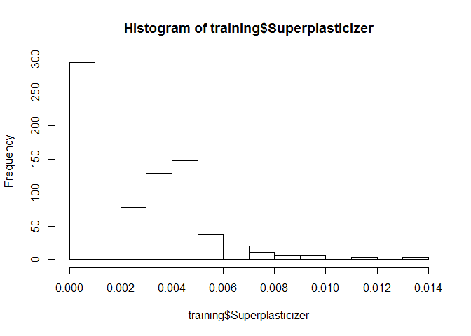
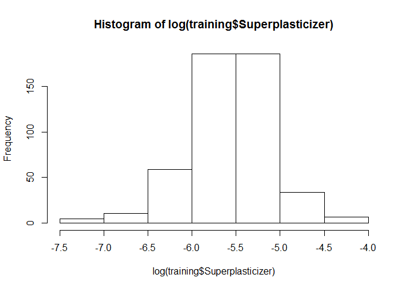

Quiz 02
=======

| Attempts | Score |
|:--------:|:-----:|
|    1/3   | 12/12 |

Question 01
-----------

Load the Alzheimer's disease data using the commands:

``` r
library(AppliedPredictiveModeling)
library(caret)
```

    ## Loading required package: lattice
    ## Loading required package: ggplot2

``` r
data(AlzheimerDisease)
```

Which of the following commands will create training and test sets with about 50% of the observations assigned to each?

### Answer

``` r
adData = data.frame(diagnosis, predictors)
trainIndex = createDataPartition(diagnosis, p = 0.50, list = FALSE)
training = adData[trainIndex,]
testing = adData[-trainIndex,]
```

Question 02
-----------

Load the cement data using the commands:

``` r
library(AppliedPredictiveModeling)
data(concrete)
library(caret)
set.seed(1000)
inTrain = createDataPartition(mixtures$CompressiveStrength, p = 3/4)[[1]]
training = mixtures[inTrain,]
testing = mixtures[-inTrain,]
```

Make a histogram and confirm the SuperPlasticizer variable is skewed. Normally you might use the log transform to try to make the data more symmetric. Why would that be a poor choice for this variable?

### Answer

-   There are values of zero so when you take the log() transform those values will be -Inf.

#### Explanation

``` r
hist(training$Superplasticizer)
```



``` r
hist(log(training$Superplasticizer))
```



``` r
log(training$Superplasticizer)
```

    ##   [1]      -Inf      -Inf      -Inf      -Inf      -Inf      -Inf -6.258221
    ##   [8] -5.760205 -5.720732 -5.720732 -6.024509 -6.230310 -6.230310 -6.257710
    ##  [15] -6.257710 -6.017525 -6.017525 -5.841694 -5.871192 -5.871192 -5.947436
    ##  [22] -5.804618 -5.616687 -5.437410 -5.724297 -5.868116 -6.004355 -5.737845
    ##  [29] -5.665540 -5.665540 -5.395940 -5.313623 -5.272172 -5.231944 -5.125137
    ##  [36] -5.304507 -5.521587 -5.500705 -5.352739 -5.675061 -5.713183 -6.364709
    ##  [43] -5.898041 -5.495519 -5.478068 -6.093996 -5.312785 -5.756881 -6.011225
    ##  [50]      -Inf -5.478068 -5.332885 -5.145745 -7.212078 -7.212078 -7.212078
    ##  [57] -6.021685      -Inf      -Inf      -Inf      -Inf      -Inf      -Inf
    ##  [64]      -Inf      -Inf      -Inf      -Inf      -Inf      -Inf      -Inf
    ##  [71]      -Inf      -Inf      -Inf      -Inf      -Inf      -Inf      -Inf
    ##  [78]      -Inf      -Inf      -Inf      -Inf      -Inf      -Inf      -Inf
    ##  [85]      -Inf      -Inf      -Inf      -Inf      -Inf      -Inf      -Inf
    ##  [92]      -Inf      -Inf      -Inf      -Inf      -Inf      -Inf      -Inf
    ##  [99]      -Inf      -Inf      -Inf      -Inf      -Inf      -Inf      -Inf
    ## [106]      -Inf      -Inf      -Inf      -Inf      -Inf      -Inf      -Inf
    ## [113]      -Inf      -Inf      -Inf      -Inf      -Inf      -Inf      -Inf
    ## [120]      -Inf      -Inf      -Inf      -Inf      -Inf      -Inf      -Inf
    ## [127]      -Inf      -Inf      -Inf      -Inf      -Inf      -Inf      -Inf
    ## [134]      -Inf      -Inf      -Inf      -Inf      -Inf      -Inf      -Inf
    ## [141]      -Inf      -Inf      -Inf      -Inf      -Inf      -Inf      -Inf
    ## [148]      -Inf      -Inf      -Inf      -Inf      -Inf      -Inf      -Inf
    ## [155]      -Inf      -Inf      -Inf -5.521905 -4.842436 -5.245707 -5.238656
    ## [162] -5.934894 -5.536459 -5.645447 -4.964155 -5.296042 -4.955387 -5.786897
    ## [169] -5.326109 -5.518791 -5.010191 -5.628969 -5.519236 -5.934012 -5.915753
    ## [176] -5.525716 -5.657893 -4.957837 -5.663568 -5.295860 -4.980617 -5.772713
    ## [183] -5.316750 -5.507785 -5.418985 -5.010546 -5.654062 -5.393357 -5.544200
    ## [190] -4.848007 -5.279345 -5.263752 -5.186499 -5.918233      -Inf      -Inf
    ## [197]      -Inf -5.481546 -5.639058 -4.656602 -4.996598 -4.996598 -5.136950
    ## [204] -5.033352 -5.388501 -5.536837 -6.258221 -6.258221 -6.258221 -6.227610
    ## [211] -5.760205 -5.760205 -5.720732 -6.024509 -6.024509 -6.230310 -6.257710
    ## [218] -6.257710 -6.017525 -6.017525 -5.841694 -5.947436 -5.947436 -5.804618
    ## [225] -5.804618 -6.060270 -5.616687 -5.616687 -5.437410 -5.868116 -5.868116
    ## [232] -5.906170 -5.737845 -5.665540 -5.395940 -5.272172 -5.272172 -5.231944
    ## [239] -5.489438 -5.453854 -5.316023 -5.373789 -5.314034 -5.352739 -5.352739
    ## [246]      -Inf      -Inf -5.992648 -5.675061 -6.487177 -5.713183 -5.699003
    ## [253] -5.495519 -6.093996 -5.312785 -5.756881 -6.364709 -5.478068 -6.093996
    ## [260] -6.011225 -5.478068 -5.478068 -5.332885 -5.173952 -6.436684 -5.641698
    ## [267] -5.566241 -6.021685 -5.405607      -Inf      -Inf      -Inf      -Inf
    ## [274]      -Inf      -Inf      -Inf      -Inf      -Inf      -Inf      -Inf
    ## [281]      -Inf      -Inf      -Inf      -Inf      -Inf      -Inf      -Inf
    ## [288]      -Inf      -Inf      -Inf      -Inf      -Inf      -Inf      -Inf
    ## [295]      -Inf      -Inf      -Inf      -Inf      -Inf      -Inf      -Inf
    ## [302]      -Inf      -Inf      -Inf      -Inf      -Inf      -Inf      -Inf
    ## [309]      -Inf      -Inf      -Inf      -Inf      -Inf      -Inf      -Inf
    ## [316]      -Inf      -Inf      -Inf      -Inf      -Inf      -Inf      -Inf
    ## [323]      -Inf      -Inf      -Inf      -Inf      -Inf      -Inf      -Inf
    ## [330]      -Inf      -Inf      -Inf      -Inf      -Inf      -Inf      -Inf
    ## [337]      -Inf      -Inf -4.786175 -4.657849 -5.940610 -5.941924 -5.427150
    ## [344] -5.653804 -5.347973 -5.904908 -6.633318 -5.312758 -5.655992 -5.181784
    ## [351] -5.415211 -5.655992 -6.125558 -5.327876 -5.645447 -5.646330 -5.536897
    ## [358] -6.645091 -5.788649 -7.057898 -5.670312 -5.435031 -5.946293 -5.644563
    ## [365] -5.416989 -5.774552 -5.905044 -6.508638 -6.603507 -5.656079 -5.364476
    ## [372] -5.597142 -5.585705 -5.526066 -6.519581 -5.505420 -6.962932 -5.670183
    ## [379] -4.796889 -5.907908 -5.026771 -5.447265 -5.617340 -6.029942 -5.311651
    ## [386] -5.388149 -5.577929      -Inf      -Inf      -Inf      -Inf      -Inf
    ## [393]      -Inf      -Inf      -Inf      -Inf      -Inf      -Inf      -Inf
    ## [400]      -Inf      -Inf      -Inf      -Inf      -Inf      -Inf      -Inf
    ## [407]      -Inf      -Inf      -Inf      -Inf      -Inf      -Inf      -Inf
    ## [414]      -Inf      -Inf -4.877001 -5.604397 -4.331387 -5.371943 -5.344065
    ## [421] -5.344065 -4.711698 -5.344065 -5.639058 -4.656602 -5.388501 -5.536837
    ## [428] -6.258221 -6.227610 -5.760205 -5.720732 -5.720732 -6.230310 -5.481480
    ## [435] -6.017525 -5.841694 -5.871192 -5.804618 -5.804618 -6.060270 -6.060270
    ## [442] -5.616687 -5.616687 -5.437410 -5.724297 -5.724297 -5.868116 -6.004355
    ## [449] -5.906170 -5.906170 -5.737845 -5.665540 -5.395940 -5.538464 -5.538464
    ## [456] -5.313623 -5.591322 -5.272172 -5.272172 -5.125137 -5.304507 -5.316023
    ## [463] -5.314034 -5.500705 -5.352739      -Inf -5.631824 -6.701428 -6.701428
    ## [470] -5.018837 -5.619746 -5.884975 -6.487177 -5.713183 -5.699003 -5.495519
    ## [477] -5.756881 -6.364709 -6.093996 -6.011225      -Inf -6.093996 -5.756881
    ## [484] -6.011225 -5.332885 -5.332885 -5.353899 -5.173952 -6.407937 -5.616343
    ## [491] -6.021685 -5.405607      -Inf      -Inf      -Inf      -Inf      -Inf
    ## [498]      -Inf      -Inf      -Inf      -Inf      -Inf      -Inf      -Inf
    ## [505]      -Inf      -Inf      -Inf      -Inf      -Inf      -Inf      -Inf
    ## [512]      -Inf      -Inf      -Inf      -Inf      -Inf      -Inf      -Inf
    ## [519]      -Inf      -Inf      -Inf      -Inf      -Inf      -Inf      -Inf
    ## [526]      -Inf      -Inf      -Inf      -Inf      -Inf      -Inf      -Inf
    ## [533]      -Inf -5.527222 -4.847681 -5.459160 -5.339285 -5.347108 -5.944984
    ## [540] -5.930475 -5.543005 -5.334474 -5.339285 -5.807713 -5.267429 -5.547345
    ## [547] -5.662526 -5.676326 -5.773664 -5.813277 -6.652433 -5.263122 -5.441552
    ## [554] -5.710013 -5.792578 -5.183942 -5.405826 -5.676754 -5.718494 -5.347019
    ## [561] -6.527442 -5.271317 -5.402547 -5.709847 -5.199532 -5.676497 -5.526824
    ## [568] -4.653271 -5.844971 -5.459160 -5.374672 -5.928804 -5.981281 -5.334737
    ## [575] -5.434457 -5.295313 -5.937445 -5.808228 -5.251286 -5.558778 -6.875439
    ## [582]      -Inf      -Inf      -Inf      -Inf      -Inf      -Inf      -Inf
    ## [589]      -Inf      -Inf      -Inf      -Inf      -Inf      -Inf      -Inf
    ## [596]      -Inf      -Inf      -Inf -5.481546 -4.877001 -4.331387 -4.996598
    ## [603] -5.371943 -5.344065 -5.452413 -5.033352 -5.344065 -5.344065 -5.378734
    ## [610] -5.639058 -4.996598 -4.877001 -5.604397 -4.331387 -5.303880 -4.463337
    ## [617] -4.996598 -5.136950 -5.371943 -5.452413 -5.033352 -5.388501 -5.344065
    ## [624] -5.378734 -5.344065 -5.536837 -5.639058 -4.996598 -4.877001 -4.656602
    ## [631] -4.331387 -4.996598 -5.303880 -4.463337 -5.136950 -5.344065 -5.033352
    ## [638] -5.344065 -5.388501 -5.344065 -5.378734 -5.536837 -5.481546 -5.639058
    ## [645] -4.877001 -4.656602 -5.604397 -4.996598 -5.303880 -4.463337 -4.996598
    ## [652] -5.136950 -5.344065 -5.033352 -5.344065 -5.388501 -5.344065 -4.711698
    ## [659] -5.344065 -5.536837 -5.841694 -5.841694 -5.871192 -5.871192 -5.724297
    ## [666] -5.665540 -5.313623 -5.313623 -5.313623 -5.591322 -5.231944 -5.125137
    ## [673] -5.125137 -5.125137 -5.304507 -5.304507 -5.304507 -5.489438 -5.489438
    ## [680] -5.489438 -5.521587 -5.521587 -5.521587 -5.453854 -5.453854 -5.316023
    ## [687] -5.316023 -5.373789 -5.373789 -5.373789 -5.373789 -5.314034 -5.314034
    ## [694] -5.500705 -5.500705 -5.500705 -6.422841 -7.148387 -6.040214 -5.359379
    ## [701] -6.136730 -5.834853 -6.124178 -4.774913 -4.731464 -4.875837      -Inf
    ## [708] -5.511942 -5.564095 -5.675061 -5.675061 -6.487177 -5.713183 -5.898041
    ## [715] -5.699003 -5.495519 -5.312785 -5.675061 -6.487177 -5.713183 -5.495519
    ## [722] -5.312785 -5.332885 -5.332885 -5.332885 -5.332885 -5.451205 -5.173952
    ## [729] -5.353899 -5.145745 -5.173952 -5.353899 -6.407937 -5.616343 -5.616343
    ## [736] -5.566241 -5.405607 -5.405607      -Inf      -Inf      -Inf      -Inf
    ## [743]      -Inf      -Inf      -Inf      -Inf      -Inf      -Inf      -Inf
    ## [750]      -Inf      -Inf      -Inf      -Inf      -Inf      -Inf      -Inf
    ## [757] -5.941048 -6.141607 -5.808571 -5.672034 -5.446306 -5.454466 -5.668587
    ## [764] -5.952377 -5.406870 -5.655905 -5.669320 -6.039085 -5.941442 -6.225247
    ## [771] -5.867455 -5.498462 -5.574629 -5.611796

Question 03
-----------

Load the Alzheimer's disease data using the commands:

``` r
library(caret)
library(AppliedPredictiveModeling)
set.seed(3433)
data(AlzheimerDisease)
adData = data.frame(diagnosis,predictors)
inTrain = createDataPartition(adData$diagnosis, p = 3/4)[[1]]
training = adData[ inTrain,]
testing = adData[-inTrain,]
```

Find all the predictor variables in the training set that begin with IL. Perform principal components on these variables with the preProcess() function from the caret package. Calculate the number of principal components needed to capture 80% of the variance. How many are there?

### Answer

7

#### Explanation

``` r
newData <- training[, grep("^IL",  names(training), value = TRUE)]
preProcess(newData, method = "pca", thresh = 0.8)
```

    ## 
    ## Call:
    ## preProcess.default(x = newData, method = "pca", thresh = 0.8)
    ## 
    ## Created from 251 samples and 12 variables
    ## Pre-processing: principal component signal extraction, scaled, centered 
    ## 
    ## PCA needed 7 components to capture 80 percent of the variance

Question 04
-----------

Load the Alzheimer's disease data using the commands:

``` r
library(caret)
library(AppliedPredictiveModeling)
set.seed(3433)
data(AlzheimerDisease)
adData = data.frame(diagnosis,predictors)
inTrain = createDataPartition(adData$diagnosis, p = 3/4)[[1]]
training = adData[ inTrain,]
testing = adData[-inTrain,]
```

Create a training data set consisting of only the predictors with variable names beginning with IL and the diagnosis. Build two predictive models, one using the predictors as they are and one using PCA with principal components explaining 80% of the variance in the predictors. Use method="glm" in the train function. What is the accuracy of each method in the test set? Which is more accurate?

### Answer

Non-PCA Accuracy: 0.65;
PCA Accuracy: 0.72

#### Explanation

``` r
newData <- training[,c(grep("^IL", names(training), value=TRUE), "diagnosis")]
train(newData$diagnosis ~ ., method = "glm", data = newData)
```

    ## Generalized Linear Model 
    ## 
    ## 251 samples
    ##  12 predictor
    ##   2 classes: 'Impaired', 'Control' 
    ## 
    ## No pre-processing
    ## Resampling: Bootstrapped (25 reps) 
    ## 
    ## Summary of sample sizes: 251, 251, 251, 251, 251, 251, ... 
    ## 
    ## Resampling results
    ## 
    ##   Accuracy  Kappa       Accuracy SD  Kappa SD  
    ##   0.669878  0.02171277  0.03828896   0.08956068
    ## 
    ## 

``` r
train (training$diagnosis~., method = "glm", data = predict(preProcess(newData[,-13], method = "pca", thresh = 0.8), newData[,-13]))
```

    ## Generalized Linear Model 
    ## 
    ## 251 samples
    ##   6 predictor
    ##   2 classes: 'Impaired', 'Control' 
    ## 
    ## No pre-processing
    ## Resampling: Bootstrapped (25 reps) 
    ## 
    ## Summary of sample sizes: 251, 251, 251, 251, 251, 251, ... 
    ## 
    ## Resampling results
    ## 
    ##   Accuracy   Kappa       Accuracy SD  Kappa SD  
    ##   0.7045287  0.07296213  0.04314126   0.09511129
    ## 
    ##
