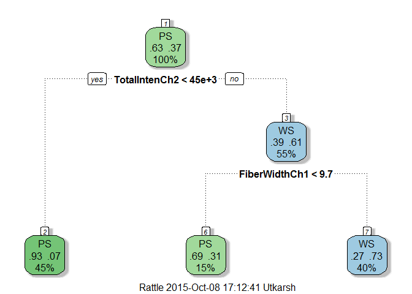

Quiz 03
=======

| Attempts | Score |
|:--------:|:-----:|
|    1/3   | 15/15 |

Question 01
-----------

Load the cell segmentation data from the AppliedPredictiveModeling package using the commands:

``` r
library(AppliedPredictiveModeling)
data(segmentationOriginal)
library(caret)
```

    ## Loading required package: lattice
    ## Loading required package: ggplot2

1.  Subset the data to a training set and testing set based on the Case variable in the data set.
2.  Set the seed to 125 and fit a CART model with the rpart method using all predictor variables and default caret settings.
3.  In the final model what would be the final model prediction for cases with the following variable values:

<!-- -->

1.  TotalIntench2 = 23,000; FiberWidthCh1 = 10; PerimStatusCh1 = 2.
2.  TotalIntench2 = 50,000; FiberWidthCh1 = 10; VarIntenCh4 = 100.
3.  TotalIntench2 = 57,000; FiberWidthCh1 = 8; VarIntenCh4 = 100.
4.  FiberWidthCh1 = 8; VarIntenCh4 = 100; PerimStatusCh1 = 2.

### Answer

1.  PS
2.  WS
3.  PS
4.  Not possible to predict

#### Explanation

``` r
library(rattle)
```

    ## Loading required package: RGtk2
    ## Rattle: A free graphical interface for data mining with R.
    ## Version 3.5.0 Copyright (c) 2006-2015 Togaware Pty Ltd.
    ## Type 'rattle()' to shake, rattle, and roll your data.

``` r
data <- segmentationOriginal
set.seed(125)
inTrain <- data$Case == "Train"
trainData <- data[inTrain,]
testData <- data[!inTrain,]
cartModel <- train(Class ~ ., data = trainData, method = "rpart")
```

    ## Loading required package: rpart

``` r
cartModel$finalModel
```

    ## n= 1009 
    ## 
    ## node), split, n, loss, yval, (yprob)
    ##       * denotes terminal node
    ## 
    ## 1) root 1009 373 PS (0.63032706 0.36967294)  
    ##   2) TotalIntenCh2< 45323.5 454  34 PS (0.92511013 0.07488987) *
    ##   3) TotalIntenCh2>=45323.5 555 216 WS (0.38918919 0.61081081)  
    ##     6) FiberWidthCh1< 9.673245 154  47 PS (0.69480519 0.30519481) *
    ##     7) FiberWidthCh1>=9.673245 401 109 WS (0.27182045 0.72817955) *

``` r
fancyRpartPlot(cartModel$finalModel)
```



Question 02
-----------

If K is small in a K-fold cross validation is the bias in the estimate of out-of-sample (test set) accuracy smaller or bigger? If K is small is the variance in the estimate of out-of-sample (test set) accuracy smaller or bigger. Is K large or small in leave one out cross validation?

### Answer

The bias is larger and the variance is smaller. Under leave one out cross validation K is equal to the sample size.

Question 03
-----------

Load the olive oil data using the commands:

``` r
library(pgmm)
data(olive)
olive = olive[,-1]
```

These data contain information on 572 different Italian olive oils from multiple regions in Italy. Fit a classification tree where Area is the outcome variable. Then predict the value of area for the following data frame using the tree command with all defaults.

``` r
newdata = as.data.frame(t(colMeans(olive)))
```

What is the resulting prediction? Is the resulting prediction strange? Why or why not?

### Answer

-   2.783. It is strange because Area should be a qualitative variable - but tree is reporting the average value of Area as a numeric variable in the leaf predicted for newdata.

#### Explanation

``` r
treeModel <- train(Area ~ ., data=olive, method="rpart2")
treeModel
```

    ## CART 
    ## 
    ## 572 samples
    ##   8 predictor
    ## 
    ## No pre-processing
    ## Resampling: Bootstrapped (25 reps) 
    ## 
    ## Summary of sample sizes: 572, 572, 572, 572, 572, 572, ... 
    ## 
    ## Resampling results across tuning parameters:
    ## 
    ##   maxdepth  RMSE       Rsquared   RMSE SD     Rsquared SD
    ##   1         1.1392894  0.7661580  0.03330200  0.01213634 
    ##   2         0.7459851  0.8997217  0.02674037  0.00655757 
    ##   3         0.6668225  0.9202201  0.05336429  0.01232194 
    ## 
    ## RMSE was used to select the optimal model using  the smallest value.
    ## The final value used for the model was maxdepth = 3.

``` r
newdata <- as.data.frame(t(colMeans(olive)))
predict(treeModel, newdata)
```

    ## [1] 2.875

Question 04
-----------

Load the South Africa Heart Disease Data and create training and test sets with the following code:

``` r
library(ElemStatLearn)
data(SAheart)
set.seed(8484)
train = sample(1:dim(SAheart)[1],size=dim(SAheart)[1]/2,replace=F)
trainSA = SAheart[train,]
testSA = SAheart[-train,]
```

Then set the seed to 13234 and fit a logistic regression model (method="glm", be sure to specify family="binomial") with Coronary Heart Disease (chd) as the outcome and age at onset, current alcohol consumption, obesity levels, cumulative tabacco, type-A behavior, and low density lipoprotein cholesterol as predictors. Calculate the misclassification rate for your model using this function and a prediction on the "response" scale:

``` r
missClass = function(values,prediction){sum(((prediction > 0.5)*1) != values)/length(values)}
```

What is the misclassification rate on the training set? What is the misclassification rate on the test set?

### Answer

Test Set Misclassification: 0.31;
Training Set: 0.27

#### Explanation

``` r
set.seed(13234)
logitModel <- train(chd ~ age + alcohol + obesity + tobacco + typea + ldl, data=trainSA, method="glm", family="binomial")
logitModel
```

    ## Generalized Linear Model 
    ## 
    ## 231 samples
    ##   9 predictor
    ## 
    ## No pre-processing
    ## Resampling: Bootstrapped (25 reps) 
    ## 
    ## Summary of sample sizes: 231, 231, 231, 231, 231, 231, ... 
    ## 
    ## Resampling results
    ## 
    ##   RMSE       Rsquared   RMSE SD    Rsquared SD
    ##   0.4366982  0.2000453  0.0239573  0.06521095 
    ## 
    ## 

``` r
missClass <- function(values,prediction){sum(((prediction > 0.5)*1) != values)/length(values)}
predictTrain <- predict(logitModel, trainSA)
predictTest <- predict(logitModel, testSA)
# Test Set Misclassification rate
missClass(testSA$chd, predictTest)
```

    ## [1] 0.3116883

``` r
# Training Set Misclassification rate
missClass(trainSA$chd, predictTrain)
```

    ## [1] 0.2727273

Question 05
-----------

Load the vowel.train and vowel.test data sets:

``` r
library(ElemStatLearn)
data(vowel.train)
data(vowel.test)
```

Set the variable y to be a factor variable in both the training and test set. Then set the seed to 33833. Fit a random forest predictor relating the factor variable y to the remaining variables.
Read about variable importance in random forests here:
[<http://www.stat.berkeley.edu/~breiman/RandomForests/cc_home.htm#ooberr>](http://www.stat.berkeley.edu/~breiman/RandomForests/cc_home.htm#ooberr)
The caret package uses by defualt the Gini importance. Calculate the variable importance using the varImp function in the caret package. What is the order of variable importance?

### Answer

The order of the variables is: x.2, x.1, x.5, x.6, x.8, x.4, x.9, x.3, x.7, x.10

#### Explanation

``` r
library(randomForest)
```

    ## randomForest 4.6-12
    ## Type rfNews() to see new features/changes/bug fixes.

``` r
head(vowel.train)
```

    ##   y    x.1   x.2    x.3   x.4    x.5   x.6    x.7    x.8    x.9   x.10
    ## 1 1 -3.639 0.418 -0.670 1.779 -0.168 1.627 -0.388  0.529 -0.874 -0.814
    ## 2 2 -3.327 0.496 -0.694 1.365 -0.265 1.933 -0.363  0.510 -0.621 -0.488
    ## 3 3 -2.120 0.894 -1.576 0.147 -0.707 1.559 -0.579  0.676 -0.809 -0.049
    ## 4 4 -2.287 1.809 -1.498 1.012 -1.053 1.060 -0.567  0.235 -0.091 -0.795
    ## 5 5 -2.598 1.938 -0.846 1.062 -1.633 0.764  0.394 -0.150  0.277 -0.396
    ## 6 6 -2.852 1.914 -0.755 0.825 -1.588 0.855  0.217 -0.246  0.238 -0.365

``` r
head(vowel.test)
```

    ##   y    x.1    x.2    x.3    x.4    x.5   x.6    x.7   x.8    x.9   x.10
    ## 1 1 -1.149 -0.904 -1.988  0.739 -0.060 1.206  0.864 1.196 -0.300 -0.467
    ## 2 2 -2.613 -0.092 -0.540  0.484  0.389 1.741  0.198 0.257 -0.375 -0.604
    ## 3 3 -2.505  0.632 -0.593  0.304  0.496 0.824 -0.162 0.181 -0.363 -0.764
    ## 4 4 -1.768  1.769 -1.142 -0.739 -0.086 0.120 -0.230 0.217 -0.009 -0.279
    ## 5 5 -2.671  3.155 -0.514  0.133 -0.964 0.234 -0.071 1.192  0.254 -0.471
    ## 6 6 -2.509  1.326  0.354  0.663 -0.724 0.418 -0.496 0.713  0.638 -0.204

``` r
dim(vowel.train)
```

    ## [1] 528  11

``` r
dim(vowel.test)
```

    ## [1] 462  11

``` r
vowel.train$y <- as.factor(vowel.train$y)
vowel.test$y <- as.factor(vowel.test$y)
set.seed(33833)
modelRf <- randomForest(y ~ ., data = vowel.train, importance = FALSE)
order(varImp(modelRf), decreasing=T)
```

    ##  [1]  2  1  5  6  8  4  9  3  7 10
