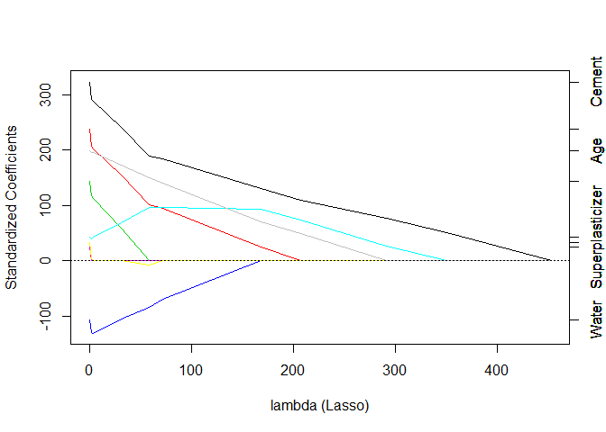

Quiz 03
=======

| Attempts | Score |
|:--------:|:-----:|
|    1/3   | 15/15 |

Question 01
-----------

Load the vowel.train and vowel.test data sets:

``` r
library(ElemStatLearn)
data(vowel.train)
data(vowel.test)
```

Set the variable y to be a factor variable in both the training and test set. Then set the seed to 33833. Fit (1) a random forest predictor relating the factor variable y to the remaining variables and (2) a boosted predictor using the "gbm" method. Fit these both with the train() command in the caret package.
What are the accuracies for the two approaches on the test data set? What is the accuracy among the test set samples where the two methods agree?

### Answer

RF Accuracy = 0.6082
GBM Accuracy = 0.5152
Agreement Accuracy = 0.6361

#### Explanation

``` r
library(caret)
```

    ## Loading required package: lattice
    ## Loading required package: ggplot2

``` r
vowel.train$y <- as.factor(vowel.train$y)
vowel.test$y <- as.factor(vowel.test$y)
set.seed(33833)
# fit rf predictor relating the factor variable y
fitRf <- train(y ~ ., data=vowel.train, method = "rf")
```

    ## Loading required package: randomForest
    ## randomForest 4.6-12
    ## Type rfNews() to see new features/changes/bug fixes.

``` r
fitGBM <- train(y ~ ., data=vowel.train, method = "gbm")
```

    ## Loading required package: gbm
    ## Loading required package: survival
    ## Loading required package: splines
    ## 
    ## Attaching package: 'survival'
    ## 
    ## The following object is masked from 'package:caret':
    ## 
    ##     cluster
    ## 
    ## Loading required package: parallel
    ## Loaded gbm 2.1
    ## Loading required package: plyr
    ## 
    ## Attaching package: 'plyr'
    ## 
    ## The following object is masked from 'package:ElemStatLearn':
    ## 
    ##     ozone

    ## Iter   TrainDeviance   ValidDeviance   StepSize   Improve
    ##      1        2.3979             nan     0.1000    0.3754
    ##      2        2.1771             nan     0.1000    0.2307
    ##      3        2.0281             nan     0.1000    0.1679
    ##      4        1.9187             nan     0.1000    0.1236
    ##      5        1.8321             nan     0.1000    0.1028
    ##      6        1.7448             nan     0.1000    0.0964
    ##      7        1.6754             nan     0.1000    0.1142
    ##      8        1.5966             nan     0.1000    0.0538
    ##      9        1.5443             nan     0.1000    0.0592
    ##     10        1.4916             nan     0.1000    0.0527
    ##     20        1.1321             nan     0.1000    0.0293
    ##     40        0.7344             nan     0.1000   -0.0038
    ##     60        0.5323             nan     0.1000    0.0001
    ##     80        0.3979             nan     0.1000    0.0013
    ##    100        0.3002             nan     0.1000   -0.0017
    ##    120        0.2332             nan     0.1000   -0.0024
    ##    140        0.1848             nan     0.1000   -0.0026
    ##    150        0.1634             nan     0.1000   -0.0024
    ## 
    ## Iter   TrainDeviance   ValidDeviance   StepSize   Improve
    ##      1        2.3979             nan     0.1000    0.6168
    ##      2        2.0265             nan     0.1000    0.3929
    ##      3        1.7831             nan     0.1000    0.2568
    ##      4        1.6184             nan     0.1000    0.2164
    ##      5        1.4752             nan     0.1000    0.1493
    ##      6        1.3663             nan     0.1000    0.1486
    ##      7        1.2611             nan     0.1000    0.0810
    ##      8        1.1896             nan     0.1000    0.0916
    ##      9        1.1114             nan     0.1000    0.0799
    ##     10        1.0437             nan     0.1000    0.0910
    ##     20        0.6056             nan     0.1000    0.0220
    ##     40        0.2661             nan     0.1000    0.0065
    ##     60        0.1361             nan     0.1000    0.0002
    ##     80        0.0750             nan     0.1000   -0.0008
    ##    100        0.0428             nan     0.1000   -0.0001
    ##    120        0.0255             nan     0.1000   -0.0004
    ##    140        0.0151             nan     0.1000   -0.0002
    ##    150        0.0118             nan     0.1000   -0.0000
    ## 
    ## Iter   TrainDeviance   ValidDeviance   StepSize   Improve
    ##      1        2.3979             nan     0.1000    0.7139
    ##      2        1.9174             nan     0.1000    0.3744
    ##      3        1.6675             nan     0.1000    0.3201
    ##      4        1.4399             nan     0.1000    0.2401
    ##      5        1.2722             nan     0.1000    0.1525
    ##      6        1.1560             nan     0.1000    0.1513
    ##      7        1.0444             nan     0.1000    0.1234
    ##      8        0.9540             nan     0.1000    0.1070
    ##      9        0.8715             nan     0.1000    0.0831
    ##     10        0.7994             nan     0.1000    0.0729
    ##     20        0.3891             nan     0.1000    0.0226
    ##     40        0.1256             nan     0.1000    0.0024
    ##     60        0.0498             nan     0.1000   -0.0001
    ##     80        0.0227             nan     0.1000    0.0003
    ##    100        0.0102             nan     0.1000    0.0001
    ##    120        0.0047             nan     0.1000    0.0000
    ##    140        0.0022             nan     0.1000    0.0000
    ##    150        0.0015             nan     0.1000   -0.0000
    ## 
    ## Iter   TrainDeviance   ValidDeviance   StepSize   Improve
    ##      1        2.3979             nan     0.1000    0.4197
    ##      2        2.1525             nan     0.1000    0.2378
    ##      3        2.0019             nan     0.1000    0.1392
    ##      4        1.8992             nan     0.1000    0.1278
    ##      5        1.8059             nan     0.1000    0.1322
    ##      6        1.7201             nan     0.1000    0.0941
    ##      7        1.6523             nan     0.1000    0.0783
    ##      8        1.5868             nan     0.1000    0.0805
    ##      9        1.5288             nan     0.1000    0.0754
    ##     10        1.4723             nan     0.1000    0.0467
    ##     20        1.0774             nan     0.1000    0.0224
    ##     40        0.6959             nan     0.1000    0.0042
    ##     60        0.5002             nan     0.1000    0.0012
    ##     80        0.3734             nan     0.1000    0.0022
    ##    100        0.2840             nan     0.1000   -0.0040
    ##    120        0.2213             nan     0.1000   -0.0043
    ##    140        0.1738             nan     0.1000   -0.0030
    ##    150        0.1548             nan     0.1000   -0.0032
    ## 
    ## Iter   TrainDeviance   ValidDeviance   StepSize   Improve
    ##      1        2.3979             nan     0.1000    0.6060
    ##      2        1.9787             nan     0.1000    0.3643
    ##      3        1.7453             nan     0.1000    0.2024
    ##      4        1.5936             nan     0.1000    0.1662
    ##      5        1.4683             nan     0.1000    0.1612
    ##      6        1.3479             nan     0.1000    0.1342
    ##      7        1.2484             nan     0.1000    0.1013
    ##      8        1.1684             nan     0.1000    0.0912
    ##      9        1.0939             nan     0.1000    0.0921
    ##     10        1.0221             nan     0.1000    0.0651
    ##     20        0.5955             nan     0.1000    0.0298
    ##     40        0.2627             nan     0.1000    0.0045
    ##     60        0.1362             nan     0.1000    0.0015
    ##     80        0.0766             nan     0.1000   -0.0014
    ##    100        0.0443             nan     0.1000   -0.0007
    ##    120        0.0259             nan     0.1000   -0.0001
    ##    140        0.0155             nan     0.1000    0.0000
    ##    150        0.0124             nan     0.1000   -0.0002
    ## 
    ## Iter   TrainDeviance   ValidDeviance   StepSize   Improve
    ##      1        2.3979             nan     0.1000    0.7321
    ##      2        1.8946             nan     0.1000    0.3745
    ##      3        1.6478             nan     0.1000    0.2641
    ##      4        1.4488             nan     0.1000    0.2068
    ##      5        1.3027             nan     0.1000    0.1975
    ##      6        1.1603             nan     0.1000    0.1144
    ##      7        1.0570             nan     0.1000    0.1162
    ##      8        0.9722             nan     0.1000    0.1125
    ##      9        0.8882             nan     0.1000    0.0903
    ##     10        0.8113             nan     0.1000    0.0677
    ##     20        0.3869             nan     0.1000    0.0256
    ##     40        0.1243             nan     0.1000    0.0024
    ##     60        0.0501             nan     0.1000    0.0008
    ##     80        0.0226             nan     0.1000   -0.0004
    ##    100        0.0107             nan     0.1000    0.0002
    ##    120        0.0055             nan     0.1000   -0.0002
    ##    140        0.0029             nan     0.1000   -0.0001
    ##    150        0.0021             nan     0.1000    0.0000
    ## 
    ## Iter   TrainDeviance   ValidDeviance   StepSize   Improve
    ##      1        2.3979             nan     0.1000    0.3487
    ##      2        2.1747             nan     0.1000    0.2210
    ##      3        2.0340             nan     0.1000    0.1494
    ##      4        1.9131             nan     0.1000    0.1120
    ##      5        1.8202             nan     0.1000    0.1081
    ##      6        1.7366             nan     0.1000    0.1001
    ##      7        1.6655             nan     0.1000    0.0825
    ##      8        1.6003             nan     0.1000    0.0662
    ##      9        1.5460             nan     0.1000    0.0744
    ##     10        1.4857             nan     0.1000    0.0528
    ##     20        1.1031             nan     0.1000    0.0242
    ##     40        0.7133             nan     0.1000   -0.0001
    ##     60        0.5103             nan     0.1000   -0.0022
    ##     80        0.3697             nan     0.1000   -0.0080
    ##    100        0.2829             nan     0.1000   -0.0042
    ##    120        0.2162             nan     0.1000   -0.0029
    ##    140        0.1658             nan     0.1000   -0.0013
    ##    150        0.1474             nan     0.1000   -0.0031
    ## 
    ## Iter   TrainDeviance   ValidDeviance   StepSize   Improve
    ##      1        2.3979             nan     0.1000    0.5891
    ##      2        2.0209             nan     0.1000    0.3129
    ##      3        1.8097             nan     0.1000    0.2144
    ##      4        1.6286             nan     0.1000    0.1865
    ##      5        1.4903             nan     0.1000    0.1333
    ##      6        1.3821             nan     0.1000    0.1101
    ##      7        1.2963             nan     0.1000    0.1158
    ##      8        1.2076             nan     0.1000    0.0899
    ##      9        1.1341             nan     0.1000    0.1032
    ##     10        1.0574             nan     0.1000    0.0863
    ##     20        0.6095             nan     0.1000    0.0266
    ##     40        0.2627             nan     0.1000    0.0005
    ##     60        0.1304             nan     0.1000    0.0018
    ##     80        0.0714             nan     0.1000    0.0002
    ##    100        0.0404             nan     0.1000   -0.0006
    ##    120        0.0237             nan     0.1000   -0.0003
    ##    140        0.0141             nan     0.1000   -0.0001
    ##    150        0.0105             nan     0.1000    0.0000
    ## 
    ## Iter   TrainDeviance   ValidDeviance   StepSize   Improve
    ##      1        2.3979             nan     0.1000    0.7005
    ##      2        1.9040             nan     0.1000    0.3870
    ##      3        1.6333             nan     0.1000    0.2893
    ##      4        1.4417             nan     0.1000    0.2266
    ##      5        1.2809             nan     0.1000    0.1661
    ##      6        1.1450             nan     0.1000    0.1397
    ##      7        1.0456             nan     0.1000    0.1155
    ##      8        0.9507             nan     0.1000    0.1108
    ##      9        0.8697             nan     0.1000    0.0823
    ##     10        0.7986             nan     0.1000    0.0678
    ##     20        0.3788             nan     0.1000    0.0183
    ##     40        0.1189             nan     0.1000    0.0025
    ##     60        0.0467             nan     0.1000    0.0000
    ##     80        0.0211             nan     0.1000   -0.0003
    ##    100        0.0097             nan     0.1000   -0.0001
    ##    120        0.0046             nan     0.1000   -0.0001
    ##    140        0.0023             nan     0.1000   -0.0000
    ##    150        0.0016             nan     0.1000   -0.0000
    ## 
    ## Iter   TrainDeviance   ValidDeviance   StepSize   Improve
    ##      1        2.3979             nan     0.1000    0.4055
    ##      2        2.1574             nan     0.1000    0.2312
    ##      3        2.0055             nan     0.1000    0.1628
    ##      4        1.8957             nan     0.1000    0.1540
    ##      5        1.7963             nan     0.1000    0.1407
    ##      6        1.7059             nan     0.1000    0.0932
    ##      7        1.6360             nan     0.1000    0.0773
    ##      8        1.5740             nan     0.1000    0.0660
    ##      9        1.5148             nan     0.1000    0.0823
    ##     10        1.4525             nan     0.1000    0.0582
    ##     20        1.0639             nan     0.1000    0.0298
    ##     40        0.6910             nan     0.1000    0.0031
    ##     60        0.4902             nan     0.1000   -0.0027
    ##     80        0.3700             nan     0.1000    0.0000
    ##    100        0.2843             nan     0.1000    0.0017
    ##    120        0.2183             nan     0.1000   -0.0049
    ##    140        0.1733             nan     0.1000   -0.0009
    ##    150        0.1548             nan     0.1000   -0.0024
    ## 
    ## Iter   TrainDeviance   ValidDeviance   StepSize   Improve
    ##      1        2.3979             nan     0.1000    0.6673
    ##      2        1.9889             nan     0.1000    0.3797
    ##      3        1.7456             nan     0.1000    0.2406
    ##      4        1.5835             nan     0.1000    0.1900
    ##      5        1.4507             nan     0.1000    0.1395
    ##      6        1.3351             nan     0.1000    0.1279
    ##      7        1.2357             nan     0.1000    0.1095
    ##      8        1.1495             nan     0.1000    0.0778
    ##      9        1.0862             nan     0.1000    0.0876
    ##     10        1.0192             nan     0.1000    0.1081
    ##     20        0.5889             nan     0.1000    0.0284
    ##     40        0.2620             nan     0.1000   -0.0014
    ##     60        0.1330             nan     0.1000    0.0000
    ##     80        0.0748             nan     0.1000   -0.0010
    ##    100        0.0438             nan     0.1000   -0.0005
    ##    120        0.0277             nan     0.1000   -0.0004
    ##    140        0.0163             nan     0.1000   -0.0003
    ##    150        0.0127             nan     0.1000   -0.0003
    ## 
    ## Iter   TrainDeviance   ValidDeviance   StepSize   Improve
    ##      1        2.3979             nan     0.1000    0.7823
    ##      2        1.8898             nan     0.1000    0.4187
    ##      3        1.6192             nan     0.1000    0.2978
    ##      4        1.4175             nan     0.1000    0.2329
    ##      5        1.2513             nan     0.1000    0.1951
    ##      6        1.1214             nan     0.1000    0.1536
    ##      7        1.0171             nan     0.1000    0.1028
    ##      8        0.9347             nan     0.1000    0.0869
    ##      9        0.8590             nan     0.1000    0.0825
    ##     10        0.7911             nan     0.1000    0.0650
    ##     20        0.3822             nan     0.1000    0.0308
    ##     40        0.1267             nan     0.1000    0.0019
    ##     60        0.0487             nan     0.1000   -0.0008
    ##     80        0.0213             nan     0.1000    0.0001
    ##    100        0.0100             nan     0.1000    0.0000
    ##    120        0.0047             nan     0.1000   -0.0000
    ##    140        0.0023             nan     0.1000   -0.0000
    ##    150        0.0016             nan     0.1000    0.0000
    ## 
    ## Iter   TrainDeviance   ValidDeviance   StepSize   Improve
    ##      1        2.3979             nan     0.1000    0.3923
    ##      2        2.1625             nan     0.1000    0.2748
    ##      3        2.0034             nan     0.1000    0.1776
    ##      4        1.8876             nan     0.1000    0.1313
    ##      5        1.7907             nan     0.1000    0.1093
    ##      6        1.7118             nan     0.1000    0.0939
    ##      7        1.6393             nan     0.1000    0.0653
    ##      8        1.5809             nan     0.1000    0.0845
    ##      9        1.5204             nan     0.1000    0.0569
    ##     10        1.4650             nan     0.1000    0.0514
    ##     20        1.1195             nan     0.1000    0.0201
    ##     40        0.7404             nan     0.1000    0.0045
    ##     60        0.5248             nan     0.1000   -0.0014
    ##     80        0.3940             nan     0.1000   -0.0008
    ##    100        0.2996             nan     0.1000   -0.0009
    ##    120        0.2332             nan     0.1000   -0.0005
    ##    140        0.1863             nan     0.1000   -0.0018
    ##    150        0.1674             nan     0.1000   -0.0043
    ## 
    ## Iter   TrainDeviance   ValidDeviance   StepSize   Improve
    ##      1        2.3979             nan     0.1000    0.5294
    ##      2        2.0280             nan     0.1000    0.3094
    ##      3        1.8044             nan     0.1000    0.2300
    ##      4        1.6453             nan     0.1000    0.1725
    ##      5        1.5107             nan     0.1000    0.1918
    ##      6        1.3836             nan     0.1000    0.1440
    ##      7        1.2749             nan     0.1000    0.0938
    ##      8        1.1928             nan     0.1000    0.1047
    ##      9        1.1182             nan     0.1000    0.0769
    ##     10        1.0588             nan     0.1000    0.0752
    ##     20        0.6200             nan     0.1000    0.0247
    ##     40        0.2762             nan     0.1000    0.0069
    ##     60        0.1404             nan     0.1000    0.0013
    ##     80        0.0797             nan     0.1000    0.0002
    ##    100        0.0468             nan     0.1000   -0.0005
    ##    120        0.0268             nan     0.1000   -0.0001
    ##    140        0.0162             nan     0.1000   -0.0003
    ##    150        0.0129             nan     0.1000    0.0000
    ## 
    ## Iter   TrainDeviance   ValidDeviance   StepSize   Improve
    ##      1        2.3979             nan     0.1000    0.6890
    ##      2        1.9450             nan     0.1000    0.4401
    ##      3        1.6414             nan     0.1000    0.2691
    ##      4        1.4573             nan     0.1000    0.2102
    ##      5        1.3075             nan     0.1000    0.1815
    ##      6        1.1761             nan     0.1000    0.1452
    ##      7        1.0687             nan     0.1000    0.1316
    ##      8        0.9666             nan     0.1000    0.1129
    ##      9        0.8813             nan     0.1000    0.0780
    ##     10        0.8133             nan     0.1000    0.0807
    ##     20        0.3973             nan     0.1000    0.0191
    ##     40        0.1333             nan     0.1000   -0.0024
    ##     60        0.0544             nan     0.1000   -0.0009
    ##     80        0.0243             nan     0.1000    0.0003
    ##    100        0.0116             nan     0.1000   -0.0000
    ##    120        0.0059             nan     0.1000   -0.0002
    ##    140        0.0030             nan     0.1000   -0.0000
    ##    150        0.0022             nan     0.1000   -0.0001
    ## 
    ## Iter   TrainDeviance   ValidDeviance   StepSize   Improve
    ##      1        2.3979             nan     0.1000    0.3319
    ##      2        2.1786             nan     0.1000    0.2265
    ##      3        2.0315             nan     0.1000    0.2170
    ##      4        1.9065             nan     0.1000    0.1540
    ##      5        1.8073             nan     0.1000    0.1314
    ##      6        1.7238             nan     0.1000    0.1001
    ##      7        1.6506             nan     0.1000    0.0731
    ##      8        1.5953             nan     0.1000    0.0732
    ##      9        1.5372             nan     0.1000    0.0282
    ##     10        1.4923             nan     0.1000    0.0583
    ##     20        1.1223             nan     0.1000    0.0270
    ##     40        0.7437             nan     0.1000    0.0054
    ##     60        0.5350             nan     0.1000   -0.0028
    ##     80        0.4021             nan     0.1000    0.0040
    ##    100        0.3031             nan     0.1000   -0.0021
    ##    120        0.2361             nan     0.1000   -0.0007
    ##    140        0.1859             nan     0.1000   -0.0028
    ##    150        0.1654             nan     0.1000   -0.0020
    ## 
    ## Iter   TrainDeviance   ValidDeviance   StepSize   Improve
    ##      1        2.3979             nan     0.1000    0.5451
    ##      2        2.0187             nan     0.1000    0.3444
    ##      3        1.7897             nan     0.1000    0.2361
    ##      4        1.6243             nan     0.1000    0.1615
    ##      5        1.5062             nan     0.1000    0.1730
    ##      6        1.3896             nan     0.1000    0.1177
    ##      7        1.2971             nan     0.1000    0.0953
    ##      8        1.2149             nan     0.1000    0.0997
    ##      9        1.1407             nan     0.1000    0.0722
    ##     10        1.0675             nan     0.1000    0.0827
    ##     20        0.6291             nan     0.1000    0.0203
    ##     40        0.2782             nan     0.1000    0.0069
    ##     60        0.1454             nan     0.1000    0.0002
    ##     80        0.0787             nan     0.1000   -0.0007
    ##    100        0.0452             nan     0.1000    0.0008
    ##    120        0.0264             nan     0.1000   -0.0003
    ##    140        0.0163             nan     0.1000    0.0001
    ##    150        0.0126             nan     0.1000   -0.0002
    ## 
    ## Iter   TrainDeviance   ValidDeviance   StepSize   Improve
    ##      1        2.3979             nan     0.1000    0.6650
    ##      2        1.9246             nan     0.1000    0.3827
    ##      3        1.6654             nan     0.1000    0.2582
    ##      4        1.4703             nan     0.1000    0.1953
    ##      5        1.3217             nan     0.1000    0.1619
    ##      6        1.2022             nan     0.1000    0.1296
    ##      7        1.1075             nan     0.1000    0.1275
    ##      8        1.0120             nan     0.1000    0.1117
    ##      9        0.9229             nan     0.1000    0.1005
    ##     10        0.8452             nan     0.1000    0.0846
    ##     20        0.4128             nan     0.1000    0.0206
    ##     40        0.1388             nan     0.1000    0.0020
    ##     60        0.0566             nan     0.1000   -0.0002
    ##     80        0.0249             nan     0.1000   -0.0001
    ##    100        0.0118             nan     0.1000    0.0001
    ##    120        0.0056             nan     0.1000    0.0001
    ##    140        0.0028             nan     0.1000    0.0000
    ##    150        0.0020             nan     0.1000    0.0000
    ## 
    ## Iter   TrainDeviance   ValidDeviance   StepSize   Improve
    ##      1        2.3979             nan     0.1000    0.3995
    ##      2        2.1573             nan     0.1000    0.2572
    ##      3        2.0018             nan     0.1000    0.1746
    ##      4        1.8900             nan     0.1000    0.1383
    ##      5        1.7944             nan     0.1000    0.1107
    ##      6        1.7193             nan     0.1000    0.0912
    ##      7        1.6493             nan     0.1000    0.0899
    ##      8        1.5806             nan     0.1000    0.0597
    ##      9        1.5289             nan     0.1000    0.0495
    ##     10        1.4772             nan     0.1000    0.0546
    ##     20        1.0883             nan     0.1000    0.0270
    ##     40        0.7163             nan     0.1000    0.0095
    ##     60        0.5160             nan     0.1000   -0.0028
    ##     80        0.3778             nan     0.1000   -0.0045
    ##    100        0.2879             nan     0.1000   -0.0051
    ##    120        0.2207             nan     0.1000   -0.0020
    ##    140        0.1734             nan     0.1000   -0.0023
    ##    150        0.1560             nan     0.1000   -0.0029
    ## 
    ## Iter   TrainDeviance   ValidDeviance   StepSize   Improve
    ##      1        2.3979             nan     0.1000    0.5747
    ##      2        2.0142             nan     0.1000    0.3335
    ##      3        1.7892             nan     0.1000    0.2672
    ##      4        1.6159             nan     0.1000    0.2252
    ##      5        1.4665             nan     0.1000    0.1089
    ##      6        1.3625             nan     0.1000    0.1009
    ##      7        1.2653             nan     0.1000    0.1078
    ##      8        1.1838             nan     0.1000    0.0931
    ##      9        1.1087             nan     0.1000    0.0781
    ##     10        1.0441             nan     0.1000    0.0718
    ##     20        0.6142             nan     0.1000    0.0232
    ##     40        0.2807             nan     0.1000    0.0060
    ##     60        0.1452             nan     0.1000    0.0013
    ##     80        0.0823             nan     0.1000   -0.0010
    ##    100        0.0483             nan     0.1000   -0.0002
    ##    120        0.0287             nan     0.1000   -0.0005
    ##    140        0.0181             nan     0.1000    0.0001
    ##    150        0.0142             nan     0.1000    0.0001
    ## 
    ## Iter   TrainDeviance   ValidDeviance   StepSize   Improve
    ##      1        2.3979             nan     0.1000    0.7614
    ##      2        1.9156             nan     0.1000    0.4027
    ##      3        1.6429             nan     0.1000    0.2539
    ##      4        1.4606             nan     0.1000    0.2425
    ##      5        1.2911             nan     0.1000    0.1839
    ##      6        1.1561             nan     0.1000    0.1167
    ##      7        1.0547             nan     0.1000    0.1109
    ##      8        0.9680             nan     0.1000    0.0806
    ##      9        0.8937             nan     0.1000    0.0798
    ##     10        0.8299             nan     0.1000    0.0743
    ##     20        0.4191             nan     0.1000    0.0299
    ##     40        0.1388             nan     0.1000    0.0024
    ##     60        0.0550             nan     0.1000    0.0010
    ##     80        0.0244             nan     0.1000   -0.0001
    ##    100        0.0113             nan     0.1000   -0.0001
    ##    120        0.0055             nan     0.1000   -0.0001
    ##    140        0.0028             nan     0.1000   -0.0001
    ##    150        0.0020             nan     0.1000   -0.0000
    ## 
    ## Iter   TrainDeviance   ValidDeviance   StepSize   Improve
    ##      1        2.3979             nan     0.1000    0.3294
    ##      2        2.1791             nan     0.1000    0.2132
    ##      3        2.0296             nan     0.1000    0.1897
    ##      4        1.9125             nan     0.1000    0.1315
    ##      5        1.8251             nan     0.1000    0.1237
    ##      6        1.7435             nan     0.1000    0.0910
    ##      7        1.6603             nan     0.1000    0.0920
    ##      8        1.5885             nan     0.1000    0.0816
    ##      9        1.5246             nan     0.1000    0.0461
    ##     10        1.4784             nan     0.1000    0.0332
    ##     20        1.1118             nan     0.1000    0.0217
    ##     40        0.7145             nan     0.1000    0.0071
    ##     60        0.5066             nan     0.1000    0.0005
    ##     80        0.3799             nan     0.1000   -0.0058
    ##    100        0.2878             nan     0.1000   -0.0024
    ##    120        0.2257             nan     0.1000   -0.0013
    ##    140        0.1784             nan     0.1000   -0.0036
    ##    150        0.1589             nan     0.1000   -0.0046
    ## 
    ## Iter   TrainDeviance   ValidDeviance   StepSize   Improve
    ##      1        2.3979             nan     0.1000    0.5568
    ##      2        2.0203             nan     0.1000    0.3496
    ##      3        1.7817             nan     0.1000    0.2278
    ##      4        1.6229             nan     0.1000    0.1978
    ##      5        1.4884             nan     0.1000    0.1568
    ##      6        1.3702             nan     0.1000    0.1163
    ##      7        1.2804             nan     0.1000    0.1295
    ##      8        1.1935             nan     0.1000    0.1236
    ##      9        1.1002             nan     0.1000    0.0638
    ##     10        1.0404             nan     0.1000    0.0498
    ##     20        0.6189             nan     0.1000    0.0294
    ##     40        0.2730             nan     0.1000    0.0048
    ##     60        0.1375             nan     0.1000   -0.0021
    ##     80        0.0763             nan     0.1000    0.0002
    ##    100        0.0444             nan     0.1000    0.0000
    ##    120        0.0267             nan     0.1000   -0.0004
    ##    140        0.0160             nan     0.1000   -0.0001
    ##    150        0.0126             nan     0.1000   -0.0003
    ## 
    ## Iter   TrainDeviance   ValidDeviance   StepSize   Improve
    ##      1        2.3979             nan     0.1000    0.6187
    ##      2        1.9474             nan     0.1000    0.3908
    ##      3        1.6676             nan     0.1000    0.2918
    ##      4        1.4603             nan     0.1000    0.2260
    ##      5        1.3002             nan     0.1000    0.1850
    ##      6        1.1654             nan     0.1000    0.1572
    ##      7        1.0528             nan     0.1000    0.1231
    ##      8        0.9580             nan     0.1000    0.0957
    ##      9        0.8809             nan     0.1000    0.0961
    ##     10        0.8083             nan     0.1000    0.0656
    ##     20        0.3898             nan     0.1000    0.0172
    ##     40        0.1293             nan     0.1000    0.0014
    ##     60        0.0511             nan     0.1000    0.0003
    ##     80        0.0211             nan     0.1000   -0.0002
    ##    100        0.0101             nan     0.1000    0.0000
    ##    120        0.0049             nan     0.1000   -0.0001
    ##    140        0.0024             nan     0.1000   -0.0000
    ##    150        0.0016             nan     0.1000    0.0000
    ## 
    ## Iter   TrainDeviance   ValidDeviance   StepSize   Improve
    ##      1        2.3979             nan     0.1000    0.4285
    ##      2        2.1404             nan     0.1000    0.2803
    ##      3        1.9818             nan     0.1000    0.1861
    ##      4        1.8649             nan     0.1000    0.1445
    ##      5        1.7655             nan     0.1000    0.1081
    ##      6        1.6796             nan     0.1000    0.0989
    ##      7        1.6059             nan     0.1000    0.1132
    ##      8        1.5317             nan     0.1000    0.0806
    ##      9        1.4710             nan     0.1000    0.0817
    ##     10        1.4130             nan     0.1000    0.0547
    ##     20        1.0447             nan     0.1000    0.0144
    ##     40        0.6770             nan     0.1000    0.0092
    ##     60        0.4774             nan     0.1000    0.0013
    ##     80        0.3536             nan     0.1000    0.0012
    ##    100        0.2687             nan     0.1000   -0.0044
    ##    120        0.2094             nan     0.1000   -0.0028
    ##    140        0.1666             nan     0.1000   -0.0030
    ##    150        0.1490             nan     0.1000   -0.0025
    ## 
    ## Iter   TrainDeviance   ValidDeviance   StepSize   Improve
    ##      1        2.3979             nan     0.1000    0.7075
    ##      2        1.9784             nan     0.1000    0.3490
    ##      3        1.7480             nan     0.1000    0.2634
    ##      4        1.5740             nan     0.1000    0.1874
    ##      5        1.4348             nan     0.1000    0.1389
    ##      6        1.3247             nan     0.1000    0.1390
    ##      7        1.2264             nan     0.1000    0.1178
    ##      8        1.1269             nan     0.1000    0.1087
    ##      9        1.0466             nan     0.1000    0.0957
    ##     10        0.9732             nan     0.1000    0.0774
    ##     20        0.5536             nan     0.1000    0.0185
    ##     40        0.2413             nan     0.1000    0.0048
    ##     60        0.1192             nan     0.1000    0.0001
    ##     80        0.0669             nan     0.1000    0.0002
    ##    100        0.0388             nan     0.1000   -0.0004
    ##    120        0.0233             nan     0.1000   -0.0005
    ##    140        0.0140             nan     0.1000   -0.0003
    ##    150        0.0111             nan     0.1000   -0.0000
    ## 
    ## Iter   TrainDeviance   ValidDeviance   StepSize   Improve
    ##      1        2.3979             nan     0.1000    0.8118
    ##      2        1.8509             nan     0.1000    0.4023
    ##      3        1.5566             nan     0.1000    0.2972
    ##      4        1.3704             nan     0.1000    0.1940
    ##      5        1.2245             nan     0.1000    0.1891
    ##      6        1.1000             nan     0.1000    0.1455
    ##      7        0.9936             nan     0.1000    0.1165
    ##      8        0.9059             nan     0.1000    0.0959
    ##      9        0.8320             nan     0.1000    0.0942
    ##     10        0.7613             nan     0.1000    0.0716
    ##     20        0.3681             nan     0.1000    0.0245
    ##     40        0.1195             nan     0.1000    0.0021
    ##     60        0.0472             nan     0.1000    0.0007
    ##     80        0.0208             nan     0.1000   -0.0000
    ##    100        0.0096             nan     0.1000   -0.0000
    ##    120        0.0045             nan     0.1000   -0.0001
    ##    140        0.0022             nan     0.1000   -0.0000
    ##    150        0.0015             nan     0.1000   -0.0000
    ## 
    ## Iter   TrainDeviance   ValidDeviance   StepSize   Improve
    ##      1        2.3979             nan     0.1000    0.3920
    ##      2        2.1607             nan     0.1000    0.2236
    ##      3        2.0164             nan     0.1000    0.1574
    ##      4        1.9056             nan     0.1000    0.1401
    ##      5        1.8114             nan     0.1000    0.1143
    ##      6        1.7278             nan     0.1000    0.1117
    ##      7        1.6565             nan     0.1000    0.0639
    ##      8        1.5958             nan     0.1000    0.1062
    ##      9        1.5280             nan     0.1000    0.0545
    ##     10        1.4781             nan     0.1000    0.0489
    ##     20        1.0918             nan     0.1000    0.0410
    ##     40        0.7073             nan     0.1000    0.0074
    ##     60        0.5098             nan     0.1000    0.0039
    ##     80        0.3754             nan     0.1000   -0.0024
    ##    100        0.2912             nan     0.1000   -0.0051
    ##    120        0.2281             nan     0.1000   -0.0053
    ##    140        0.1858             nan     0.1000   -0.0028
    ##    150        0.1643             nan     0.1000   -0.0025
    ## 
    ## Iter   TrainDeviance   ValidDeviance   StepSize   Improve
    ##      1        2.3979             nan     0.1000    0.5876
    ##      2        2.0156             nan     0.1000    0.4024
    ##      3        1.7608             nan     0.1000    0.2578
    ##      4        1.5897             nan     0.1000    0.1902
    ##      5        1.4491             nan     0.1000    0.1582
    ##      6        1.3317             nan     0.1000    0.1464
    ##      7        1.2293             nan     0.1000    0.0943
    ##      8        1.1549             nan     0.1000    0.0544
    ##      9        1.0927             nan     0.1000    0.0774
    ##     10        1.0250             nan     0.1000    0.0611
    ##     20        0.6161             nan     0.1000    0.0233
    ##     40        0.2705             nan     0.1000    0.0044
    ##     60        0.1398             nan     0.1000   -0.0010
    ##     80        0.0797             nan     0.1000   -0.0004
    ##    100        0.0470             nan     0.1000   -0.0005
    ##    120        0.0285             nan     0.1000   -0.0005
    ##    140        0.0177             nan     0.1000   -0.0002
    ##    150        0.0139             nan     0.1000   -0.0000
    ## 
    ## Iter   TrainDeviance   ValidDeviance   StepSize   Improve
    ##      1        2.3979             nan     0.1000    0.6670
    ##      2        1.9093             nan     0.1000    0.3940
    ##      3        1.6354             nan     0.1000    0.2884
    ##      4        1.4397             nan     0.1000    0.2156
    ##      5        1.2746             nan     0.1000    0.1569
    ##      6        1.1542             nan     0.1000    0.1411
    ##      7        1.0458             nan     0.1000    0.1200
    ##      8        0.9564             nan     0.1000    0.1101
    ##      9        0.8680             nan     0.1000    0.0803
    ##     10        0.7971             nan     0.1000    0.0824
    ##     20        0.3985             nan     0.1000    0.0229
    ##     40        0.1279             nan     0.1000    0.0011
    ##     60        0.0512             nan     0.1000   -0.0004
    ##     80        0.0226             nan     0.1000   -0.0001
    ##    100        0.0104             nan     0.1000   -0.0001
    ##    120        0.0050             nan     0.1000    0.0001
    ##    140        0.0024             nan     0.1000   -0.0000
    ##    150        0.0017             nan     0.1000   -0.0000
    ## 
    ## Iter   TrainDeviance   ValidDeviance   StepSize   Improve
    ##      1        2.3979             nan     0.1000    0.3887
    ##      2        2.1686             nan     0.1000    0.1891
    ##      3        2.0416             nan     0.1000    0.1554
    ##      4        1.9367             nan     0.1000    0.1501
    ##      5        1.8385             nan     0.1000    0.1325
    ##      6        1.7528             nan     0.1000    0.0842
    ##      7        1.6741             nan     0.1000    0.0600
    ##      8        1.6158             nan     0.1000    0.0802
    ##      9        1.5465             nan     0.1000    0.0769
    ##     10        1.4876             nan     0.1000    0.0740
    ##     20        1.1137             nan     0.1000    0.0200
    ##     40        0.7267             nan     0.1000    0.0079
    ##     60        0.5185             nan     0.1000   -0.0006
    ##     80        0.3842             nan     0.1000   -0.0046
    ##    100        0.2899             nan     0.1000   -0.0032
    ##    120        0.2257             nan     0.1000   -0.0052
    ##    140        0.1796             nan     0.1000   -0.0025
    ##    150        0.1600             nan     0.1000   -0.0035
    ## 
    ## Iter   TrainDeviance   ValidDeviance   StepSize   Improve
    ##      1        2.3979             nan     0.1000    0.6341
    ##      2        1.9862             nan     0.1000    0.3348
    ##      3        1.7733             nan     0.1000    0.2507
    ##      4        1.5954             nan     0.1000    0.1864
    ##      5        1.4725             nan     0.1000    0.1300
    ##      6        1.3678             nan     0.1000    0.1186
    ##      7        1.2739             nan     0.1000    0.1178
    ##      8        1.1843             nan     0.1000    0.0917
    ##      9        1.1095             nan     0.1000    0.0888
    ##     10        1.0444             nan     0.1000    0.0523
    ##     20        0.6032             nan     0.1000    0.0225
    ##     40        0.2624             nan     0.1000    0.0046
    ##     60        0.1344             nan     0.1000   -0.0008
    ##     80        0.0734             nan     0.1000    0.0004
    ##    100        0.0437             nan     0.1000    0.0007
    ##    120        0.0259             nan     0.1000   -0.0002
    ##    140        0.0155             nan     0.1000   -0.0003
    ##    150        0.0123             nan     0.1000   -0.0003
    ## 
    ## Iter   TrainDeviance   ValidDeviance   StepSize   Improve
    ##      1        2.3979             nan     0.1000    0.6860
    ##      2        1.9301             nan     0.1000    0.4976
    ##      3        1.5957             nan     0.1000    0.2641
    ##      4        1.4122             nan     0.1000    0.2038
    ##      5        1.2651             nan     0.1000    0.1566
    ##      6        1.1434             nan     0.1000    0.1266
    ##      7        1.0425             nan     0.1000    0.1307
    ##      8        0.9467             nan     0.1000    0.1149
    ##      9        0.8650             nan     0.1000    0.0885
    ##     10        0.7918             nan     0.1000    0.0796
    ##     20        0.3805             nan     0.1000    0.0163
    ##     40        0.1216             nan     0.1000    0.0037
    ##     60        0.0484             nan     0.1000    0.0006
    ##     80        0.0211             nan     0.1000   -0.0002
    ##    100        0.0095             nan     0.1000   -0.0002
    ##    120        0.0045             nan     0.1000    0.0000
    ##    140        0.0021             nan     0.1000    0.0000
    ##    150        0.0015             nan     0.1000    0.0000
    ## 
    ## Iter   TrainDeviance   ValidDeviance   StepSize   Improve
    ##      1        2.3979             nan     0.1000    0.4458
    ##      2        2.1319             nan     0.1000    0.2418
    ##      3        1.9827             nan     0.1000    0.1797
    ##      4        1.8619             nan     0.1000    0.1091
    ##      5        1.7724             nan     0.1000    0.1255
    ##      6        1.6876             nan     0.1000    0.0733
    ##      7        1.6192             nan     0.1000    0.1008
    ##      8        1.5422             nan     0.1000    0.0616
    ##      9        1.4855             nan     0.1000    0.0778
    ##     10        1.4240             nan     0.1000    0.0448
    ##     20        1.0382             nan     0.1000    0.0299
    ##     40        0.6654             nan     0.1000   -0.0014
    ##     60        0.4735             nan     0.1000    0.0016
    ##     80        0.3493             nan     0.1000   -0.0041
    ##    100        0.2669             nan     0.1000   -0.0031
    ##    120        0.2064             nan     0.1000   -0.0009
    ##    140        0.1598             nan     0.1000   -0.0011
    ##    150        0.1429             nan     0.1000   -0.0019
    ## 
    ## Iter   TrainDeviance   ValidDeviance   StepSize   Improve
    ##      1        2.3979             nan     0.1000    0.6837
    ##      2        1.9870             nan     0.1000    0.3208
    ##      3        1.7528             nan     0.1000    0.1995
    ##      4        1.5927             nan     0.1000    0.2151
    ##      5        1.4424             nan     0.1000    0.1592
    ##      6        1.3293             nan     0.1000    0.1601
    ##      7        1.2218             nan     0.1000    0.1101
    ##      8        1.1406             nan     0.1000    0.0910
    ##      9        1.0681             nan     0.1000    0.0979
    ##     10        0.9950             nan     0.1000    0.0889
    ##     20        0.5629             nan     0.1000    0.0229
    ##     40        0.2544             nan     0.1000    0.0061
    ##     60        0.1302             nan     0.1000    0.0013
    ##     80        0.0701             nan     0.1000    0.0005
    ##    100        0.0407             nan     0.1000    0.0001
    ##    120        0.0242             nan     0.1000   -0.0001
    ##    140        0.0144             nan     0.1000   -0.0003
    ##    150        0.0114             nan     0.1000   -0.0001
    ## 
    ## Iter   TrainDeviance   ValidDeviance   StepSize   Improve
    ##      1        2.3979             nan     0.1000    0.7791
    ##      2        1.8635             nan     0.1000    0.3723
    ##      3        1.6179             nan     0.1000    0.3195
    ##      4        1.4014             nan     0.1000    0.2298
    ##      5        1.2438             nan     0.1000    0.1880
    ##      6        1.1103             nan     0.1000    0.1409
    ##      7        1.0040             nan     0.1000    0.1365
    ##      8        0.9075             nan     0.1000    0.1115
    ##      9        0.8274             nan     0.1000    0.0892
    ##     10        0.7562             nan     0.1000    0.0769
    ##     20        0.3646             nan     0.1000    0.0143
    ##     40        0.1190             nan     0.1000    0.0023
    ##     60        0.0480             nan     0.1000    0.0003
    ##     80        0.0203             nan     0.1000    0.0000
    ##    100        0.0095             nan     0.1000   -0.0001
    ##    120        0.0044             nan     0.1000    0.0000
    ##    140        0.0021             nan     0.1000   -0.0000
    ##    150        0.0014             nan     0.1000   -0.0000
    ## 
    ## Iter   TrainDeviance   ValidDeviance   StepSize   Improve
    ##      1        2.3979             nan     0.1000    0.3397
    ##      2        2.1774             nan     0.1000    0.2485
    ##      3        2.0157             nan     0.1000    0.1899
    ##      4        1.8937             nan     0.1000    0.1500
    ##      5        1.7953             nan     0.1000    0.1022
    ##      6        1.7232             nan     0.1000    0.0900
    ##      7        1.6573             nan     0.1000    0.0918
    ##      8        1.5840             nan     0.1000    0.0826
    ##      9        1.5270             nan     0.1000    0.0743
    ##     10        1.4736             nan     0.1000    0.0475
    ##     20        1.1129             nan     0.1000    0.0232
    ##     40        0.7303             nan     0.1000    0.0054
    ##     60        0.5220             nan     0.1000   -0.0019
    ##     80        0.3862             nan     0.1000   -0.0042
    ##    100        0.2898             nan     0.1000   -0.0031
    ##    120        0.2257             nan     0.1000   -0.0026
    ##    140        0.1787             nan     0.1000   -0.0021
    ##    150        0.1606             nan     0.1000   -0.0018
    ## 
    ## Iter   TrainDeviance   ValidDeviance   StepSize   Improve
    ##      1        2.3979             nan     0.1000    0.5620
    ##      2        2.0203             nan     0.1000    0.3779
    ##      3        1.7725             nan     0.1000    0.2397
    ##      4        1.6095             nan     0.1000    0.1718
    ##      5        1.4725             nan     0.1000    0.1601
    ##      6        1.3558             nan     0.1000    0.1625
    ##      7        1.2475             nan     0.1000    0.1023
    ##      8        1.1679             nan     0.1000    0.0938
    ##      9        1.0960             nan     0.1000    0.0900
    ##     10        1.0274             nan     0.1000    0.0571
    ##     20        0.5995             nan     0.1000    0.0236
    ##     40        0.2705             nan     0.1000    0.0017
    ##     60        0.1395             nan     0.1000    0.0019
    ##     80        0.0757             nan     0.1000    0.0025
    ##    100        0.0415             nan     0.1000    0.0005
    ##    120        0.0243             nan     0.1000   -0.0001
    ##    140        0.0149             nan     0.1000   -0.0001
    ##    150        0.0114             nan     0.1000   -0.0000
    ## 
    ## Iter   TrainDeviance   ValidDeviance   StepSize   Improve
    ##      1        2.3979             nan     0.1000    0.7867
    ##      2        1.9088             nan     0.1000    0.3988
    ##      3        1.6382             nan     0.1000    0.2931
    ##      4        1.4305             nan     0.1000    0.2088
    ##      5        1.2839             nan     0.1000    0.1790
    ##      6        1.1540             nan     0.1000    0.1459
    ##      7        1.0458             nan     0.1000    0.1026
    ##      8        0.9532             nan     0.1000    0.0931
    ##      9        0.8848             nan     0.1000    0.0880
    ##     10        0.8155             nan     0.1000    0.0813
    ##     20        0.4002             nan     0.1000    0.0210
    ##     40        0.1315             nan     0.1000    0.0039
    ##     60        0.0530             nan     0.1000    0.0009
    ##     80        0.0226             nan     0.1000    0.0002
    ##    100        0.0104             nan     0.1000   -0.0002
    ##    120        0.0050             nan     0.1000   -0.0001
    ##    140        0.0025             nan     0.1000   -0.0000
    ##    150        0.0018             nan     0.1000   -0.0000
    ## 
    ## Iter   TrainDeviance   ValidDeviance   StepSize   Improve
    ##      1        2.3979             nan     0.1000    0.3468
    ##      2        2.1805             nan     0.1000    0.1973
    ##      3        2.0426             nan     0.1000    0.1282
    ##      4        1.9464             nan     0.1000    0.1258
    ##      5        1.8572             nan     0.1000    0.1040
    ##      6        1.7775             nan     0.1000    0.0963
    ##      7        1.6968             nan     0.1000    0.0931
    ##      8        1.6271             nan     0.1000    0.0619
    ##      9        1.5704             nan     0.1000    0.0692
    ##     10        1.5151             nan     0.1000    0.0623
    ##     20        1.1212             nan     0.1000    0.0198
    ##     40        0.7399             nan     0.1000   -0.0033
    ##     60        0.5285             nan     0.1000   -0.0058
    ##     80        0.3987             nan     0.1000    0.0011
    ##    100        0.3022             nan     0.1000   -0.0029
    ##    120        0.2358             nan     0.1000   -0.0020
    ##    140        0.1867             nan     0.1000   -0.0040
    ##    150        0.1666             nan     0.1000   -0.0033
    ## 
    ## Iter   TrainDeviance   ValidDeviance   StepSize   Improve
    ##      1        2.3979             nan     0.1000    0.5711
    ##      2        2.0124             nan     0.1000    0.3469
    ##      3        1.7934             nan     0.1000    0.2228
    ##      4        1.6397             nan     0.1000    0.2243
    ##      5        1.4980             nan     0.1000    0.1503
    ##      6        1.3863             nan     0.1000    0.1469
    ##      7        1.2825             nan     0.1000    0.1176
    ##      8        1.1911             nan     0.1000    0.0983
    ##      9        1.1074             nan     0.1000    0.0754
    ##     10        1.0427             nan     0.1000    0.0896
    ##     20        0.6066             nan     0.1000    0.0253
    ##     40        0.2769             nan     0.1000    0.0039
    ##     60        0.1500             nan     0.1000    0.0003
    ##     80        0.0846             nan     0.1000    0.0008
    ##    100        0.0495             nan     0.1000    0.0001
    ##    120        0.0288             nan     0.1000   -0.0002
    ##    140        0.0176             nan     0.1000   -0.0002
    ##    150        0.0139             nan     0.1000   -0.0003
    ## 
    ## Iter   TrainDeviance   ValidDeviance   StepSize   Improve
    ##      1        2.3979             nan     0.1000    0.5821
    ##      2        1.9307             nan     0.1000    0.4160
    ##      3        1.6351             nan     0.1000    0.2495
    ##      4        1.4578             nan     0.1000    0.2358
    ##      5        1.2989             nan     0.1000    0.1944
    ##      6        1.1582             nan     0.1000    0.1608
    ##      7        1.0448             nan     0.1000    0.1149
    ##      8        0.9544             nan     0.1000    0.0948
    ##      9        0.8732             nan     0.1000    0.0825
    ##     10        0.8049             nan     0.1000    0.0824
    ##     20        0.4000             nan     0.1000    0.0369
    ##     40        0.1290             nan     0.1000    0.0031
    ##     60        0.0513             nan     0.1000    0.0009
    ##     80        0.0227             nan     0.1000   -0.0000
    ##    100        0.0107             nan     0.1000    0.0000
    ##    120        0.0051             nan     0.1000   -0.0001
    ##    140        0.0026             nan     0.1000    0.0000
    ##    150        0.0018             nan     0.1000   -0.0000
    ## 
    ## Iter   TrainDeviance   ValidDeviance   StepSize   Improve
    ##      1        2.3979             nan     0.1000    0.3411
    ##      2        2.1825             nan     0.1000    0.2026
    ##      3        2.0505             nan     0.1000    0.1916
    ##      4        1.9312             nan     0.1000    0.1440
    ##      5        1.8341             nan     0.1000    0.1007
    ##      6        1.7514             nan     0.1000    0.0744
    ##      7        1.6886             nan     0.1000    0.0868
    ##      8        1.6203             nan     0.1000    0.0593
    ##      9        1.5603             nan     0.1000    0.0883
    ##     10        1.4973             nan     0.1000    0.0471
    ##     20        1.1198             nan     0.1000    0.0169
    ##     40        0.7302             nan     0.1000    0.0051
    ##     60        0.5199             nan     0.1000   -0.0032
    ##     80        0.3860             nan     0.1000   -0.0021
    ##    100        0.2925             nan     0.1000   -0.0069
    ##    120        0.2265             nan     0.1000   -0.0034
    ##    140        0.1768             nan     0.1000   -0.0016
    ##    150        0.1593             nan     0.1000   -0.0006
    ## 
    ## Iter   TrainDeviance   ValidDeviance   StepSize   Improve
    ##      1        2.3979             nan     0.1000    0.6055
    ##      2        1.9903             nan     0.1000    0.3839
    ##      3        1.7529             nan     0.1000    0.2012
    ##      4        1.5986             nan     0.1000    0.1730
    ##      5        1.4739             nan     0.1000    0.1484
    ##      6        1.3565             nan     0.1000    0.1076
    ##      7        1.2684             nan     0.1000    0.1112
    ##      8        1.1810             nan     0.1000    0.0957
    ##      9        1.1044             nan     0.1000    0.0622
    ##     10        1.0407             nan     0.1000    0.0656
    ##     20        0.6003             nan     0.1000    0.0288
    ##     40        0.2654             nan     0.1000    0.0034
    ##     60        0.1364             nan     0.1000    0.0030
    ##     80        0.0737             nan     0.1000   -0.0003
    ##    100        0.0422             nan     0.1000    0.0001
    ##    120        0.0237             nan     0.1000   -0.0004
    ##    140        0.0140             nan     0.1000   -0.0000
    ##    150        0.0108             nan     0.1000   -0.0002
    ## 
    ## Iter   TrainDeviance   ValidDeviance   StepSize   Improve
    ##      1        2.3979             nan     0.1000    0.6495
    ##      2        1.9425             nan     0.1000    0.4190
    ##      3        1.6608             nan     0.1000    0.2546
    ##      4        1.4706             nan     0.1000    0.2043
    ##      5        1.3174             nan     0.1000    0.1849
    ##      6        1.1857             nan     0.1000    0.1356
    ##      7        1.0745             nan     0.1000    0.1269
    ##      8        0.9838             nan     0.1000    0.0982
    ##      9        0.9075             nan     0.1000    0.0866
    ##     10        0.8357             nan     0.1000    0.0848
    ##     20        0.3947             nan     0.1000    0.0191
    ##     40        0.1212             nan     0.1000    0.0044
    ##     60        0.0440             nan     0.1000    0.0001
    ##     80        0.0188             nan     0.1000    0.0002
    ##    100        0.0083             nan     0.1000    0.0001
    ##    120        0.0036             nan     0.1000    0.0000
    ##    140        0.0017             nan     0.1000    0.0000
    ##    150        0.0012             nan     0.1000    0.0000
    ## 
    ## Iter   TrainDeviance   ValidDeviance   StepSize   Improve
    ##      1        2.3979             nan     0.1000    0.4558
    ##      2        2.1450             nan     0.1000    0.2249
    ##      3        2.0030             nan     0.1000    0.1609
    ##      4        1.8995             nan     0.1000    0.1556
    ##      5        1.8034             nan     0.1000    0.1017
    ##      6        1.7269             nan     0.1000    0.0980
    ##      7        1.6558             nan     0.1000    0.0891
    ##      8        1.5851             nan     0.1000    0.0918
    ##      9        1.5219             nan     0.1000    0.0741
    ##     10        1.4662             nan     0.1000    0.0378
    ##     20        1.1016             nan     0.1000   -0.0459
    ##     40        0.7056             nan     0.1000    0.0112
    ##     60        0.4945             nan     0.1000    0.0009
    ##     80        0.3654             nan     0.1000    0.0011
    ##    100        0.2761             nan     0.1000   -0.0017
    ##    120        0.2113             nan     0.1000   -0.0033
    ##    140        0.1655             nan     0.1000   -0.0019
    ##    150        0.1476             nan     0.1000   -0.0010
    ## 
    ## Iter   TrainDeviance   ValidDeviance   StepSize   Improve
    ##      1        2.3979             nan     0.1000    0.5870
    ##      2        2.0017             nan     0.1000    0.3212
    ##      3        1.7898             nan     0.1000    0.2130
    ##      4        1.6409             nan     0.1000    0.1689
    ##      5        1.5107             nan     0.1000    0.1550
    ##      6        1.4013             nan     0.1000    0.1544
    ##      7        1.2903             nan     0.1000    0.1137
    ##      8        1.2084             nan     0.1000    0.1000
    ##      9        1.1307             nan     0.1000    0.0727
    ##     10        1.0653             nan     0.1000    0.0551
    ##     20        0.6103             nan     0.1000    0.0204
    ##     40        0.2663             nan     0.1000    0.0038
    ##     60        0.1314             nan     0.1000    0.0003
    ##     80        0.0709             nan     0.1000    0.0000
    ##    100        0.0403             nan     0.1000    0.0001
    ##    120        0.0236             nan     0.1000   -0.0004
    ##    140        0.0139             nan     0.1000   -0.0001
    ##    150        0.0108             nan     0.1000    0.0000
    ## 
    ## Iter   TrainDeviance   ValidDeviance   StepSize   Improve
    ##      1        2.3979             nan     0.1000    0.6941
    ##      2        1.9361             nan     0.1000    0.4165
    ##      3        1.6538             nan     0.1000    0.3167
    ##      4        1.4362             nan     0.1000    0.2043
    ##      5        1.2832             nan     0.1000    0.1649
    ##      6        1.1601             nan     0.1000    0.1285
    ##      7        1.0567             nan     0.1000    0.1262
    ##      8        0.9620             nan     0.1000    0.1023
    ##      9        0.8815             nan     0.1000    0.0714
    ##     10        0.8230             nan     0.1000    0.0713
    ##     20        0.3984             nan     0.1000    0.0128
    ##     40        0.1229             nan     0.1000    0.0018
    ##     60        0.0491             nan     0.1000   -0.0005
    ##     80        0.0207             nan     0.1000   -0.0003
    ##    100        0.0093             nan     0.1000   -0.0000
    ##    120        0.0044             nan     0.1000    0.0001
    ##    140        0.0022             nan     0.1000    0.0000
    ##    150        0.0015             nan     0.1000    0.0000
    ## 
    ## Iter   TrainDeviance   ValidDeviance   StepSize   Improve
    ##      1        2.3979             nan     0.1000    0.3437
    ##      2        2.1825             nan     0.1000    0.2076
    ##      3        2.0453             nan     0.1000    0.1721
    ##      4        1.9344             nan     0.1000    0.1115
    ##      5        1.8509             nan     0.1000    0.1052
    ##      6        1.7706             nan     0.1000    0.0680
    ##      7        1.7052             nan     0.1000    0.0888
    ##      8        1.6409             nan     0.1000    0.0588
    ##      9        1.5850             nan     0.1000    0.0512
    ##     10        1.5201             nan     0.1000    0.0475
    ##     20        1.1489             nan     0.1000    0.0234
    ##     40        0.7780             nan     0.1000    0.0032
    ##     60        0.5658             nan     0.1000    0.0016
    ##     80        0.4283             nan     0.1000   -0.0034
    ##    100        0.3322             nan     0.1000   -0.0014
    ##    120        0.2636             nan     0.1000   -0.0018
    ##    140        0.2038             nan     0.1000   -0.0016
    ##    150        0.1809             nan     0.1000   -0.0020
    ## 
    ## Iter   TrainDeviance   ValidDeviance   StepSize   Improve
    ##      1        2.3979             nan     0.1000    0.5573
    ##      2        2.0214             nan     0.1000    0.3632
    ##      3        1.7806             nan     0.1000    0.2377
    ##      4        1.6118             nan     0.1000    0.1812
    ##      5        1.4679             nan     0.1000    0.1362
    ##      6        1.3562             nan     0.1000    0.1216
    ##      7        1.2608             nan     0.1000    0.1132
    ##      8        1.1739             nan     0.1000    0.1166
    ##      9        1.0924             nan     0.1000    0.0927
    ##     10        1.0214             nan     0.1000    0.0614
    ##     20        0.6127             nan     0.1000    0.0283
    ##     40        0.2795             nan     0.1000    0.0059
    ##     60        0.1469             nan     0.1000   -0.0005
    ##     80        0.0826             nan     0.1000    0.0006
    ##    100        0.0485             nan     0.1000    0.0001
    ##    120        0.0290             nan     0.1000    0.0001
    ##    140        0.0176             nan     0.1000    0.0000
    ##    150        0.0138             nan     0.1000   -0.0003
    ## 
    ## Iter   TrainDeviance   ValidDeviance   StepSize   Improve
    ##      1        2.3979             nan     0.1000    0.7557
    ##      2        1.9175             nan     0.1000    0.3710
    ##      3        1.6582             nan     0.1000    0.2954
    ##      4        1.4622             nan     0.1000    0.2400
    ##      5        1.2982             nan     0.1000    0.1659
    ##      6        1.1775             nan     0.1000    0.1513
    ##      7        1.0642             nan     0.1000    0.1214
    ##      8        0.9702             nan     0.1000    0.1117
    ##      9        0.8868             nan     0.1000    0.0832
    ##     10        0.8165             nan     0.1000    0.0797
    ##     20        0.4031             nan     0.1000    0.0276
    ##     40        0.1311             nan     0.1000    0.0053
    ##     60        0.0513             nan     0.1000    0.0006
    ##     80        0.0219             nan     0.1000    0.0001
    ##    100        0.0103             nan     0.1000   -0.0000
    ##    120        0.0050             nan     0.1000   -0.0000
    ##    140        0.0024             nan     0.1000   -0.0000
    ##    150        0.0016             nan     0.1000   -0.0000
    ## 
    ## Iter   TrainDeviance   ValidDeviance   StepSize   Improve
    ##      1        2.3979             nan     0.1000    0.3709
    ##      2        2.1645             nan     0.1000    0.1607
    ##      3        2.0380             nan     0.1000    0.1422
    ##      4        1.9346             nan     0.1000    0.1746
    ##      5        1.8247             nan     0.1000    0.1050
    ##      6        1.7494             nan     0.1000    0.1126
    ##      7        1.6678             nan     0.1000    0.0758
    ##      8        1.6012             nan     0.1000    0.0931
    ##      9        1.5352             nan     0.1000    0.0814
    ##     10        1.4704             nan     0.1000    0.0626
    ##     20        1.0866             nan     0.1000    0.0287
    ##     40        0.7029             nan     0.1000   -0.0016
    ##     60        0.4984             nan     0.1000   -0.0026
    ##     80        0.3723             nan     0.1000   -0.0018
    ##    100        0.2865             nan     0.1000   -0.0013
    ##    120        0.2193             nan     0.1000   -0.0029
    ##    140        0.1725             nan     0.1000   -0.0035
    ##    150        0.1526             nan     0.1000   -0.0009
    ## 
    ## Iter   TrainDeviance   ValidDeviance   StepSize   Improve
    ##      1        2.3979             nan     0.1000    0.4934
    ##      2        2.0210             nan     0.1000    0.4033
    ##      3        1.7729             nan     0.1000    0.2319
    ##      4        1.6041             nan     0.1000    0.1652
    ##      5        1.4772             nan     0.1000    0.1418
    ##      6        1.3660             nan     0.1000    0.1363
    ##      7        1.2680             nan     0.1000    0.1140
    ##      8        1.1785             nan     0.1000    0.1291
    ##      9        1.0893             nan     0.1000    0.0753
    ##     10        1.0263             nan     0.1000    0.0716
    ##     20        0.5915             nan     0.1000    0.0305
    ##     40        0.2657             nan     0.1000    0.0020
    ##     60        0.1363             nan     0.1000    0.0018
    ##     80        0.0737             nan     0.1000   -0.0007
    ##    100        0.0423             nan     0.1000   -0.0013
    ##    120        0.0257             nan     0.1000   -0.0004
    ##    140        0.0156             nan     0.1000   -0.0004
    ##    150        0.0124             nan     0.1000   -0.0002
    ## 
    ## Iter   TrainDeviance   ValidDeviance   StepSize   Improve
    ##      1        2.3979             nan     0.1000    0.7891
    ##      2        1.9008             nan     0.1000    0.3737
    ##      3        1.6293             nan     0.1000    0.2716
    ##      4        1.4351             nan     0.1000    0.2168
    ##      5        1.2812             nan     0.1000    0.1924
    ##      6        1.1489             nan     0.1000    0.1523
    ##      7        1.0389             nan     0.1000    0.1075
    ##      8        0.9517             nan     0.1000    0.0970
    ##      9        0.8693             nan     0.1000    0.0702
    ##     10        0.8032             nan     0.1000    0.0844
    ##     20        0.3899             nan     0.1000    0.0259
    ##     40        0.1248             nan     0.1000    0.0062
    ##     60        0.0497             nan     0.1000    0.0002
    ##     80        0.0219             nan     0.1000    0.0001
    ##    100        0.0099             nan     0.1000   -0.0001
    ##    120        0.0047             nan     0.1000   -0.0000
    ##    140        0.0023             nan     0.1000   -0.0001
    ##    150        0.0016             nan     0.1000   -0.0001
    ## 
    ## Iter   TrainDeviance   ValidDeviance   StepSize   Improve
    ##      1        2.3979             nan     0.1000    0.4038
    ##      2        2.1559             nan     0.1000    0.2439
    ##      3        2.0104             nan     0.1000    0.1741
    ##      4        1.8938             nan     0.1000    0.1145
    ##      5        1.8050             nan     0.1000    0.1248
    ##      6        1.7162             nan     0.1000    0.0820
    ##      7        1.6483             nan     0.1000    0.0806
    ##      8        1.5841             nan     0.1000    0.0699
    ##      9        1.5246             nan     0.1000    0.0879
    ##     10        1.4559             nan     0.1000    0.0482
    ##     20        1.0742             nan     0.1000    0.0264
    ##     40        0.6885             nan     0.1000    0.0069
    ##     60        0.4798             nan     0.1000   -0.0012
    ##     80        0.3522             nan     0.1000   -0.0023
    ##    100        0.2721             nan     0.1000   -0.0015
    ##    120        0.2082             nan     0.1000   -0.0019
    ##    140        0.1614             nan     0.1000   -0.0031
    ##    150        0.1423             nan     0.1000   -0.0024
    ## 
    ## Iter   TrainDeviance   ValidDeviance   StepSize   Improve
    ##      1        2.3979             nan     0.1000    0.5972
    ##      2        2.0141             nan     0.1000    0.3957
    ##      3        1.7764             nan     0.1000    0.2440
    ##      4        1.6118             nan     0.1000    0.1981
    ##      5        1.4704             nan     0.1000    0.1653
    ##      6        1.3606             nan     0.1000    0.1448
    ##      7        1.2585             nan     0.1000    0.1116
    ##      8        1.1759             nan     0.1000    0.0905
    ##      9        1.0991             nan     0.1000    0.0698
    ##     10        1.0272             nan     0.1000    0.0770
    ##     20        0.5737             nan     0.1000    0.0225
    ##     40        0.2520             nan     0.1000    0.0062
    ##     60        0.1246             nan     0.1000    0.0005
    ##     80        0.0671             nan     0.1000    0.0004
    ##    100        0.0375             nan     0.1000   -0.0007
    ##    120        0.0220             nan     0.1000    0.0002
    ##    140        0.0129             nan     0.1000   -0.0000
    ##    150        0.0101             nan     0.1000   -0.0003
    ## 
    ## Iter   TrainDeviance   ValidDeviance   StepSize   Improve
    ##      1        2.3979             nan     0.1000    0.8082
    ##      2        1.8810             nan     0.1000    0.3684
    ##      3        1.6118             nan     0.1000    0.3074
    ##      4        1.4088             nan     0.1000    0.2287
    ##      5        1.2546             nan     0.1000    0.1878
    ##      6        1.1206             nan     0.1000    0.1323
    ##      7        1.0198             nan     0.1000    0.1283
    ##      8        0.9229             nan     0.1000    0.1230
    ##      9        0.8386             nan     0.1000    0.0849
    ##     10        0.7689             nan     0.1000    0.0871
    ##     20        0.3659             nan     0.1000    0.0258
    ##     40        0.1128             nan     0.1000    0.0027
    ##     60        0.0421             nan     0.1000    0.0003
    ##     80        0.0177             nan     0.1000   -0.0002
    ##    100        0.0078             nan     0.1000    0.0000
    ##    120        0.0035             nan     0.1000   -0.0001
    ##    140        0.0017             nan     0.1000   -0.0000
    ##    150        0.0012             nan     0.1000   -0.0000
    ## 
    ## Iter   TrainDeviance   ValidDeviance   StepSize   Improve
    ##      1        2.3979             nan     0.1000    0.3714
    ##      2        2.1661             nan     0.1000    0.2496
    ##      3        2.0216             nan     0.1000    0.2004
    ##      4        1.9000             nan     0.1000    0.1110
    ##      5        1.8200             nan     0.1000    0.1183
    ##      6        1.7335             nan     0.1000    0.0873
    ##      7        1.6663             nan     0.1000    0.1117
    ##      8        1.5883             nan     0.1000    0.0904
    ##      9        1.5258             nan     0.1000    0.0683
    ##     10        1.4728             nan     0.1000    0.0634
    ##     20        1.1039             nan     0.1000    0.0151
    ##     40        0.7325             nan     0.1000    0.0009
    ##     60        0.5287             nan     0.1000    0.0006
    ##     80        0.3924             nan     0.1000   -0.0046
    ##    100        0.3015             nan     0.1000   -0.0027
    ##    120        0.2378             nan     0.1000   -0.0022
    ##    140        0.1884             nan     0.1000   -0.0019
    ##    150        0.1695             nan     0.1000   -0.0023
    ## 
    ## Iter   TrainDeviance   ValidDeviance   StepSize   Improve
    ##      1        2.3979             nan     0.1000    0.5605
    ##      2        2.0215             nan     0.1000    0.3456
    ##      3        1.7931             nan     0.1000    0.2704
    ##      4        1.6176             nan     0.1000    0.1943
    ##      5        1.4740             nan     0.1000    0.1478
    ##      6        1.3682             nan     0.1000    0.0902
    ##      7        1.2845             nan     0.1000    0.1271
    ##      8        1.1924             nan     0.1000    0.1038
    ##      9        1.1207             nan     0.1000    0.0909
    ##     10        1.0489             nan     0.1000    0.0695
    ##     20        0.6203             nan     0.1000    0.0190
    ##     40        0.2845             nan     0.1000    0.0048
    ##     60        0.1480             nan     0.1000    0.0011
    ##     80        0.0812             nan     0.1000    0.0005
    ##    100        0.0471             nan     0.1000   -0.0006
    ##    120        0.0286             nan     0.1000   -0.0000
    ##    140        0.0176             nan     0.1000   -0.0002
    ##    150        0.0140             nan     0.1000   -0.0002
    ## 
    ## Iter   TrainDeviance   ValidDeviance   StepSize   Improve
    ##      1        2.3979             nan     0.1000    0.6244
    ##      2        1.9438             nan     0.1000    0.4484
    ##      3        1.6467             nan     0.1000    0.3091
    ##      4        1.4361             nan     0.1000    0.2234
    ##      5        1.2696             nan     0.1000    0.1690
    ##      6        1.1474             nan     0.1000    0.1361
    ##      7        1.0452             nan     0.1000    0.1193
    ##      8        0.9606             nan     0.1000    0.1127
    ##      9        0.8810             nan     0.1000    0.0839
    ##     10        0.8122             nan     0.1000    0.0796
    ##     20        0.4049             nan     0.1000    0.0197
    ##     40        0.1369             nan     0.1000    0.0022
    ##     60        0.0527             nan     0.1000    0.0004
    ##     80        0.0241             nan     0.1000   -0.0004
    ##    100        0.0113             nan     0.1000   -0.0001
    ##    120        0.0055             nan     0.1000   -0.0000
    ##    140        0.0028             nan     0.1000   -0.0000
    ##    150        0.0020             nan     0.1000   -0.0001
    ## 
    ## Iter   TrainDeviance   ValidDeviance   StepSize   Improve
    ##      1        2.3979             nan     0.1000    0.4544
    ##      2        2.1329             nan     0.1000    0.2274
    ##      3        1.9783             nan     0.1000    0.1772
    ##      4        1.8627             nan     0.1000    0.1300
    ##      5        1.7676             nan     0.1000    0.1121
    ##      6        1.6839             nan     0.1000    0.0764
    ##      7        1.6188             nan     0.1000    0.0831
    ##      8        1.5528             nan     0.1000    0.0814
    ##      9        1.4904             nan     0.1000    0.0510
    ##     10        1.4414             nan     0.1000    0.0860
    ##     20        1.0545             nan     0.1000    0.0299
    ##     40        0.6860             nan     0.1000    0.0014
    ##     60        0.4802             nan     0.1000   -0.0000
    ##     80        0.3551             nan     0.1000   -0.0016
    ##    100        0.2721             nan     0.1000   -0.0060
    ##    120        0.2115             nan     0.1000   -0.0045
    ##    140        0.1637             nan     0.1000   -0.0023
    ##    150        0.1434             nan     0.1000   -0.0013
    ## 
    ## Iter   TrainDeviance   ValidDeviance   StepSize   Improve
    ##      1        2.3979             nan     0.1000    0.5991
    ##      2        1.9686             nan     0.1000    0.3615
    ##      3        1.7487             nan     0.1000    0.2309
    ##      4        1.5771             nan     0.1000    0.1758
    ##      5        1.4391             nan     0.1000    0.1605
    ##      6        1.3242             nan     0.1000    0.1389
    ##      7        1.2217             nan     0.1000    0.1077
    ##      8        1.1453             nan     0.1000    0.0823
    ##      9        1.0721             nan     0.1000    0.0925
    ##     10        0.9942             nan     0.1000    0.0742
    ##     20        0.5679             nan     0.1000    0.0331
    ##     40        0.2436             nan     0.1000    0.0065
    ##     60        0.1233             nan     0.1000    0.0023
    ##     80        0.0658             nan     0.1000   -0.0006
    ##    100        0.0362             nan     0.1000   -0.0007
    ##    120        0.0212             nan     0.1000   -0.0005
    ##    140        0.0128             nan     0.1000   -0.0001
    ##    150        0.0098             nan     0.1000    0.0001
    ## 
    ## Iter   TrainDeviance   ValidDeviance   StepSize   Improve
    ##      1        2.3979             nan     0.1000    0.7696
    ##      2        1.8603             nan     0.1000    0.4084
    ##      3        1.5844             nan     0.1000    0.2745
    ##      4        1.3999             nan     0.1000    0.2139
    ##      5        1.2566             nan     0.1000    0.1688
    ##      6        1.1312             nan     0.1000    0.1324
    ##      7        1.0211             nan     0.1000    0.1228
    ##      8        0.9251             nan     0.1000    0.1013
    ##      9        0.8460             nan     0.1000    0.0916
    ##     10        0.7745             nan     0.1000    0.0778
    ##     20        0.3688             nan     0.1000    0.0182
    ##     40        0.1132             nan     0.1000    0.0018
    ##     60        0.0434             nan     0.1000   -0.0002
    ##     80        0.0193             nan     0.1000   -0.0003
    ##    100        0.0087             nan     0.1000   -0.0002
    ##    120        0.0041             nan     0.1000   -0.0002
    ##    140        0.0020             nan     0.1000   -0.0001
    ##    150        0.0015             nan     0.1000   -0.0000
    ## 
    ## Iter   TrainDeviance   ValidDeviance   StepSize   Improve
    ##      1        2.3979             nan     0.1000    0.3581
    ##      2        2.1876             nan     0.1000    0.2337
    ##      3        2.0386             nan     0.1000    0.1735
    ##      4        1.9315             nan     0.1000    0.1324
    ##      5        1.8436             nan     0.1000    0.0934
    ##      6        1.7613             nan     0.1000    0.0976
    ##      7        1.6895             nan     0.1000    0.0842
    ##      8        1.6182             nan     0.1000    0.0469
    ##      9        1.5624             nan     0.1000    0.0505
    ##     10        1.5158             nan     0.1000    0.0601
    ##     20        1.1356             nan     0.1000    0.0188
    ##     40        0.7602             nan     0.1000    0.0070
    ##     60        0.5313             nan     0.1000    0.0008
    ##     80        0.3960             nan     0.1000   -0.0038
    ##    100        0.2996             nan     0.1000   -0.0001
    ##    120        0.2324             nan     0.1000   -0.0012
    ##    140        0.1813             nan     0.1000   -0.0018
    ##    150        0.1600             nan     0.1000   -0.0036
    ## 
    ## Iter   TrainDeviance   ValidDeviance   StepSize   Improve
    ##      1        2.3979             nan     0.1000    0.5989
    ##      2        2.0285             nan     0.1000    0.2814
    ##      3        1.8062             nan     0.1000    0.2119
    ##      4        1.6522             nan     0.1000    0.1740
    ##      5        1.5246             nan     0.1000    0.1665
    ##      6        1.4023             nan     0.1000    0.1028
    ##      7        1.3159             nan     0.1000    0.0979
    ##      8        1.2281             nan     0.1000    0.0932
    ##      9        1.1449             nan     0.1000    0.1154
    ##     10        1.0618             nan     0.1000    0.0474
    ##     20        0.6227             nan     0.1000    0.0228
    ##     40        0.2682             nan     0.1000    0.0057
    ##     60        0.1376             nan     0.1000    0.0028
    ##     80        0.0725             nan     0.1000   -0.0007
    ##    100        0.0412             nan     0.1000   -0.0007
    ##    120        0.0245             nan     0.1000   -0.0006
    ##    140        0.0146             nan     0.1000    0.0000
    ##    150        0.0116             nan     0.1000   -0.0001
    ## 
    ## Iter   TrainDeviance   ValidDeviance   StepSize   Improve
    ##      1        2.3979             nan     0.1000    0.7473
    ##      2        1.9283             nan     0.1000    0.3770
    ##      3        1.6503             nan     0.1000    0.2623
    ##      4        1.4512             nan     0.1000    0.2293
    ##      5        1.2945             nan     0.1000    0.2116
    ##      6        1.1580             nan     0.1000    0.1068
    ##      7        1.0635             nan     0.1000    0.1209
    ##      8        0.9583             nan     0.1000    0.1005
    ##      9        0.8784             nan     0.1000    0.0751
    ##     10        0.8115             nan     0.1000    0.0634
    ##     20        0.3946             nan     0.1000    0.0265
    ##     40        0.1287             nan     0.1000    0.0033
    ##     60        0.0497             nan     0.1000    0.0011
    ##     80        0.0216             nan     0.1000   -0.0003
    ##    100        0.0100             nan     0.1000    0.0000
    ##    120        0.0049             nan     0.1000   -0.0000
    ##    140        0.0025             nan     0.1000   -0.0000
    ##    150        0.0017             nan     0.1000   -0.0000
    ## 
    ## Iter   TrainDeviance   ValidDeviance   StepSize   Improve
    ##      1        2.3979             nan     0.1000    0.3794
    ##      2        2.1609             nan     0.1000    0.2651
    ##      3        2.0027             nan     0.1000    0.1749
    ##      4        1.8943             nan     0.1000    0.1556
    ##      5        1.7909             nan     0.1000    0.1181
    ##      6        1.7029             nan     0.1000    0.0995
    ##      7        1.6313             nan     0.1000    0.0868
    ##      8        1.5712             nan     0.1000    0.0608
    ##      9        1.5224             nan     0.1000    0.0637
    ##     10        1.4679             nan     0.1000    0.0546
    ##     20        1.0919             nan     0.1000    0.0128
    ##     40        0.7081             nan     0.1000    0.0054
    ##     60        0.5015             nan     0.1000   -0.0003
    ##     80        0.3714             nan     0.1000   -0.0061
    ##    100        0.2812             nan     0.1000   -0.0022
    ##    120        0.2195             nan     0.1000   -0.0042
    ##    140        0.1732             nan     0.1000   -0.0026
    ##    150        0.1530             nan     0.1000   -0.0034
    ## 
    ## Iter   TrainDeviance   ValidDeviance   StepSize   Improve
    ##      1        2.3979             nan     0.1000    0.6345
    ##      2        1.9829             nan     0.1000    0.3278
    ##      3        1.7593             nan     0.1000    0.2118
    ##      4        1.5969             nan     0.1000    0.2112
    ##      5        1.4572             nan     0.1000    0.1082
    ##      6        1.3640             nan     0.1000    0.1615
    ##      7        1.2526             nan     0.1000    0.1196
    ##      8        1.1655             nan     0.1000    0.1038
    ##      9        1.0865             nan     0.1000    0.0979
    ##     10        1.0167             nan     0.1000    0.1023
    ##     20        0.5986             nan     0.1000    0.0336
    ##     40        0.2591             nan     0.1000    0.0006
    ##     60        0.1321             nan     0.1000   -0.0007
    ##     80        0.0738             nan     0.1000   -0.0011
    ##    100        0.0442             nan     0.1000   -0.0007
    ##    120        0.0259             nan     0.1000   -0.0004
    ##    140        0.0153             nan     0.1000   -0.0005
    ##    150        0.0123             nan     0.1000   -0.0003
    ## 
    ## Iter   TrainDeviance   ValidDeviance   StepSize   Improve
    ##      1        2.3979             nan     0.1000    0.7485
    ##      2        1.8864             nan     0.1000    0.3661
    ##      3        1.6167             nan     0.1000    0.3058
    ##      4        1.4200             nan     0.1000    0.2095
    ##      5        1.2695             nan     0.1000    0.1736
    ##      6        1.1441             nan     0.1000    0.1309
    ##      7        1.0462             nan     0.1000    0.1197
    ##      8        0.9493             nan     0.1000    0.1033
    ##      9        0.8719             nan     0.1000    0.0829
    ##     10        0.7990             nan     0.1000    0.0720
    ##     20        0.3781             nan     0.1000    0.0219
    ##     40        0.1237             nan     0.1000    0.0017
    ##     60        0.0513             nan     0.1000   -0.0001
    ##     80        0.0229             nan     0.1000   -0.0001
    ##    100        0.0107             nan     0.1000   -0.0002
    ##    120        0.0052             nan     0.1000    0.0000
    ##    140        0.0025             nan     0.1000   -0.0000
    ##    150        0.0018             nan     0.1000   -0.0001
    ## 
    ## Iter   TrainDeviance   ValidDeviance   StepSize   Improve
    ##      1        2.3979             nan     0.1000    0.3969
    ##      2        2.1605             nan     0.1000    0.2154
    ##      3        2.0110             nan     0.1000    0.1919
    ##      4        1.8911             nan     0.1000    0.1062
    ##      5        1.8088             nan     0.1000    0.1482
    ##      6        1.7119             nan     0.1000    0.0876
    ##      7        1.6442             nan     0.1000    0.0762
    ##      8        1.5802             nan     0.1000    0.0805
    ##      9        1.5179             nan     0.1000    0.0683
    ##     10        1.4656             nan     0.1000    0.0614
    ##     20        1.0633             nan     0.1000    0.0231
    ##     40        0.6926             nan     0.1000    0.0068
    ##     60        0.4991             nan     0.1000   -0.0019
    ##     80        0.3702             nan     0.1000   -0.0021
    ##    100        0.2818             nan     0.1000   -0.0061
    ##    120        0.2207             nan     0.1000   -0.0029
    ##    140        0.1726             nan     0.1000   -0.0017
    ##    150        0.1546             nan     0.1000   -0.0009
    ## 
    ## Iter   TrainDeviance   ValidDeviance   StepSize   Improve
    ##      1        2.3979             nan     0.1000    0.5820
    ##      2        2.0188             nan     0.1000    0.3268
    ##      3        1.7999             nan     0.1000    0.2201
    ##      4        1.6454             nan     0.1000    0.1897
    ##      5        1.5165             nan     0.1000    0.1720
    ##      6        1.3936             nan     0.1000    0.1290
    ##      7        1.2925             nan     0.1000    0.1197
    ##      8        1.2111             nan     0.1000    0.0885
    ##      9        1.1375             nan     0.1000    0.0848
    ##     10        1.0580             nan     0.1000    0.0574
    ##     20        0.6047             nan     0.1000    0.0233
    ##     40        0.2636             nan     0.1000    0.0002
    ##     60        0.1373             nan     0.1000   -0.0000
    ##     80        0.0779             nan     0.1000    0.0001
    ##    100        0.0443             nan     0.1000   -0.0007
    ##    120        0.0264             nan     0.1000   -0.0006
    ##    140        0.0157             nan     0.1000   -0.0001
    ##    150        0.0124             nan     0.1000    0.0000
    ## 
    ## Iter   TrainDeviance   ValidDeviance   StepSize   Improve
    ##      1        2.3979             nan     0.1000    0.7550
    ##      2        1.8819             nan     0.1000    0.3589
    ##      3        1.6318             nan     0.1000    0.3157
    ##      4        1.4263             nan     0.1000    0.2106
    ##      5        1.2672             nan     0.1000    0.1820
    ##      6        1.1431             nan     0.1000    0.1312
    ##      7        1.0392             nan     0.1000    0.1208
    ##      8        0.9514             nan     0.1000    0.0918
    ##      9        0.8833             nan     0.1000    0.0833
    ##     10        0.8118             nan     0.1000    0.0541
    ##     20        0.3921             nan     0.1000    0.0202
    ##     40        0.1312             nan     0.1000    0.0033
    ##     60        0.0517             nan     0.1000   -0.0002
    ##     80        0.0236             nan     0.1000   -0.0002
    ##    100        0.0113             nan     0.1000   -0.0002
    ##    120        0.0054             nan     0.1000   -0.0001
    ##    140        0.0027             nan     0.1000   -0.0000
    ##    150        0.0019             nan     0.1000   -0.0001
    ## 
    ## Iter   TrainDeviance   ValidDeviance   StepSize   Improve
    ##      1        2.3979             nan     0.1000    0.3261
    ##      2        2.1776             nan     0.1000    0.2352
    ##      3        2.0314             nan     0.1000    0.1946
    ##      4        1.9199             nan     0.1000    0.1606
    ##      5        1.8181             nan     0.1000    0.1018
    ##      6        1.7401             nan     0.1000    0.0772
    ##      7        1.6693             nan     0.1000    0.0893
    ##      8        1.6085             nan     0.1000    0.0844
    ##      9        1.5420             nan     0.1000    0.0586
    ##     10        1.4926             nan     0.1000    0.0735
    ##     20        1.1169             nan     0.1000    0.0219
    ##     40        0.7277             nan     0.1000    0.0014
    ##     60        0.5198             nan     0.1000   -0.0015
    ##     80        0.3933             nan     0.1000    0.0007
    ##    100        0.3033             nan     0.1000   -0.0020
    ##    120        0.2349             nan     0.1000   -0.0017
    ##    140        0.1858             nan     0.1000   -0.0010
    ##    150        0.1663             nan     0.1000   -0.0022
    ## 
    ## Iter   TrainDeviance   ValidDeviance   StepSize   Improve
    ##      1        2.3979             nan     0.1000    0.5838
    ##      2        2.0170             nan     0.1000    0.3677
    ##      3        1.7787             nan     0.1000    0.2712
    ##      4        1.5942             nan     0.1000    0.2002
    ##      5        1.4595             nan     0.1000    0.1638
    ##      6        1.3399             nan     0.1000    0.1318
    ##      7        1.2404             nan     0.1000    0.0976
    ##      8        1.1561             nan     0.1000    0.1022
    ##      9        1.0834             nan     0.1000    0.0678
    ##     10        1.0212             nan     0.1000    0.0676
    ##     20        0.6127             nan     0.1000    0.0218
    ##     40        0.2771             nan     0.1000    0.0066
    ##     60        0.1398             nan     0.1000    0.0020
    ##     80        0.0763             nan     0.1000    0.0008
    ##    100        0.0439             nan     0.1000   -0.0009
    ##    120        0.0264             nan     0.1000   -0.0004
    ##    140        0.0168             nan     0.1000    0.0001
    ##    150        0.0133             nan     0.1000   -0.0003
    ## 
    ## Iter   TrainDeviance   ValidDeviance   StepSize   Improve
    ##      1        2.3979             nan     0.1000    0.7628
    ##      2        1.8939             nan     0.1000    0.4057
    ##      3        1.6059             nan     0.1000    0.3002
    ##      4        1.3997             nan     0.1000    0.2250
    ##      5        1.2471             nan     0.1000    0.1611
    ##      6        1.1254             nan     0.1000    0.1341
    ##      7        1.0200             nan     0.1000    0.1286
    ##      8        0.9293             nan     0.1000    0.0970
    ##      9        0.8528             nan     0.1000    0.0908
    ##     10        0.7794             nan     0.1000    0.0762
    ##     20        0.3827             nan     0.1000    0.0210
    ##     40        0.1160             nan     0.1000    0.0007
    ##     60        0.0451             nan     0.1000    0.0010
    ##     80        0.0195             nan     0.1000   -0.0002
    ##    100        0.0091             nan     0.1000   -0.0001
    ##    120        0.0043             nan     0.1000   -0.0001
    ##    140        0.0022             nan     0.1000   -0.0000
    ##    150        0.0016             nan     0.1000   -0.0000
    ## 
    ## Iter   TrainDeviance   ValidDeviance   StepSize   Improve
    ##      1        2.3979             nan     0.1000    0.6523
    ##      2        1.9692             nan     0.1000    0.3443
    ##      3        1.7168             nan     0.1000    0.2633
    ##      4        1.5189             nan     0.1000    0.1668
    ##      5        1.3792             nan     0.1000    0.1905
    ##      6        1.2420             nan     0.1000    0.1172
    ##      7        1.1440             nan     0.1000    0.0913
    ##      8        1.0597             nan     0.1000    0.1014
    ##      9        0.9733             nan     0.1000    0.0764
    ##     10        0.9014             nan     0.1000    0.0740
    ##     20        0.4699             nan     0.1000    0.0293
    ##     40        0.1757             nan     0.1000    0.0011
    ##     60        0.0772             nan     0.1000   -0.0002
    ##     80        0.0394             nan     0.1000   -0.0006
    ##    100        0.0208             nan     0.1000   -0.0001
    ##    120        0.0108             nan     0.1000   -0.0001
    ##    140        0.0057             nan     0.1000   -0.0000
    ##    150        0.0041             nan     0.1000   -0.0001

``` r
predRf <- predict(fitRf, vowel.test)
predGBM <- predict(fitGBM, vowel.test)
# RF Accuracy:
confusionMatrix(predRf, vowel.test$y)$overall[1]
```

    ##  Accuracy 
    ## 0.6060606

``` r
# GBM Accuracy:
confusionMatrix(predGBM,  vowel.test$y)$overall[1]
```

    ## Accuracy 
    ## 0.530303

``` r
pred <- data.frame(predRf, predGBM, y = vowel.test$y, agree=predRf == predGBM)
head(pred)
```

    ##   predRf predGBM y agree
    ## 1      1       1 1  TRUE
    ## 2      2       1 2 FALSE
    ## 3      3       3 3  TRUE
    ## 4      4       4 4  TRUE
    ## 5      5       5 5  TRUE
    ## 6      6       6 6  TRUE

``` r
accuracy <- sum(predRf[pred$agree] == pred$y[pred$agree]) / sum(pred$agree)
accuracy
```

    ## [1] 0.6448598

Question 02
-----------

Load the Alzheimer's data using the following commands:

``` r
library(caret)
library(gbm)
set.seed(3433)
library(AppliedPredictiveModeling)
data(AlzheimerDisease)
adData = data.frame(diagnosis,predictors)
inTrain = createDataPartition(adData$diagnosis, p = 3/4)[[1]]
training = adData[ inTrain,]
testing = adData[-inTrain,]
```

Set the seed to 62433 and predict diagnosis with all the other variables using a random forest ("rf"), boosted trees ("gbm") and linear discriminant analysis ("lda") model. Stack the predictions together using random forests ("rf"). What is the resulting accuracy on the test set? Is it better or worse than each of the individual predictions?

### Answer

Stacked Accuracy: 0.80 is better than random forests and lda and the same as boosting.

#### Explanation

``` r
dim(adData)
```

    ## [1] 333 131

``` r
set.seed(62433)
fitRf <- train(diagnosis ~ ., data = training, method = "rf")
fitGBM <- train(diagnosis ~ ., data = training, method = "gbm")
```

    ## Iter   TrainDeviance   ValidDeviance   StepSize   Improve
    ##      1        1.1670             nan     0.1000    0.0115
    ##      2        1.1171             nan     0.1000    0.0144
    ##      3        1.0905             nan     0.1000    0.0034
    ##      4        1.0506             nan     0.1000    0.0175
    ##      5        1.0340             nan     0.1000   -0.0004
    ##      6        1.0071             nan     0.1000    0.0095
    ##      7        0.9812             nan     0.1000    0.0100
    ##      8        0.9587             nan     0.1000    0.0073
    ##      9        0.9385             nan     0.1000    0.0020
    ##     10        0.9131             nan     0.1000    0.0060
    ##     20        0.7432             nan     0.1000    0.0039
    ##     40        0.5396             nan     0.1000   -0.0003
    ##     60        0.4139             nan     0.1000   -0.0000
    ##     80        0.3245             nan     0.1000   -0.0009
    ##    100        0.2650             nan     0.1000    0.0011
    ##    120        0.2171             nan     0.1000   -0.0011
    ##    140        0.1805             nan     0.1000   -0.0008
    ##    150        0.1662             nan     0.1000    0.0001
    ## 
    ## Iter   TrainDeviance   ValidDeviance   StepSize   Improve
    ##      1        1.1140             nan     0.1000    0.0380
    ##      2        1.0652             nan     0.1000    0.0169
    ##      3        1.0091             nan     0.1000    0.0211
    ##      4        0.9675             nan     0.1000    0.0100
    ##      5        0.9220             nan     0.1000    0.0184
    ##      6        0.8868             nan     0.1000    0.0107
    ##      7        0.8516             nan     0.1000    0.0071
    ##      8        0.8245             nan     0.1000    0.0076
    ##      9        0.7932             nan     0.1000    0.0099
    ##     10        0.7637             nan     0.1000    0.0075
    ##     20        0.5176             nan     0.1000    0.0062
    ##     40        0.3019             nan     0.1000    0.0003
    ##     60        0.1978             nan     0.1000    0.0009
    ##     80        0.1350             nan     0.1000   -0.0008
    ##    100        0.0934             nan     0.1000    0.0005
    ##    120        0.0668             nan     0.1000   -0.0000
    ##    140        0.0480             nan     0.1000   -0.0001
    ##    150        0.0409             nan     0.1000   -0.0001
    ## 
    ## Iter   TrainDeviance   ValidDeviance   StepSize   Improve
    ##      1        1.1295             nan     0.1000    0.0284
    ##      2        1.0628             nan     0.1000    0.0122
    ##      3        0.9802             nan     0.1000    0.0344
    ##      4        0.9128             nan     0.1000    0.0243
    ##      5        0.8523             nan     0.1000    0.0209
    ##      6        0.7804             nan     0.1000    0.0314
    ##      7        0.7417             nan     0.1000    0.0125
    ##      8        0.7150             nan     0.1000    0.0057
    ##      9        0.6760             nan     0.1000    0.0119
    ##     10        0.6518             nan     0.1000    0.0052
    ##     20        0.4233             nan     0.1000    0.0035
    ##     40        0.2133             nan     0.1000   -0.0004
    ##     60        0.1177             nan     0.1000    0.0005
    ##     80        0.0709             nan     0.1000   -0.0005
    ##    100        0.0414             nan     0.1000   -0.0001
    ##    120        0.0267             nan     0.1000    0.0001
    ##    140        0.0159             nan     0.1000    0.0001
    ##    150        0.0124             nan     0.1000    0.0001
    ## 
    ## Iter   TrainDeviance   ValidDeviance   StepSize   Improve
    ##      1        1.1434             nan     0.1000    0.0138
    ##      2        1.0861             nan     0.1000    0.0240
    ##      3        1.0430             nan     0.1000    0.0169
    ##      4        1.0133             nan     0.1000    0.0099
    ##      5        0.9810             nan     0.1000    0.0146
    ##      6        0.9552             nan     0.1000    0.0101
    ##      7        0.9345             nan     0.1000    0.0063
    ##      8        0.9064             nan     0.1000    0.0093
    ##      9        0.8837             nan     0.1000    0.0060
    ##     10        0.8656             nan     0.1000    0.0043
    ##     20        0.7027             nan     0.1000    0.0065
    ##     40        0.5271             nan     0.1000    0.0008
    ##     60        0.4160             nan     0.1000    0.0014
    ##     80        0.3390             nan     0.1000    0.0015
    ##    100        0.2865             nan     0.1000   -0.0012
    ##    120        0.2439             nan     0.1000   -0.0004
    ##    140        0.2019             nan     0.1000   -0.0002
    ##    150        0.1841             nan     0.1000   -0.0002
    ## 
    ## Iter   TrainDeviance   ValidDeviance   StepSize   Improve
    ##      1        1.1233             nan     0.1000    0.0263
    ##      2        1.0587             nan     0.1000    0.0188
    ##      3        0.9860             nan     0.1000    0.0330
    ##      4        0.9345             nan     0.1000    0.0217
    ##      5        0.8992             nan     0.1000    0.0091
    ##      6        0.8580             nan     0.1000    0.0130
    ##      7        0.8253             nan     0.1000    0.0055
    ##      8        0.7944             nan     0.1000    0.0090
    ##      9        0.7704             nan     0.1000    0.0051
    ##     10        0.7400             nan     0.1000    0.0117
    ##     20        0.5338             nan     0.1000    0.0040
    ##     40        0.3278             nan     0.1000    0.0023
    ##     60        0.2179             nan     0.1000   -0.0002
    ##     80        0.1539             nan     0.1000    0.0004
    ##    100        0.1111             nan     0.1000   -0.0005
    ##    120        0.0810             nan     0.1000   -0.0004
    ##    140        0.0592             nan     0.1000   -0.0002
    ##    150        0.0506             nan     0.1000   -0.0001
    ## 
    ## Iter   TrainDeviance   ValidDeviance   StepSize   Improve
    ##      1        1.0946             nan     0.1000    0.0411
    ##      2        1.0210             nan     0.1000    0.0267
    ##      3        0.9532             nan     0.1000    0.0246
    ##      4        0.9112             nan     0.1000    0.0131
    ##      5        0.8604             nan     0.1000    0.0167
    ##      6        0.7985             nan     0.1000    0.0268
    ##      7        0.7530             nan     0.1000    0.0146
    ##      8        0.7204             nan     0.1000    0.0083
    ##      9        0.6853             nan     0.1000    0.0127
    ##     10        0.6477             nan     0.1000    0.0091
    ##     20        0.4401             nan     0.1000    0.0030
    ##     40        0.2284             nan     0.1000   -0.0001
    ##     60        0.1311             nan     0.1000    0.0009
    ##     80        0.0798             nan     0.1000   -0.0005
    ##    100        0.0510             nan     0.1000   -0.0002
    ##    120        0.0320             nan     0.1000   -0.0001
    ##    140        0.0219             nan     0.1000   -0.0001
    ##    150        0.0181             nan     0.1000   -0.0000
    ## 
    ## Iter   TrainDeviance   ValidDeviance   StepSize   Improve
    ##      1        1.1391             nan     0.1000    0.0182
    ##      2        1.0964             nan     0.1000    0.0205
    ##      3        1.0552             nan     0.1000    0.0173
    ##      4        1.0286             nan     0.1000    0.0068
    ##      5        0.9909             nan     0.1000    0.0148
    ##      6        0.9435             nan     0.1000    0.0192
    ##      7        0.9264             nan     0.1000    0.0053
    ##      8        0.9102             nan     0.1000    0.0019
    ##      9        0.8805             nan     0.1000    0.0149
    ##     10        0.8518             nan     0.1000    0.0109
    ##     20        0.7090             nan     0.1000    0.0045
    ##     40        0.5398             nan     0.1000    0.0014
    ##     60        0.4265             nan     0.1000    0.0011
    ##     80        0.3524             nan     0.1000   -0.0008
    ##    100        0.2887             nan     0.1000    0.0005
    ##    120        0.2405             nan     0.1000   -0.0004
    ##    140        0.2056             nan     0.1000   -0.0005
    ##    150        0.1873             nan     0.1000   -0.0006
    ## 
    ## Iter   TrainDeviance   ValidDeviance   StepSize   Improve
    ##      1        1.0990             nan     0.1000    0.0416
    ##      2        1.0249             nan     0.1000    0.0316
    ##      3        0.9623             nan     0.1000    0.0250
    ##      4        0.9123             nan     0.1000    0.0178
    ##      5        0.8796             nan     0.1000    0.0102
    ##      6        0.8252             nan     0.1000    0.0189
    ##      7        0.7919             nan     0.1000    0.0148
    ##      8        0.7608             nan     0.1000    0.0125
    ##      9        0.7357             nan     0.1000    0.0062
    ##     10        0.7067             nan     0.1000    0.0078
    ##     20        0.5361             nan     0.1000    0.0012
    ##     40        0.3211             nan     0.1000    0.0008
    ##     60        0.2133             nan     0.1000    0.0011
    ##     80        0.1512             nan     0.1000    0.0007
    ##    100        0.1058             nan     0.1000    0.0002
    ##    120        0.0732             nan     0.1000   -0.0002
    ##    140        0.0523             nan     0.1000   -0.0001
    ##    150        0.0444             nan     0.1000   -0.0001
    ## 
    ## Iter   TrainDeviance   ValidDeviance   StepSize   Improve
    ##      1        1.0980             nan     0.1000    0.0354
    ##      2        1.0232             nan     0.1000    0.0369
    ##      3        0.9568             nan     0.1000    0.0302
    ##      4        0.9023             nan     0.1000    0.0075
    ##      5        0.8559             nan     0.1000    0.0143
    ##      6        0.8128             nan     0.1000    0.0107
    ##      7        0.7768             nan     0.1000    0.0103
    ##      8        0.7383             nan     0.1000    0.0107
    ##      9        0.7009             nan     0.1000    0.0154
    ##     10        0.6547             nan     0.1000    0.0203
    ##     20        0.4394             nan     0.1000    0.0028
    ##     40        0.2269             nan     0.1000    0.0043
    ##     60        0.1285             nan     0.1000    0.0001
    ##     80        0.0783             nan     0.1000   -0.0003
    ##    100        0.0472             nan     0.1000    0.0002
    ##    120        0.0285             nan     0.1000    0.0001
    ##    140        0.0185             nan     0.1000   -0.0000
    ##    150        0.0145             nan     0.1000    0.0001
    ## 
    ## Iter   TrainDeviance   ValidDeviance   StepSize   Improve
    ##      1        1.1990             nan     0.1000    0.0206
    ##      2        1.1502             nan     0.1000    0.0232
    ##      3        1.0945             nan     0.1000    0.0233
    ##      4        1.0596             nan     0.1000    0.0149
    ##      5        1.0193             nan     0.1000    0.0120
    ##      6        0.9813             nan     0.1000    0.0176
    ##      7        0.9486             nan     0.1000    0.0130
    ##      8        0.9193             nan     0.1000    0.0104
    ##      9        0.8896             nan     0.1000    0.0121
    ##     10        0.8663             nan     0.1000    0.0082
    ##     20        0.6799             nan     0.1000    0.0004
    ##     40        0.4838             nan     0.1000    0.0000
    ##     60        0.3748             nan     0.1000   -0.0002
    ##     80        0.2950             nan     0.1000    0.0002
    ##    100        0.2375             nan     0.1000   -0.0004
    ##    120        0.1949             nan     0.1000    0.0000
    ##    140        0.1638             nan     0.1000   -0.0006
    ##    150        0.1490             nan     0.1000    0.0002
    ## 
    ## Iter   TrainDeviance   ValidDeviance   StepSize   Improve
    ##      1        1.1624             nan     0.1000    0.0408
    ##      2        1.0825             nan     0.1000    0.0376
    ##      3        1.0066             nan     0.1000    0.0272
    ##      4        0.9627             nan     0.1000    0.0159
    ##      5        0.9131             nan     0.1000    0.0185
    ##      6        0.8614             nan     0.1000    0.0204
    ##      7        0.8006             nan     0.1000    0.0269
    ##      8        0.7630             nan     0.1000    0.0113
    ##      9        0.7158             nan     0.1000    0.0177
    ##     10        0.6901             nan     0.1000    0.0086
    ##     20        0.4677             nan     0.1000    0.0023
    ##     40        0.2820             nan     0.1000    0.0002
    ##     60        0.1832             nan     0.1000    0.0003
    ##     80        0.1229             nan     0.1000    0.0006
    ##    100        0.0864             nan     0.1000   -0.0003
    ##    120        0.0653             nan     0.1000   -0.0004
    ##    140        0.0470             nan     0.1000   -0.0001
    ##    150        0.0399             nan     0.1000    0.0000
    ## 
    ## Iter   TrainDeviance   ValidDeviance   StepSize   Improve
    ##      1        1.1583             nan     0.1000    0.0309
    ##      2        1.0793             nan     0.1000    0.0313
    ##      3        0.9758             nan     0.1000    0.0463
    ##      4        0.9097             nan     0.1000    0.0251
    ##      5        0.8587             nan     0.1000    0.0225
    ##      6        0.8104             nan     0.1000    0.0152
    ##      7        0.7561             nan     0.1000    0.0202
    ##      8        0.7178             nan     0.1000    0.0118
    ##      9        0.6852             nan     0.1000    0.0087
    ##     10        0.6447             nan     0.1000    0.0170
    ##     20        0.4128             nan     0.1000    0.0015
    ##     40        0.2002             nan     0.1000   -0.0001
    ##     60        0.1128             nan     0.1000   -0.0003
    ##     80        0.0694             nan     0.1000   -0.0001
    ##    100        0.0448             nan     0.1000   -0.0005
    ##    120        0.0291             nan     0.1000   -0.0003
    ##    140        0.0187             nan     0.1000    0.0000
    ##    150        0.0152             nan     0.1000    0.0000
    ## 
    ## Iter   TrainDeviance   ValidDeviance   StepSize   Improve
    ##      1        1.1695             nan     0.1000    0.0230
    ##      2        1.1276             nan     0.1000    0.0200
    ##      3        1.0962             nan     0.1000    0.0116
    ##      4        1.0585             nan     0.1000    0.0153
    ##      5        1.0257             nan     0.1000    0.0093
    ##      6        0.9908             nan     0.1000    0.0154
    ##      7        0.9694             nan     0.1000    0.0063
    ##      8        0.9414             nan     0.1000    0.0094
    ##      9        0.9146             nan     0.1000    0.0100
    ##     10        0.8959             nan     0.1000    0.0034
    ##     20        0.7276             nan     0.1000    0.0039
    ##     40        0.5414             nan     0.1000   -0.0005
    ##     60        0.4239             nan     0.1000    0.0016
    ##     80        0.3405             nan     0.1000   -0.0010
    ##    100        0.2847             nan     0.1000    0.0008
    ##    120        0.2377             nan     0.1000   -0.0009
    ##    140        0.1975             nan     0.1000    0.0001
    ##    150        0.1794             nan     0.1000   -0.0004
    ## 
    ## Iter   TrainDeviance   ValidDeviance   StepSize   Improve
    ##      1        1.1515             nan     0.1000    0.0298
    ##      2        1.0853             nan     0.1000    0.0217
    ##      3        1.0226             nan     0.1000    0.0299
    ##      4        0.9764             nan     0.1000    0.0156
    ##      5        0.9404             nan     0.1000    0.0116
    ##      6        0.8968             nan     0.1000    0.0186
    ##      7        0.8592             nan     0.1000    0.0150
    ##      8        0.8170             nan     0.1000    0.0178
    ##      9        0.7884             nan     0.1000    0.0109
    ##     10        0.7648             nan     0.1000    0.0073
    ##     20        0.5549             nan     0.1000    0.0062
    ##     40        0.3359             nan     0.1000   -0.0002
    ##     60        0.2289             nan     0.1000   -0.0001
    ##     80        0.1594             nan     0.1000    0.0000
    ##    100        0.1189             nan     0.1000   -0.0007
    ##    120        0.0859             nan     0.1000   -0.0003
    ##    140        0.0647             nan     0.1000   -0.0006
    ##    150        0.0565             nan     0.1000   -0.0003
    ## 
    ## Iter   TrainDeviance   ValidDeviance   StepSize   Improve
    ##      1        1.1590             nan     0.1000    0.0207
    ##      2        1.0701             nan     0.1000    0.0372
    ##      3        0.9931             nan     0.1000    0.0275
    ##      4        0.9295             nan     0.1000    0.0156
    ##      5        0.8781             nan     0.1000    0.0197
    ##      6        0.8384             nan     0.1000    0.0116
    ##      7        0.7930             nan     0.1000    0.0135
    ##      8        0.7383             nan     0.1000    0.0223
    ##      9        0.6907             nan     0.1000    0.0198
    ##     10        0.6544             nan     0.1000    0.0110
    ##     20        0.4355             nan     0.1000    0.0005
    ##     40        0.2258             nan     0.1000    0.0008
    ##     60        0.1304             nan     0.1000   -0.0003
    ##     80        0.0835             nan     0.1000   -0.0004
    ##    100        0.0560             nan     0.1000   -0.0003
    ##    120        0.0374             nan     0.1000   -0.0002
    ##    140        0.0238             nan     0.1000   -0.0001
    ##    150        0.0189             nan     0.1000    0.0001
    ## 
    ## Iter   TrainDeviance   ValidDeviance   StepSize   Improve
    ##      1        1.1753             nan     0.1000    0.0210
    ##      2        1.1440             nan     0.1000    0.0067
    ##      3        1.1125             nan     0.1000    0.0100
    ##      4        1.0864             nan     0.1000    0.0123
    ##      5        1.0570             nan     0.1000    0.0118
    ##      6        1.0295             nan     0.1000    0.0094
    ##      7        1.0031             nan     0.1000    0.0112
    ##      8        0.9859             nan     0.1000    0.0035
    ##      9        0.9635             nan     0.1000    0.0041
    ##     10        0.9429             nan     0.1000    0.0051
    ##     20        0.7852             nan     0.1000    0.0015
    ##     40        0.6067             nan     0.1000    0.0010
    ##     60        0.4847             nan     0.1000    0.0006
    ##     80        0.3998             nan     0.1000    0.0003
    ##    100        0.3297             nan     0.1000   -0.0015
    ##    120        0.2794             nan     0.1000   -0.0002
    ##    140        0.2388             nan     0.1000   -0.0002
    ##    150        0.2211             nan     0.1000    0.0003
    ## 
    ## Iter   TrainDeviance   ValidDeviance   StepSize   Improve
    ##      1        1.1683             nan     0.1000    0.0217
    ##      2        1.1260             nan     0.1000    0.0153
    ##      3        1.0626             nan     0.1000    0.0211
    ##      4        1.0141             nan     0.1000    0.0160
    ##      5        0.9748             nan     0.1000    0.0082
    ##      6        0.9290             nan     0.1000    0.0189
    ##      7        0.8975             nan     0.1000    0.0070
    ##      8        0.8690             nan     0.1000    0.0122
    ##      9        0.8402             nan     0.1000    0.0082
    ##     10        0.8153             nan     0.1000    0.0041
    ##     20        0.6032             nan     0.1000    0.0055
    ##     40        0.3730             nan     0.1000   -0.0006
    ##     60        0.2517             nan     0.1000    0.0016
    ##     80        0.1791             nan     0.1000   -0.0007
    ##    100        0.1302             nan     0.1000   -0.0004
    ##    120        0.0952             nan     0.1000   -0.0005
    ##    140        0.0696             nan     0.1000   -0.0000
    ##    150        0.0614             nan     0.1000    0.0001
    ## 
    ## Iter   TrainDeviance   ValidDeviance   StepSize   Improve
    ##      1        1.1516             nan     0.1000    0.0224
    ##      2        1.0880             nan     0.1000    0.0179
    ##      3        1.0220             nan     0.1000    0.0179
    ##      4        0.9679             nan     0.1000    0.0225
    ##      5        0.9097             nan     0.1000    0.0251
    ##      6        0.8583             nan     0.1000    0.0159
    ##      7        0.8026             nan     0.1000    0.0199
    ##      8        0.7631             nan     0.1000    0.0135
    ##      9        0.7276             nan     0.1000    0.0075
    ##     10        0.6964             nan     0.1000    0.0116
    ##     20        0.4923             nan     0.1000    0.0033
    ##     40        0.2701             nan     0.1000    0.0010
    ##     60        0.1660             nan     0.1000    0.0002
    ##     80        0.1088             nan     0.1000    0.0001
    ##    100        0.0698             nan     0.1000   -0.0001
    ##    120        0.0452             nan     0.1000   -0.0001
    ##    140        0.0308             nan     0.1000    0.0001
    ##    150        0.0242             nan     0.1000   -0.0001
    ## 
    ## Iter   TrainDeviance   ValidDeviance   StepSize   Improve
    ##      1        1.0424             nan     0.1000    0.0152
    ##      2        1.0058             nan     0.1000    0.0146
    ##      3        0.9641             nan     0.1000    0.0170
    ##      4        0.9431             nan     0.1000    0.0054
    ##      5        0.9072             nan     0.1000    0.0182
    ##      6        0.8747             nan     0.1000    0.0090
    ##      7        0.8458             nan     0.1000    0.0107
    ##      8        0.8222             nan     0.1000    0.0088
    ##      9        0.7975             nan     0.1000    0.0105
    ##     10        0.7676             nan     0.1000    0.0084
    ##     20        0.6062             nan     0.1000    0.0016
    ##     40        0.4438             nan     0.1000    0.0015
    ##     60        0.3450             nan     0.1000    0.0018
    ##     80        0.2594             nan     0.1000   -0.0001
    ##    100        0.2096             nan     0.1000   -0.0010
    ##    120        0.1735             nan     0.1000   -0.0009
    ##    140        0.1437             nan     0.1000    0.0001
    ##    150        0.1290             nan     0.1000    0.0001
    ## 
    ## Iter   TrainDeviance   ValidDeviance   StepSize   Improve
    ##      1        1.0293             nan     0.1000    0.0245
    ##      2        0.9573             nan     0.1000    0.0309
    ##      3        0.9038             nan     0.1000    0.0169
    ##      4        0.8205             nan     0.1000    0.0346
    ##      5        0.7854             nan     0.1000    0.0088
    ##      6        0.7490             nan     0.1000    0.0125
    ##      7        0.7108             nan     0.1000    0.0133
    ##      8        0.6916             nan     0.1000    0.0043
    ##      9        0.6654             nan     0.1000    0.0120
    ##     10        0.6346             nan     0.1000    0.0120
    ##     20        0.4415             nan     0.1000    0.0012
    ##     40        0.2555             nan     0.1000    0.0017
    ##     60        0.1672             nan     0.1000    0.0005
    ##     80        0.1143             nan     0.1000   -0.0000
    ##    100        0.0804             nan     0.1000   -0.0006
    ##    120        0.0578             nan     0.1000    0.0002
    ##    140        0.0419             nan     0.1000   -0.0001
    ##    150        0.0358             nan     0.1000   -0.0001
    ## 
    ## Iter   TrainDeviance   ValidDeviance   StepSize   Improve
    ##      1        0.9671             nan     0.1000    0.0491
    ##      2        0.9056             nan     0.1000    0.0224
    ##      3        0.8428             nan     0.1000    0.0235
    ##      4        0.7916             nan     0.1000    0.0202
    ##      5        0.7383             nan     0.1000    0.0193
    ##      6        0.6851             nan     0.1000    0.0222
    ##      7        0.6442             nan     0.1000    0.0158
    ##      8        0.6022             nan     0.1000    0.0148
    ##      9        0.5735             nan     0.1000    0.0053
    ##     10        0.5492             nan     0.1000    0.0080
    ##     20        0.3550             nan     0.1000    0.0019
    ##     40        0.1834             nan     0.1000    0.0007
    ##     60        0.0976             nan     0.1000    0.0005
    ##     80        0.0594             nan     0.1000   -0.0001
    ##    100        0.0368             nan     0.1000   -0.0002
    ##    120        0.0228             nan     0.1000   -0.0001
    ##    140        0.0138             nan     0.1000    0.0000
    ##    150        0.0109             nan     0.1000    0.0001
    ## 
    ## Iter   TrainDeviance   ValidDeviance   StepSize   Improve
    ##      1        1.2022             nan     0.1000    0.0157
    ##      2        1.1577             nan     0.1000    0.0133
    ##      3        1.1228             nan     0.1000    0.0147
    ##      4        1.0902             nan     0.1000    0.0097
    ##      5        1.0612             nan     0.1000    0.0012
    ##      6        1.0280             nan     0.1000    0.0113
    ##      7        1.0024             nan     0.1000    0.0093
    ##      8        0.9789             nan     0.1000    0.0118
    ##      9        0.9575             nan     0.1000    0.0071
    ##     10        0.9336             nan     0.1000    0.0091
    ##     20        0.7798             nan     0.1000    0.0005
    ##     40        0.5860             nan     0.1000    0.0048
    ##     60        0.4663             nan     0.1000   -0.0004
    ##     80        0.3863             nan     0.1000    0.0010
    ##    100        0.3196             nan     0.1000   -0.0001
    ##    120        0.2724             nan     0.1000   -0.0001
    ##    140        0.2296             nan     0.1000   -0.0006
    ##    150        0.2099             nan     0.1000   -0.0009
    ## 
    ## Iter   TrainDeviance   ValidDeviance   StepSize   Improve
    ##      1        1.1875             nan     0.1000    0.0227
    ##      2        1.1129             nan     0.1000    0.0237
    ##      3        1.0626             nan     0.1000    0.0192
    ##      4        1.0162             nan     0.1000    0.0150
    ##      5        0.9672             nan     0.1000    0.0176
    ##      6        0.9461             nan     0.1000    0.0001
    ##      7        0.9117             nan     0.1000    0.0114
    ##      8        0.8798             nan     0.1000    0.0128
    ##      9        0.8418             nan     0.1000    0.0099
    ##     10        0.8101             nan     0.1000    0.0075
    ##     20        0.5734             nan     0.1000    0.0053
    ##     40        0.3739             nan     0.1000    0.0002
    ##     60        0.2485             nan     0.1000    0.0007
    ##     80        0.1784             nan     0.1000   -0.0002
    ##    100        0.1322             nan     0.1000   -0.0002
    ##    120        0.0985             nan     0.1000   -0.0002
    ##    140        0.0736             nan     0.1000   -0.0005
    ##    150        0.0639             nan     0.1000   -0.0003
    ## 
    ## Iter   TrainDeviance   ValidDeviance   StepSize   Improve
    ##      1        1.1654             nan     0.1000    0.0347
    ##      2        1.0786             nan     0.1000    0.0341
    ##      3        1.0099             nan     0.1000    0.0207
    ##      4        0.9549             nan     0.1000    0.0173
    ##      5        0.9204             nan     0.1000    0.0067
    ##      6        0.8780             nan     0.1000    0.0106
    ##      7        0.8344             nan     0.1000    0.0144
    ##      8        0.7968             nan     0.1000    0.0119
    ##      9        0.7576             nan     0.1000    0.0137
    ##     10        0.7269             nan     0.1000    0.0049
    ##     20        0.5020             nan     0.1000    0.0043
    ##     40        0.2608             nan     0.1000   -0.0001
    ##     60        0.1571             nan     0.1000   -0.0002
    ##     80        0.0964             nan     0.1000   -0.0003
    ##    100        0.0640             nan     0.1000   -0.0005
    ##    120        0.0416             nan     0.1000    0.0001
    ##    140        0.0274             nan     0.1000    0.0000
    ##    150        0.0230             nan     0.1000   -0.0001
    ## 
    ## Iter   TrainDeviance   ValidDeviance   StepSize   Improve
    ##      1        1.0209             nan     0.1000    0.0272
    ##      2        0.9793             nan     0.1000    0.0086
    ##      3        0.9397             nan     0.1000    0.0138
    ##      4        0.9133             nan     0.1000    0.0028
    ##      5        0.8848             nan     0.1000    0.0079
    ##      6        0.8656             nan     0.1000    0.0036
    ##      7        0.8467             nan     0.1000    0.0042
    ##      8        0.8274             nan     0.1000    0.0023
    ##      9        0.8024             nan     0.1000    0.0061
    ##     10        0.7833             nan     0.1000    0.0073
    ##     20        0.6344             nan     0.1000    0.0022
    ##     40        0.4603             nan     0.1000    0.0029
    ##     60        0.3686             nan     0.1000    0.0002
    ##     80        0.2961             nan     0.1000    0.0009
    ##    100        0.2411             nan     0.1000    0.0003
    ##    120        0.2011             nan     0.1000   -0.0000
    ##    140        0.1686             nan     0.1000    0.0002
    ##    150        0.1542             nan     0.1000   -0.0001
    ## 
    ## Iter   TrainDeviance   ValidDeviance   StepSize   Improve
    ##      1        0.9957             nan     0.1000    0.0315
    ##      2        0.9498             nan     0.1000    0.0125
    ##      3        0.9033             nan     0.1000    0.0159
    ##      4        0.8602             nan     0.1000    0.0147
    ##      5        0.8317             nan     0.1000    0.0049
    ##      6        0.7792             nan     0.1000    0.0182
    ##      7        0.7428             nan     0.1000    0.0120
    ##      8        0.7198             nan     0.1000    0.0035
    ##      9        0.6808             nan     0.1000    0.0169
    ##     10        0.6630             nan     0.1000    0.0018
    ##     20        0.4866             nan     0.1000    0.0011
    ##     40        0.3020             nan     0.1000   -0.0020
    ##     60        0.1916             nan     0.1000   -0.0001
    ##     80        0.1358             nan     0.1000   -0.0001
    ##    100        0.0972             nan     0.1000    0.0001
    ##    120        0.0719             nan     0.1000   -0.0001
    ##    140        0.0524             nan     0.1000   -0.0002
    ##    150        0.0442             nan     0.1000    0.0000
    ## 
    ## Iter   TrainDeviance   ValidDeviance   StepSize   Improve
    ##      1        1.0025             nan     0.1000    0.0111
    ##      2        0.9206             nan     0.1000    0.0327
    ##      3        0.8554             nan     0.1000    0.0284
    ##      4        0.8056             nan     0.1000    0.0200
    ##      5        0.7595             nan     0.1000    0.0108
    ##      6        0.7098             nan     0.1000    0.0197
    ##      7        0.6728             nan     0.1000    0.0132
    ##      8        0.6336             nan     0.1000    0.0128
    ##      9        0.6061             nan     0.1000    0.0119
    ##     10        0.5778             nan     0.1000    0.0069
    ##     20        0.3882             nan     0.1000    0.0046
    ##     40        0.2052             nan     0.1000    0.0013
    ##     60        0.1232             nan     0.1000    0.0014
    ##     80        0.0767             nan     0.1000   -0.0001
    ##    100        0.0499             nan     0.1000   -0.0003
    ##    120        0.0320             nan     0.1000   -0.0001
    ##    140        0.0205             nan     0.1000   -0.0001
    ##    150        0.0162             nan     0.1000    0.0000
    ## 
    ## Iter   TrainDeviance   ValidDeviance   StepSize   Improve
    ##      1        1.0720             nan     0.1000    0.0047
    ##      2        1.0148             nan     0.1000    0.0263
    ##      3        0.9845             nan     0.1000    0.0103
    ##      4        0.9499             nan     0.1000    0.0112
    ##      5        0.9167             nan     0.1000    0.0136
    ##      6        0.8874             nan     0.1000    0.0136
    ##      7        0.8687             nan     0.1000    0.0083
    ##      8        0.8496             nan     0.1000    0.0043
    ##      9        0.8271             nan     0.1000    0.0086
    ##     10        0.8037             nan     0.1000    0.0073
    ##     20        0.6642             nan     0.1000   -0.0010
    ##     40        0.4856             nan     0.1000   -0.0010
    ##     60        0.3751             nan     0.1000   -0.0001
    ##     80        0.2981             nan     0.1000    0.0007
    ##    100        0.2413             nan     0.1000   -0.0001
    ##    120        0.2007             nan     0.1000   -0.0002
    ##    140        0.1616             nan     0.1000    0.0006
    ##    150        0.1496             nan     0.1000   -0.0008
    ## 
    ## Iter   TrainDeviance   ValidDeviance   StepSize   Improve
    ##      1        0.9858             nan     0.1000    0.0467
    ##      2        0.9113             nan     0.1000    0.0327
    ##      3        0.8556             nan     0.1000    0.0268
    ##      4        0.8107             nan     0.1000    0.0211
    ##      5        0.7594             nan     0.1000    0.0258
    ##      6        0.7249             nan     0.1000    0.0106
    ##      7        0.6983             nan     0.1000    0.0074
    ##      8        0.6727             nan     0.1000    0.0067
    ##      9        0.6571             nan     0.1000   -0.0003
    ##     10        0.6316             nan     0.1000    0.0082
    ##     20        0.4468             nan     0.1000    0.0071
    ##     40        0.2605             nan     0.1000   -0.0001
    ##     60        0.1710             nan     0.1000   -0.0003
    ##     80        0.1154             nan     0.1000    0.0003
    ##    100        0.0781             nan     0.1000   -0.0001
    ##    120        0.0541             nan     0.1000   -0.0002
    ##    140        0.0389             nan     0.1000   -0.0001
    ##    150        0.0340             nan     0.1000   -0.0002
    ## 
    ## Iter   TrainDeviance   ValidDeviance   StepSize   Improve
    ##      1        0.9835             nan     0.1000    0.0508
    ##      2        0.9006             nan     0.1000    0.0343
    ##      3        0.8407             nan     0.1000    0.0220
    ##      4        0.7947             nan     0.1000    0.0126
    ##      5        0.7332             nan     0.1000    0.0249
    ##      6        0.7006             nan     0.1000    0.0069
    ##      7        0.6633             nan     0.1000    0.0085
    ##      8        0.6372             nan     0.1000    0.0059
    ##      9        0.6097             nan     0.1000    0.0094
    ##     10        0.5692             nan     0.1000    0.0152
    ##     20        0.3653             nan     0.1000    0.0009
    ##     40        0.1891             nan     0.1000    0.0004
    ##     60        0.1029             nan     0.1000   -0.0003
    ##     80        0.0578             nan     0.1000   -0.0000
    ##    100        0.0352             nan     0.1000   -0.0005
    ##    120        0.0219             nan     0.1000   -0.0000
    ##    140        0.0139             nan     0.1000   -0.0000
    ##    150        0.0120             nan     0.1000   -0.0001
    ## 
    ## Iter   TrainDeviance   ValidDeviance   StepSize   Improve
    ##      1        1.0855             nan     0.1000    0.0147
    ##      2        1.0548             nan     0.1000    0.0081
    ##      3        1.0148             nan     0.1000    0.0129
    ##      4        0.9908             nan     0.1000    0.0055
    ##      5        0.9618             nan     0.1000    0.0129
    ##      6        0.9373             nan     0.1000    0.0089
    ##      7        0.9190             nan     0.1000    0.0038
    ##      8        0.8916             nan     0.1000    0.0109
    ##      9        0.8697             nan     0.1000    0.0058
    ##     10        0.8551             nan     0.1000    0.0041
    ##     20        0.7217             nan     0.1000    0.0028
    ##     40        0.5505             nan     0.1000    0.0015
    ##     60        0.4383             nan     0.1000    0.0004
    ##     80        0.3481             nan     0.1000   -0.0002
    ##    100        0.2812             nan     0.1000    0.0000
    ##    120        0.2387             nan     0.1000   -0.0003
    ##    140        0.2066             nan     0.1000    0.0001
    ##    150        0.1884             nan     0.1000   -0.0011
    ## 
    ## Iter   TrainDeviance   ValidDeviance   StepSize   Improve
    ##      1        1.0585             nan     0.1000    0.0269
    ##      2        1.0136             nan     0.1000    0.0139
    ##      3        0.9556             nan     0.1000    0.0196
    ##      4        0.9142             nan     0.1000    0.0121
    ##      5        0.8669             nan     0.1000    0.0206
    ##      6        0.8346             nan     0.1000    0.0103
    ##      7        0.8051             nan     0.1000    0.0071
    ##      8        0.7795             nan     0.1000    0.0057
    ##      9        0.7531             nan     0.1000    0.0065
    ##     10        0.7303             nan     0.1000    0.0056
    ##     20        0.5409             nan     0.1000    0.0038
    ##     40        0.3525             nan     0.1000   -0.0011
    ##     60        0.2414             nan     0.1000   -0.0005
    ##     80        0.1638             nan     0.1000   -0.0005
    ##    100        0.1166             nan     0.1000    0.0002
    ##    120        0.0839             nan     0.1000   -0.0003
    ##    140        0.0612             nan     0.1000   -0.0002
    ##    150        0.0536             nan     0.1000   -0.0003
    ## 
    ## Iter   TrainDeviance   ValidDeviance   StepSize   Improve
    ##      1        1.0578             nan     0.1000    0.0206
    ##      2        0.9977             nan     0.1000    0.0217
    ##      3        0.9410             nan     0.1000    0.0169
    ##      4        0.8829             nan     0.1000    0.0240
    ##      5        0.8268             nan     0.1000    0.0178
    ##      6        0.7943             nan     0.1000    0.0090
    ##      7        0.7596             nan     0.1000    0.0106
    ##      8        0.7207             nan     0.1000    0.0132
    ##      9        0.6916             nan     0.1000    0.0071
    ##     10        0.6678             nan     0.1000    0.0057
    ##     20        0.4618             nan     0.1000    0.0056
    ##     40        0.2549             nan     0.1000   -0.0011
    ##     60        0.1448             nan     0.1000   -0.0007
    ##     80        0.0848             nan     0.1000    0.0002
    ##    100        0.0547             nan     0.1000    0.0001
    ##    120        0.0351             nan     0.1000   -0.0001
    ##    140        0.0233             nan     0.1000    0.0002
    ##    150        0.0186             nan     0.1000    0.0001
    ## 
    ## Iter   TrainDeviance   ValidDeviance   StepSize   Improve
    ##      1        1.2298             nan     0.1000    0.0261
    ##      2        1.1793             nan     0.1000    0.0206
    ##      3        1.1396             nan     0.1000    0.0168
    ##      4        1.1047             nan     0.1000    0.0118
    ##      5        1.0697             nan     0.1000    0.0167
    ##      6        1.0473             nan     0.1000    0.0093
    ##      7        1.0198             nan     0.1000    0.0104
    ##      8        0.9915             nan     0.1000    0.0075
    ##      9        0.9702             nan     0.1000    0.0094
    ##     10        0.9489             nan     0.1000    0.0082
    ##     20        0.7980             nan     0.1000    0.0021
    ##     40        0.5962             nan     0.1000    0.0012
    ##     60        0.4668             nan     0.1000    0.0000
    ##     80        0.3795             nan     0.1000    0.0005
    ##    100        0.3052             nan     0.1000   -0.0001
    ##    120        0.2506             nan     0.1000   -0.0004
    ##    140        0.2114             nan     0.1000    0.0002
    ##    150        0.1947             nan     0.1000   -0.0005
    ## 
    ## Iter   TrainDeviance   ValidDeviance   StepSize   Improve
    ##      1        1.2105             nan     0.1000    0.0278
    ##      2        1.1481             nan     0.1000    0.0237
    ##      3        1.0864             nan     0.1000    0.0288
    ##      4        1.0330             nan     0.1000    0.0253
    ##      5        0.9906             nan     0.1000    0.0126
    ##      6        0.9446             nan     0.1000    0.0198
    ##      7        0.9091             nan     0.1000    0.0124
    ##      8        0.8761             nan     0.1000    0.0129
    ##      9        0.8476             nan     0.1000    0.0090
    ##     10        0.8238             nan     0.1000    0.0058
    ##     20        0.6008             nan     0.1000    0.0030
    ##     40        0.3720             nan     0.1000    0.0007
    ##     60        0.2586             nan     0.1000    0.0003
    ##     80        0.1749             nan     0.1000   -0.0006
    ##    100        0.1288             nan     0.1000   -0.0006
    ##    120        0.0950             nan     0.1000    0.0000
    ##    140        0.0724             nan     0.1000   -0.0001
    ##    150        0.0637             nan     0.1000   -0.0000
    ## 
    ## Iter   TrainDeviance   ValidDeviance   StepSize   Improve
    ##      1        1.1749             nan     0.1000    0.0522
    ##      2        1.1162             nan     0.1000    0.0204
    ##      3        1.0551             nan     0.1000    0.0217
    ##      4        0.9928             nan     0.1000    0.0258
    ##      5        0.9358             nan     0.1000    0.0234
    ##      6        0.8813             nan     0.1000    0.0183
    ##      7        0.8298             nan     0.1000    0.0199
    ##      8        0.7892             nan     0.1000    0.0138
    ##      9        0.7476             nan     0.1000    0.0155
    ##     10        0.7108             nan     0.1000    0.0082
    ##     20        0.4742             nan     0.1000    0.0064
    ##     40        0.2515             nan     0.1000    0.0021
    ##     60        0.1447             nan     0.1000   -0.0001
    ##     80        0.0882             nan     0.1000    0.0002
    ##    100        0.0577             nan     0.1000   -0.0001
    ##    120        0.0376             nan     0.1000   -0.0003
    ##    140        0.0248             nan     0.1000   -0.0001
    ##    150        0.0206             nan     0.1000   -0.0002
    ## 
    ## Iter   TrainDeviance   ValidDeviance   StepSize   Improve
    ##      1        1.1614             nan     0.1000    0.0217
    ##      2        1.1182             nan     0.1000    0.0156
    ##      3        1.0811             nan     0.1000    0.0121
    ##      4        1.0552             nan     0.1000    0.0079
    ##      5        1.0275             nan     0.1000    0.0115
    ##      6        1.0067             nan     0.1000    0.0050
    ##      7        0.9854             nan     0.1000    0.0082
    ##      8        0.9577             nan     0.1000    0.0116
    ##      9        0.9441             nan     0.1000   -0.0005
    ##     10        0.9218             nan     0.1000    0.0092
    ##     20        0.7839             nan     0.1000   -0.0000
    ##     40        0.5879             nan     0.1000   -0.0002
    ##     60        0.4448             nan     0.1000    0.0021
    ##     80        0.3575             nan     0.1000    0.0000
    ##    100        0.2889             nan     0.1000   -0.0012
    ##    120        0.2362             nan     0.1000   -0.0010
    ##    140        0.1961             nan     0.1000   -0.0005
    ##    150        0.1774             nan     0.1000   -0.0006
    ## 
    ## Iter   TrainDeviance   ValidDeviance   StepSize   Improve
    ##      1        1.1405             nan     0.1000    0.0189
    ##      2        1.0555             nan     0.1000    0.0357
    ##      3        1.0081             nan     0.1000    0.0162
    ##      4        0.9493             nan     0.1000    0.0215
    ##      5        0.9106             nan     0.1000    0.0136
    ##      6        0.8778             nan     0.1000    0.0098
    ##      7        0.8428             nan     0.1000    0.0130
    ##      8        0.8057             nan     0.1000    0.0121
    ##      9        0.7781             nan     0.1000    0.0083
    ##     10        0.7560             nan     0.1000    0.0026
    ##     20        0.5605             nan     0.1000    0.0059
    ##     40        0.3326             nan     0.1000    0.0048
    ##     60        0.2193             nan     0.1000   -0.0003
    ##     80        0.1497             nan     0.1000    0.0002
    ##    100        0.1063             nan     0.1000    0.0005
    ##    120        0.0791             nan     0.1000   -0.0001
    ##    140        0.0595             nan     0.1000   -0.0004
    ##    150        0.0507             nan     0.1000   -0.0000
    ## 
    ## Iter   TrainDeviance   ValidDeviance   StepSize   Improve
    ##      1        1.1366             nan     0.1000    0.0233
    ##      2        1.0530             nan     0.1000    0.0319
    ##      3        0.9755             nan     0.1000    0.0293
    ##      4        0.9114             nan     0.1000    0.0242
    ##      5        0.8663             nan     0.1000    0.0128
    ##      6        0.8196             nan     0.1000    0.0180
    ##      7        0.7765             nan     0.1000    0.0177
    ##      8        0.7462             nan     0.1000    0.0094
    ##      9        0.6957             nan     0.1000    0.0160
    ##     10        0.6625             nan     0.1000    0.0066
    ##     20        0.4533             nan     0.1000    0.0002
    ##     40        0.2360             nan     0.1000    0.0006
    ##     60        0.1371             nan     0.1000   -0.0001
    ##     80        0.0848             nan     0.1000    0.0004
    ##    100        0.0550             nan     0.1000    0.0001
    ##    120        0.0340             nan     0.1000   -0.0001
    ##    140        0.0217             nan     0.1000    0.0000
    ##    150        0.0173             nan     0.1000    0.0000
    ## 
    ## Iter   TrainDeviance   ValidDeviance   StepSize   Improve
    ##      1        1.0840             nan     0.1000    0.0194
    ##      2        1.0310             nan     0.1000    0.0265
    ##      3        0.9886             nan     0.1000    0.0195
    ##      4        0.9547             nan     0.1000    0.0158
    ##      5        0.9244             nan     0.1000    0.0123
    ##      6        0.8967             nan     0.1000    0.0116
    ##      7        0.8703             nan     0.1000    0.0111
    ##      8        0.8468             nan     0.1000    0.0095
    ##      9        0.8248             nan     0.1000    0.0069
    ##     10        0.8024             nan     0.1000    0.0067
    ##     20        0.6653             nan     0.1000    0.0029
    ##     40        0.4641             nan     0.1000    0.0004
    ##     60        0.3545             nan     0.1000   -0.0006
    ##     80        0.2740             nan     0.1000    0.0005
    ##    100        0.2280             nan     0.1000    0.0006
    ##    120        0.1856             nan     0.1000   -0.0002
    ##    140        0.1465             nan     0.1000   -0.0007
    ##    150        0.1340             nan     0.1000   -0.0008
    ## 
    ## Iter   TrainDeviance   ValidDeviance   StepSize   Improve
    ##      1        1.0680             nan     0.1000    0.0346
    ##      2        0.9910             nan     0.1000    0.0234
    ##      3        0.9241             nan     0.1000    0.0271
    ##      4        0.8816             nan     0.1000    0.0138
    ##      5        0.8327             nan     0.1000    0.0163
    ##      6        0.7928             nan     0.1000    0.0157
    ##      7        0.7562             nan     0.1000    0.0161
    ##      8        0.7254             nan     0.1000    0.0120
    ##      9        0.6920             nan     0.1000    0.0127
    ##     10        0.6623             nan     0.1000    0.0101
    ##     20        0.4530             nan     0.1000    0.0088
    ##     40        0.2607             nan     0.1000    0.0000
    ##     60        0.1761             nan     0.1000    0.0001
    ##     80        0.1200             nan     0.1000    0.0001
    ##    100        0.0810             nan     0.1000   -0.0002
    ##    120        0.0545             nan     0.1000   -0.0004
    ##    140        0.0415             nan     0.1000   -0.0005
    ##    150        0.0346             nan     0.1000   -0.0000
    ## 
    ## Iter   TrainDeviance   ValidDeviance   StepSize   Improve
    ##      1        1.0325             nan     0.1000    0.0339
    ##      2        0.9459             nan     0.1000    0.0374
    ##      3        0.8761             nan     0.1000    0.0307
    ##      4        0.8314             nan     0.1000    0.0174
    ##      5        0.7765             nan     0.1000    0.0194
    ##      6        0.7217             nan     0.1000    0.0273
    ##      7        0.6804             nan     0.1000    0.0152
    ##      8        0.6425             nan     0.1000    0.0133
    ##      9        0.6157             nan     0.1000    0.0095
    ##     10        0.5802             nan     0.1000    0.0128
    ##     20        0.3706             nan     0.1000    0.0051
    ##     40        0.2037             nan     0.1000    0.0001
    ##     60        0.1124             nan     0.1000    0.0003
    ##     80        0.0662             nan     0.1000    0.0006
    ##    100        0.0401             nan     0.1000    0.0001
    ##    120        0.0270             nan     0.1000   -0.0001
    ##    140        0.0169             nan     0.1000    0.0001
    ##    150        0.0132             nan     0.1000   -0.0001
    ## 
    ## Iter   TrainDeviance   ValidDeviance   StepSize   Improve
    ##      1        1.0276             nan     0.1000    0.0242
    ##      2        0.9829             nan     0.1000    0.0170
    ##      3        0.9469             nan     0.1000    0.0171
    ##      4        0.9237             nan     0.1000    0.0066
    ##      5        0.8896             nan     0.1000    0.0158
    ##      6        0.8690             nan     0.1000    0.0056
    ##      7        0.8399             nan     0.1000    0.0124
    ##      8        0.8158             nan     0.1000    0.0056
    ##      9        0.7964             nan     0.1000    0.0068
    ##     10        0.7833             nan     0.1000   -0.0012
    ##     20        0.6528             nan     0.1000    0.0006
    ##     40        0.4911             nan     0.1000   -0.0017
    ##     60        0.3898             nan     0.1000    0.0000
    ##     80        0.3116             nan     0.1000   -0.0013
    ##    100        0.2555             nan     0.1000   -0.0017
    ##    120        0.2153             nan     0.1000   -0.0008
    ##    140        0.1818             nan     0.1000   -0.0007
    ##    150        0.1662             nan     0.1000   -0.0002
    ## 
    ## Iter   TrainDeviance   ValidDeviance   StepSize   Improve
    ##      1        1.0170             nan     0.1000    0.0232
    ##      2        0.9433             nan     0.1000    0.0347
    ##      3        0.8980             nan     0.1000    0.0163
    ##      4        0.8557             nan     0.1000    0.0148
    ##      5        0.8182             nan     0.1000    0.0095
    ##      6        0.7750             nan     0.1000    0.0168
    ##      7        0.7484             nan     0.1000    0.0064
    ##      8        0.7242             nan     0.1000    0.0058
    ##      9        0.6997             nan     0.1000    0.0085
    ##     10        0.6719             nan     0.1000    0.0102
    ##     20        0.4981             nan     0.1000    0.0028
    ##     40        0.3089             nan     0.1000   -0.0007
    ##     60        0.2075             nan     0.1000   -0.0017
    ##     80        0.1466             nan     0.1000   -0.0002
    ##    100        0.1036             nan     0.1000   -0.0007
    ##    120        0.0726             nan     0.1000   -0.0005
    ##    140        0.0514             nan     0.1000   -0.0003
    ##    150        0.0442             nan     0.1000   -0.0000
    ## 
    ## Iter   TrainDeviance   ValidDeviance   StepSize   Improve
    ##      1        0.9991             nan     0.1000    0.0394
    ##      2        0.9282             nan     0.1000    0.0260
    ##      3        0.8653             nan     0.1000    0.0267
    ##      4        0.8122             nan     0.1000    0.0241
    ##      5        0.7687             nan     0.1000    0.0129
    ##      6        0.7162             nan     0.1000    0.0194
    ##      7        0.6828             nan     0.1000    0.0086
    ##      8        0.6462             nan     0.1000    0.0098
    ##      9        0.6182             nan     0.1000    0.0081
    ##     10        0.5866             nan     0.1000    0.0084
    ##     20        0.3912             nan     0.1000    0.0033
    ##     40        0.2114             nan     0.1000   -0.0002
    ##     60        0.1250             nan     0.1000    0.0012
    ##     80        0.0764             nan     0.1000   -0.0001
    ##    100        0.0484             nan     0.1000   -0.0000
    ##    120        0.0306             nan     0.1000    0.0000
    ##    140        0.0208             nan     0.1000   -0.0001
    ##    150        0.0167             nan     0.1000   -0.0002
    ## 
    ## Iter   TrainDeviance   ValidDeviance   StepSize   Improve
    ##      1        1.2070             nan     0.1000    0.0313
    ##      2        1.1561             nan     0.1000    0.0259
    ##      3        1.1044             nan     0.1000    0.0193
    ##      4        1.0608             nan     0.1000    0.0172
    ##      5        1.0254             nan     0.1000    0.0145
    ##      6        0.9928             nan     0.1000    0.0121
    ##      7        0.9639             nan     0.1000    0.0132
    ##      8        0.9316             nan     0.1000    0.0114
    ##      9        0.9109             nan     0.1000    0.0081
    ##     10        0.8907             nan     0.1000    0.0041
    ##     20        0.7220             nan     0.1000    0.0041
    ##     40        0.5406             nan     0.1000    0.0013
    ##     60        0.4298             nan     0.1000    0.0018
    ##     80        0.3426             nan     0.1000    0.0003
    ##    100        0.2833             nan     0.1000   -0.0009
    ##    120        0.2338             nan     0.1000   -0.0002
    ##    140        0.1996             nan     0.1000   -0.0006
    ##    150        0.1836             nan     0.1000   -0.0006
    ## 
    ## Iter   TrainDeviance   ValidDeviance   StepSize   Improve
    ##      1        1.1791             nan     0.1000    0.0404
    ##      2        1.1094             nan     0.1000    0.0183
    ##      3        1.0427             nan     0.1000    0.0317
    ##      4        0.9677             nan     0.1000    0.0360
    ##      5        0.9177             nan     0.1000    0.0200
    ##      6        0.8870             nan     0.1000    0.0075
    ##      7        0.8461             nan     0.1000    0.0154
    ##      8        0.8085             nan     0.1000    0.0124
    ##      9        0.7777             nan     0.1000    0.0117
    ##     10        0.7443             nan     0.1000    0.0129
    ##     20        0.5341             nan     0.1000    0.0036
    ##     40        0.3368             nan     0.1000    0.0013
    ##     60        0.2316             nan     0.1000    0.0000
    ##     80        0.1594             nan     0.1000    0.0001
    ##    100        0.1137             nan     0.1000    0.0002
    ##    120        0.0799             nan     0.1000   -0.0000
    ##    140        0.0601             nan     0.1000    0.0001
    ##    150        0.0518             nan     0.1000   -0.0001
    ## 
    ## Iter   TrainDeviance   ValidDeviance   StepSize   Improve
    ##      1        1.1697             nan     0.1000    0.0469
    ##      2        1.0854             nan     0.1000    0.0312
    ##      3        1.0073             nan     0.1000    0.0337
    ##      4        0.9295             nan     0.1000    0.0236
    ##      5        0.8768             nan     0.1000    0.0180
    ##      6        0.8273             nan     0.1000    0.0182
    ##      7        0.7916             nan     0.1000    0.0109
    ##      8        0.7553             nan     0.1000    0.0109
    ##      9        0.7174             nan     0.1000    0.0118
    ##     10        0.6870             nan     0.1000    0.0123
    ##     20        0.4757             nan     0.1000    0.0032
    ##     40        0.2539             nan     0.1000    0.0035
    ##     60        0.1524             nan     0.1000    0.0005
    ##     80        0.0923             nan     0.1000   -0.0001
    ##    100        0.0574             nan     0.1000    0.0000
    ##    120        0.0372             nan     0.1000    0.0002
    ##    140        0.0243             nan     0.1000   -0.0001
    ##    150        0.0199             nan     0.1000    0.0000
    ## 
    ## Iter   TrainDeviance   ValidDeviance   StepSize   Improve
    ##      1        1.0738             nan     0.1000    0.0273
    ##      2        1.0313             nan     0.1000    0.0166
    ##      3        1.0008             nan     0.1000    0.0145
    ##      4        0.9811             nan     0.1000    0.0050
    ##      5        0.9523             nan     0.1000    0.0083
    ##      6        0.9312             nan     0.1000    0.0076
    ##      7        0.9089             nan     0.1000    0.0080
    ##      8        0.8895             nan     0.1000    0.0074
    ##      9        0.8732             nan     0.1000    0.0049
    ##     10        0.8602             nan     0.1000    0.0001
    ##     20        0.7219             nan     0.1000    0.0013
    ##     40        0.5549             nan     0.1000   -0.0014
    ##     60        0.4405             nan     0.1000    0.0012
    ##     80        0.3668             nan     0.1000   -0.0007
    ##    100        0.3059             nan     0.1000   -0.0000
    ##    120        0.2624             nan     0.1000   -0.0007
    ##    140        0.2262             nan     0.1000   -0.0015
    ##    150        0.2087             nan     0.1000   -0.0001
    ## 
    ## Iter   TrainDeviance   ValidDeviance   StepSize   Improve
    ##      1        1.0317             nan     0.1000    0.0484
    ##      2        0.9818             nan     0.1000    0.0212
    ##      3        0.9261             nan     0.1000    0.0187
    ##      4        0.8796             nan     0.1000    0.0223
    ##      5        0.8435             nan     0.1000    0.0123
    ##      6        0.8077             nan     0.1000    0.0148
    ##      7        0.7729             nan     0.1000    0.0114
    ##      8        0.7488             nan     0.1000    0.0062
    ##      9        0.7250             nan     0.1000    0.0040
    ##     10        0.6987             nan     0.1000    0.0088
    ##     20        0.5197             nan     0.1000   -0.0005
    ##     40        0.3250             nan     0.1000    0.0005
    ##     60        0.2265             nan     0.1000    0.0012
    ##     80        0.1520             nan     0.1000    0.0010
    ##    100        0.1098             nan     0.1000   -0.0001
    ##    120        0.0814             nan     0.1000   -0.0004
    ##    140        0.0592             nan     0.1000    0.0001
    ##    150        0.0514             nan     0.1000   -0.0004
    ## 
    ## Iter   TrainDeviance   ValidDeviance   StepSize   Improve
    ##      1        1.0482             nan     0.1000    0.0323
    ##      2        0.9754             nan     0.1000    0.0217
    ##      3        0.9043             nan     0.1000    0.0238
    ##      4        0.8431             nan     0.1000    0.0304
    ##      5        0.7995             nan     0.1000    0.0174
    ##      6        0.7465             nan     0.1000    0.0197
    ##      7        0.7111             nan     0.1000    0.0123
    ##      8        0.6771             nan     0.1000    0.0101
    ##      9        0.6350             nan     0.1000    0.0149
    ##     10        0.6083             nan     0.1000    0.0057
    ##     20        0.4281             nan     0.1000   -0.0000
    ##     40        0.2313             nan     0.1000    0.0014
    ##     60        0.1368             nan     0.1000   -0.0002
    ##     80        0.0817             nan     0.1000    0.0004
    ##    100        0.0537             nan     0.1000    0.0001
    ##    120        0.0338             nan     0.1000    0.0001
    ##    140        0.0221             nan     0.1000    0.0001
    ##    150        0.0180             nan     0.1000   -0.0002
    ## 
    ## Iter   TrainDeviance   ValidDeviance   StepSize   Improve
    ##      1        1.1475             nan     0.1000    0.0202
    ##      2        1.1100             nan     0.1000    0.0172
    ##      3        1.0733             nan     0.1000    0.0167
    ##      4        1.0432             nan     0.1000    0.0035
    ##      5        1.0126             nan     0.1000    0.0106
    ##      6        0.9833             nan     0.1000    0.0118
    ##      7        0.9592             nan     0.1000    0.0106
    ##      8        0.9377             nan     0.1000    0.0054
    ##      9        0.9095             nan     0.1000    0.0125
    ##     10        0.8845             nan     0.1000    0.0104
    ##     20        0.7128             nan     0.1000    0.0043
    ##     40        0.5154             nan     0.1000    0.0032
    ##     60        0.3969             nan     0.1000    0.0003
    ##     80        0.3141             nan     0.1000    0.0004
    ##    100        0.2579             nan     0.1000   -0.0008
    ##    120        0.2118             nan     0.1000    0.0007
    ##    140        0.1745             nan     0.1000   -0.0003
    ##    150        0.1556             nan     0.1000   -0.0002
    ## 
    ## Iter   TrainDeviance   ValidDeviance   StepSize   Improve
    ##      1        1.1246             nan     0.1000    0.0201
    ##      2        1.0580             nan     0.1000    0.0178
    ##      3        1.0044             nan     0.1000    0.0147
    ##      4        0.9433             nan     0.1000    0.0240
    ##      5        0.9025             nan     0.1000    0.0127
    ##      6        0.8631             nan     0.1000    0.0166
    ##      7        0.8307             nan     0.1000    0.0090
    ##      8        0.7942             nan     0.1000    0.0083
    ##      9        0.7600             nan     0.1000    0.0097
    ##     10        0.7229             nan     0.1000    0.0168
    ##     20        0.5180             nan     0.1000    0.0031
    ##     40        0.3033             nan     0.1000   -0.0008
    ##     60        0.1920             nan     0.1000    0.0017
    ##     80        0.1252             nan     0.1000   -0.0008
    ##    100        0.0881             nan     0.1000   -0.0004
    ##    120        0.0617             nan     0.1000    0.0001
    ##    140        0.0441             nan     0.1000   -0.0002
    ##    150        0.0380             nan     0.1000    0.0000
    ## 
    ## Iter   TrainDeviance   ValidDeviance   StepSize   Improve
    ##      1        1.0885             nan     0.1000    0.0394
    ##      2        1.0209             nan     0.1000    0.0164
    ##      3        0.9521             nan     0.1000    0.0244
    ##      4        0.8813             nan     0.1000    0.0299
    ##      5        0.8450             nan     0.1000    0.0048
    ##      6        0.8064             nan     0.1000    0.0079
    ##      7        0.7625             nan     0.1000    0.0136
    ##      8        0.7210             nan     0.1000    0.0166
    ##      9        0.6857             nan     0.1000    0.0133
    ##     10        0.6587             nan     0.1000    0.0080
    ##     20        0.4317             nan     0.1000    0.0096
    ##     40        0.2210             nan     0.1000    0.0011
    ##     60        0.1227             nan     0.1000    0.0011
    ##     80        0.0773             nan     0.1000    0.0005
    ##    100        0.0474             nan     0.1000   -0.0003
    ##    120        0.0298             nan     0.1000   -0.0001
    ##    140        0.0179             nan     0.1000   -0.0001
    ##    150        0.0141             nan     0.1000    0.0000
    ## 
    ## Iter   TrainDeviance   ValidDeviance   StepSize   Improve
    ##      1        1.1548             nan     0.1000    0.0140
    ##      2        1.1088             nan     0.1000    0.0198
    ##      3        1.0724             nan     0.1000    0.0095
    ##      4        1.0455             nan     0.1000    0.0087
    ##      5        1.0096             nan     0.1000    0.0131
    ##      6        0.9707             nan     0.1000    0.0119
    ##      7        0.9523             nan     0.1000    0.0054
    ##      8        0.9234             nan     0.1000    0.0118
    ##      9        0.9043             nan     0.1000    0.0027
    ##     10        0.8814             nan     0.1000    0.0076
    ##     20        0.7167             nan     0.1000    0.0040
    ##     40        0.5377             nan     0.1000    0.0013
    ##     60        0.4213             nan     0.1000   -0.0000
    ##     80        0.3250             nan     0.1000   -0.0020
    ##    100        0.2643             nan     0.1000   -0.0000
    ##    120        0.2208             nan     0.1000    0.0000
    ##    140        0.1823             nan     0.1000    0.0000
    ##    150        0.1660             nan     0.1000    0.0001
    ## 
    ## Iter   TrainDeviance   ValidDeviance   StepSize   Improve
    ##      1        1.1255             nan     0.1000    0.0295
    ##      2        1.0497             nan     0.1000    0.0297
    ##      3        0.9960             nan     0.1000    0.0236
    ##      4        0.9410             nan     0.1000    0.0227
    ##      5        0.8833             nan     0.1000    0.0243
    ##      6        0.8548             nan     0.1000    0.0074
    ##      7        0.8055             nan     0.1000    0.0207
    ##      8        0.7791             nan     0.1000    0.0066
    ##      9        0.7517             nan     0.1000    0.0073
    ##     10        0.7306             nan     0.1000    0.0050
    ##     20        0.5487             nan     0.1000    0.0009
    ##     40        0.3242             nan     0.1000    0.0009
    ##     60        0.2126             nan     0.1000   -0.0000
    ##     80        0.1422             nan     0.1000   -0.0001
    ##    100        0.0981             nan     0.1000   -0.0002
    ##    120        0.0684             nan     0.1000   -0.0003
    ##    140        0.0509             nan     0.1000   -0.0006
    ##    150        0.0440             nan     0.1000   -0.0003
    ## 
    ## Iter   TrainDeviance   ValidDeviance   StepSize   Improve
    ##      1        1.0887             nan     0.1000    0.0497
    ##      2        1.0169             nan     0.1000    0.0225
    ##      3        0.9587             nan     0.1000    0.0216
    ##      4        0.8865             nan     0.1000    0.0276
    ##      5        0.8292             nan     0.1000    0.0231
    ##      6        0.7783             nan     0.1000    0.0228
    ##      7        0.7324             nan     0.1000    0.0157
    ##      8        0.7013             nan     0.1000    0.0105
    ##      9        0.6590             nan     0.1000    0.0168
    ##     10        0.6191             nan     0.1000    0.0156
    ##     20        0.4120             nan     0.1000    0.0005
    ##     40        0.2279             nan     0.1000    0.0026
    ##     60        0.1342             nan     0.1000   -0.0000
    ##     80        0.0810             nan     0.1000    0.0004
    ##    100        0.0514             nan     0.1000   -0.0004
    ##    120        0.0327             nan     0.1000    0.0000
    ##    140        0.0210             nan     0.1000   -0.0001
    ##    150        0.0171             nan     0.1000   -0.0001
    ## 
    ## Iter   TrainDeviance   ValidDeviance   StepSize   Improve
    ##      1        1.1151             nan     0.1000    0.0230
    ##      2        1.0736             nan     0.1000    0.0141
    ##      3        1.0317             nan     0.1000    0.0174
    ##      4        1.0075             nan     0.1000    0.0087
    ##      5        0.9834             nan     0.1000    0.0108
    ##      6        0.9490             nan     0.1000    0.0138
    ##      7        0.9238             nan     0.1000    0.0107
    ##      8        0.9020             nan     0.1000    0.0059
    ##      9        0.8838             nan     0.1000    0.0065
    ##     10        0.8660             nan     0.1000    0.0028
    ##     20        0.7016             nan     0.1000    0.0010
    ##     40        0.5218             nan     0.1000   -0.0011
    ##     60        0.4222             nan     0.1000   -0.0002
    ##     80        0.3384             nan     0.1000   -0.0017
    ##    100        0.2802             nan     0.1000   -0.0004
    ##    120        0.2326             nan     0.1000   -0.0005
    ##    140        0.1938             nan     0.1000    0.0000
    ##    150        0.1767             nan     0.1000    0.0003
    ## 
    ## Iter   TrainDeviance   ValidDeviance   StepSize   Improve
    ##      1        1.0905             nan     0.1000    0.0304
    ##      2        1.0237             nan     0.1000    0.0253
    ##      3        0.9526             nan     0.1000    0.0215
    ##      4        0.9060             nan     0.1000    0.0135
    ##      5        0.8702             nan     0.1000    0.0097
    ##      6        0.8251             nan     0.1000    0.0148
    ##      7        0.7962             nan     0.1000    0.0082
    ##      8        0.7692             nan     0.1000    0.0100
    ##      9        0.7400             nan     0.1000    0.0097
    ##     10        0.7098             nan     0.1000    0.0092
    ##     20        0.5201             nan     0.1000    0.0026
    ##     40        0.3361             nan     0.1000    0.0020
    ##     60        0.2249             nan     0.1000    0.0011
    ##     80        0.1565             nan     0.1000   -0.0002
    ##    100        0.1108             nan     0.1000   -0.0002
    ##    120        0.0778             nan     0.1000   -0.0001
    ##    140        0.0569             nan     0.1000   -0.0002
    ##    150        0.0477             nan     0.1000    0.0001
    ## 
    ## Iter   TrainDeviance   ValidDeviance   StepSize   Improve
    ##      1        1.0910             nan     0.1000    0.0293
    ##      2        1.0152             nan     0.1000    0.0266
    ##      3        0.9681             nan     0.1000    0.0092
    ##      4        0.9068             nan     0.1000    0.0233
    ##      5        0.8532             nan     0.1000    0.0118
    ##      6        0.8039             nan     0.1000    0.0168
    ##      7        0.7600             nan     0.1000    0.0122
    ##      8        0.7300             nan     0.1000    0.0052
    ##      9        0.6890             nan     0.1000    0.0152
    ##     10        0.6562             nan     0.1000    0.0123
    ##     20        0.4561             nan     0.1000    0.0012
    ##     40        0.2397             nan     0.1000   -0.0009
    ##     60        0.1264             nan     0.1000   -0.0004
    ##     80        0.0781             nan     0.1000   -0.0001
    ##    100        0.0482             nan     0.1000   -0.0004
    ##    120        0.0322             nan     0.1000   -0.0001
    ##    140        0.0208             nan     0.1000    0.0000
    ##    150        0.0164             nan     0.1000   -0.0001
    ## 
    ## Iter   TrainDeviance   ValidDeviance   StepSize   Improve
    ##      1        1.0983             nan     0.1000    0.0213
    ##      2        1.0624             nan     0.1000    0.0131
    ##      3        1.0082             nan     0.1000    0.0245
    ##      4        0.9676             nan     0.1000    0.0194
    ##      5        0.9367             nan     0.1000    0.0172
    ##      6        0.9050             nan     0.1000    0.0081
    ##      7        0.8855             nan     0.1000    0.0077
    ##      8        0.8672             nan     0.1000    0.0059
    ##      9        0.8446             nan     0.1000    0.0050
    ##     10        0.8218             nan     0.1000    0.0089
    ##     20        0.6836             nan     0.1000    0.0020
    ##     40        0.5255             nan     0.1000    0.0008
    ##     60        0.4121             nan     0.1000   -0.0003
    ##     80        0.3392             nan     0.1000   -0.0005
    ##    100        0.2708             nan     0.1000    0.0012
    ##    120        0.2298             nan     0.1000    0.0004
    ##    140        0.1946             nan     0.1000   -0.0014
    ##    150        0.1777             nan     0.1000    0.0002
    ## 
    ## Iter   TrainDeviance   ValidDeviance   StepSize   Improve
    ##      1        1.0765             nan     0.1000    0.0253
    ##      2        1.0054             nan     0.1000    0.0302
    ##      3        0.9541             nan     0.1000    0.0198
    ##      4        0.9195             nan     0.1000    0.0079
    ##      5        0.8861             nan     0.1000    0.0076
    ##      6        0.8400             nan     0.1000    0.0175
    ##      7        0.8064             nan     0.1000    0.0121
    ##      8        0.7834             nan     0.1000    0.0007
    ##      9        0.7543             nan     0.1000    0.0061
    ##     10        0.7251             nan     0.1000    0.0117
    ##     20        0.5138             nan     0.1000    0.0024
    ##     40        0.3197             nan     0.1000   -0.0006
    ##     60        0.2089             nan     0.1000   -0.0006
    ##     80        0.1480             nan     0.1000   -0.0002
    ##    100        0.1040             nan     0.1000   -0.0001
    ##    120        0.0738             nan     0.1000    0.0003
    ##    140        0.0531             nan     0.1000   -0.0000
    ##    150        0.0453             nan     0.1000    0.0001
    ## 
    ## Iter   TrainDeviance   ValidDeviance   StepSize   Improve
    ##      1        1.0379             nan     0.1000    0.0445
    ##      2        0.9550             nan     0.1000    0.0295
    ##      3        0.9021             nan     0.1000    0.0173
    ##      4        0.8465             nan     0.1000    0.0215
    ##      5        0.8004             nan     0.1000    0.0145
    ##      6        0.7587             nan     0.1000    0.0129
    ##      7        0.7272             nan     0.1000    0.0080
    ##      8        0.6973             nan     0.1000    0.0070
    ##      9        0.6714             nan     0.1000    0.0066
    ##     10        0.6446             nan     0.1000    0.0049
    ##     20        0.4505             nan     0.1000    0.0023
    ##     40        0.2255             nan     0.1000    0.0011
    ##     60        0.1303             nan     0.1000    0.0005
    ##     80        0.0783             nan     0.1000   -0.0003
    ##    100        0.0485             nan     0.1000    0.0000
    ##    120        0.0309             nan     0.1000    0.0000
    ##    140        0.0203             nan     0.1000   -0.0001
    ##    150        0.0158             nan     0.1000    0.0000
    ## 
    ## Iter   TrainDeviance   ValidDeviance   StepSize   Improve
    ##      1        1.1293             nan     0.1000    0.0250
    ##      2        1.0852             nan     0.1000    0.0184
    ##      3        1.0515             nan     0.1000    0.0115
    ##      4        1.0155             nan     0.1000    0.0144
    ##      5        0.9908             nan     0.1000    0.0078
    ##      6        0.9640             nan     0.1000    0.0107
    ##      7        0.9299             nan     0.1000    0.0112
    ##      8        0.8965             nan     0.1000    0.0123
    ##      9        0.8693             nan     0.1000    0.0090
    ##     10        0.8519             nan     0.1000    0.0045
    ##     20        0.6933             nan     0.1000    0.0020
    ##     40        0.5239             nan     0.1000   -0.0005
    ##     60        0.3990             nan     0.1000    0.0004
    ##     80        0.3259             nan     0.1000   -0.0001
    ##    100        0.2709             nan     0.1000   -0.0010
    ##    120        0.2238             nan     0.1000    0.0002
    ##    140        0.1872             nan     0.1000    0.0001
    ##    150        0.1714             nan     0.1000   -0.0003
    ## 
    ## Iter   TrainDeviance   ValidDeviance   StepSize   Improve
    ##      1        1.1228             nan     0.1000    0.0203
    ##      2        1.0439             nan     0.1000    0.0368
    ##      3        0.9893             nan     0.1000    0.0207
    ##      4        0.9482             nan     0.1000    0.0155
    ##      5        0.9051             nan     0.1000    0.0172
    ##      6        0.8633             nan     0.1000    0.0145
    ##      7        0.8335             nan     0.1000    0.0081
    ##      8        0.8050             nan     0.1000    0.0091
    ##      9        0.7739             nan     0.1000    0.0109
    ##     10        0.7506             nan     0.1000    0.0043
    ##     20        0.5204             nan     0.1000   -0.0010
    ##     40        0.3253             nan     0.1000   -0.0020
    ##     60        0.2064             nan     0.1000    0.0019
    ##     80        0.1397             nan     0.1000    0.0004
    ##    100        0.1020             nan     0.1000    0.0004
    ##    120        0.0714             nan     0.1000   -0.0002
    ##    140        0.0527             nan     0.1000   -0.0002
    ##    150        0.0438             nan     0.1000   -0.0001
    ## 
    ## Iter   TrainDeviance   ValidDeviance   StepSize   Improve
    ##      1        1.0900             nan     0.1000    0.0531
    ##      2        1.0189             nan     0.1000    0.0269
    ##      3        0.9450             nan     0.1000    0.0315
    ##      4        0.9023             nan     0.1000    0.0154
    ##      5        0.8328             nan     0.1000    0.0301
    ##      6        0.7948             nan     0.1000    0.0127
    ##      7        0.7538             nan     0.1000    0.0161
    ##      8        0.7132             nan     0.1000    0.0148
    ##      9        0.6845             nan     0.1000    0.0057
    ##     10        0.6406             nan     0.1000    0.0178
    ##     20        0.4056             nan     0.1000    0.0058
    ##     40        0.2025             nan     0.1000    0.0015
    ##     60        0.1121             nan     0.1000    0.0001
    ##     80        0.0644             nan     0.1000    0.0001
    ##    100        0.0408             nan     0.1000   -0.0004
    ##    120        0.0270             nan     0.1000    0.0000
    ##    140        0.0165             nan     0.1000    0.0001
    ##    150        0.0129             nan     0.1000   -0.0000
    ## 
    ## Iter   TrainDeviance   ValidDeviance   StepSize   Improve
    ##      1        1.0583             nan     0.1000    0.0198
    ##      2        1.0222             nan     0.1000    0.0168
    ##      3        0.9802             nan     0.1000    0.0128
    ##      4        0.9574             nan     0.1000    0.0100
    ##      5        0.9323             nan     0.1000    0.0100
    ##      6        0.9107             nan     0.1000    0.0065
    ##      7        0.8929             nan     0.1000    0.0051
    ##      8        0.8789             nan     0.1000    0.0030
    ##      9        0.8732             nan     0.1000   -0.0048
    ##     10        0.8562             nan     0.1000    0.0051
    ##     20        0.7313             nan     0.1000   -0.0004
    ##     40        0.5615             nan     0.1000    0.0001
    ##     60        0.4478             nan     0.1000    0.0006
    ##     80        0.3659             nan     0.1000   -0.0003
    ##    100        0.3004             nan     0.1000    0.0001
    ##    120        0.2537             nan     0.1000   -0.0004
    ##    140        0.2135             nan     0.1000    0.0003
    ##    150        0.1975             nan     0.1000    0.0000
    ## 
    ## Iter   TrainDeviance   ValidDeviance   StepSize   Improve
    ##      1        1.0321             nan     0.1000    0.0252
    ##      2        0.9687             nan     0.1000    0.0245
    ##      3        0.9173             nan     0.1000    0.0164
    ##      4        0.8815             nan     0.1000    0.0126
    ##      5        0.8480             nan     0.1000    0.0113
    ##      6        0.8178             nan     0.1000    0.0105
    ##      7        0.7871             nan     0.1000    0.0049
    ##      8        0.7509             nan     0.1000    0.0148
    ##      9        0.7255             nan     0.1000    0.0048
    ##     10        0.7070             nan     0.1000    0.0052
    ##     20        0.5455             nan     0.1000   -0.0014
    ##     40        0.3394             nan     0.1000    0.0002
    ##     60        0.2239             nan     0.1000   -0.0006
    ##     80        0.1543             nan     0.1000    0.0005
    ##    100        0.1154             nan     0.1000   -0.0004
    ##    120        0.0844             nan     0.1000   -0.0003
    ##    140        0.0625             nan     0.1000    0.0002
    ##    150        0.0556             nan     0.1000   -0.0002
    ## 
    ## Iter   TrainDeviance   ValidDeviance   StepSize   Improve
    ##      1        1.0239             nan     0.1000    0.0439
    ##      2        0.9448             nan     0.1000    0.0352
    ##      3        0.8920             nan     0.1000    0.0192
    ##      4        0.8414             nan     0.1000    0.0188
    ##      5        0.7944             nan     0.1000    0.0156
    ##      6        0.7595             nan     0.1000    0.0093
    ##      7        0.7267             nan     0.1000    0.0099
    ##      8        0.6958             nan     0.1000    0.0081
    ##      9        0.6692             nan     0.1000    0.0035
    ##     10        0.6308             nan     0.1000    0.0155
    ##     20        0.4261             nan     0.1000    0.0046
    ##     40        0.2342             nan     0.1000   -0.0007
    ##     60        0.1395             nan     0.1000    0.0010
    ##     80        0.0882             nan     0.1000   -0.0006
    ##    100        0.0566             nan     0.1000   -0.0003
    ##    120        0.0366             nan     0.1000   -0.0000
    ##    140        0.0245             nan     0.1000   -0.0000
    ##    150        0.0204             nan     0.1000   -0.0001
    ## 
    ## Iter   TrainDeviance   ValidDeviance   StepSize   Improve
    ##      1        1.1237             nan     0.1000    0.0341
    ##      2        1.0656             nan     0.1000    0.0285
    ##      3        1.0188             nan     0.1000    0.0217
    ##      4        0.9900             nan     0.1000    0.0127
    ##      5        0.9603             nan     0.1000    0.0126
    ##      6        0.9343             nan     0.1000    0.0126
    ##      7        0.9040             nan     0.1000    0.0077
    ##      8        0.8724             nan     0.1000    0.0124
    ##      9        0.8566             nan     0.1000    0.0007
    ##     10        0.8387             nan     0.1000    0.0072
    ##     20        0.7113             nan     0.1000   -0.0007
    ##     40        0.5367             nan     0.1000   -0.0012
    ##     60        0.4341             nan     0.1000   -0.0003
    ##     80        0.3491             nan     0.1000   -0.0003
    ##    100        0.2901             nan     0.1000   -0.0002
    ##    120        0.2442             nan     0.1000   -0.0013
    ##    140        0.2016             nan     0.1000   -0.0001
    ##    150        0.1852             nan     0.1000   -0.0012
    ## 
    ## Iter   TrainDeviance   ValidDeviance   StepSize   Improve
    ##      1        1.1063             nan     0.1000    0.0435
    ##      2        1.0398             nan     0.1000    0.0256
    ##      3        0.9768             nan     0.1000    0.0339
    ##      4        0.9270             nan     0.1000    0.0209
    ##      5        0.8854             nan     0.1000    0.0142
    ##      6        0.8464             nan     0.1000    0.0154
    ##      7        0.8139             nan     0.1000    0.0112
    ##      8        0.7840             nan     0.1000    0.0090
    ##      9        0.7557             nan     0.1000    0.0073
    ##     10        0.7320             nan     0.1000    0.0069
    ##     20        0.5522             nan     0.1000    0.0006
    ##     40        0.3359             nan     0.1000    0.0012
    ##     60        0.2247             nan     0.1000    0.0000
    ##     80        0.1589             nan     0.1000   -0.0008
    ##    100        0.1135             nan     0.1000   -0.0001
    ##    120        0.0819             nan     0.1000   -0.0000
    ##    140        0.0586             nan     0.1000    0.0001
    ##    150        0.0506             nan     0.1000   -0.0001
    ## 
    ## Iter   TrainDeviance   ValidDeviance   StepSize   Improve
    ##      1        1.1006             nan     0.1000    0.0369
    ##      2        1.0110             nan     0.1000    0.0385
    ##      3        0.9584             nan     0.1000    0.0184
    ##      4        0.8956             nan     0.1000    0.0221
    ##      5        0.8458             nan     0.1000    0.0176
    ##      6        0.8007             nan     0.1000    0.0123
    ##      7        0.7621             nan     0.1000    0.0137
    ##      8        0.7281             nan     0.1000    0.0084
    ##      9        0.6969             nan     0.1000    0.0101
    ##     10        0.6542             nan     0.1000    0.0157
    ##     20        0.4184             nan     0.1000    0.0018
    ##     40        0.2214             nan     0.1000    0.0010
    ##     60        0.1256             nan     0.1000    0.0010
    ##     80        0.0753             nan     0.1000   -0.0001
    ##    100        0.0492             nan     0.1000   -0.0002
    ##    120        0.0311             nan     0.1000   -0.0001
    ##    140        0.0205             nan     0.1000   -0.0000
    ##    150        0.0165             nan     0.1000   -0.0001
    ## 
    ## Iter   TrainDeviance   ValidDeviance   StepSize   Improve
    ##      1        1.1128             nan     0.1000    0.0363
    ##      2        1.0701             nan     0.1000    0.0239
    ##      3        1.0380             nan     0.1000    0.0100
    ##      4        0.9951             nan     0.1000    0.0166
    ##      5        0.9587             nan     0.1000    0.0146
    ##      6        0.9380             nan     0.1000    0.0045
    ##      7        0.9107             nan     0.1000    0.0096
    ##      8        0.8874             nan     0.1000    0.0073
    ##      9        0.8627             nan     0.1000    0.0074
    ##     10        0.8404             nan     0.1000    0.0084
    ##     20        0.6691             nan     0.1000    0.0024
    ##     40        0.4869             nan     0.1000    0.0031
    ##     60        0.3733             nan     0.1000   -0.0011
    ##     80        0.2900             nan     0.1000   -0.0001
    ##    100        0.2391             nan     0.1000   -0.0007
    ##    120        0.2006             nan     0.1000   -0.0002
    ##    140        0.1670             nan     0.1000   -0.0003
    ##    150        0.1540             nan     0.1000   -0.0005
    ## 
    ## Iter   TrainDeviance   ValidDeviance   StepSize   Improve
    ##      1        1.0732             nan     0.1000    0.0537
    ##      2        0.9947             nan     0.1000    0.0335
    ##      3        0.9227             nan     0.1000    0.0323
    ##      4        0.8610             nan     0.1000    0.0236
    ##      5        0.8180             nan     0.1000    0.0206
    ##      6        0.7920             nan     0.1000    0.0028
    ##      7        0.7452             nan     0.1000    0.0181
    ##      8        0.7126             nan     0.1000    0.0149
    ##      9        0.6889             nan     0.1000    0.0032
    ##     10        0.6640             nan     0.1000    0.0092
    ##     20        0.4736             nan     0.1000    0.0023
    ##     40        0.2864             nan     0.1000    0.0002
    ##     60        0.1919             nan     0.1000   -0.0003
    ##     80        0.1233             nan     0.1000   -0.0006
    ##    100        0.0893             nan     0.1000   -0.0000
    ##    120        0.0608             nan     0.1000    0.0000
    ##    140        0.0434             nan     0.1000   -0.0000
    ##    150        0.0364             nan     0.1000   -0.0003
    ## 
    ## Iter   TrainDeviance   ValidDeviance   StepSize   Improve
    ##      1        1.0823             nan     0.1000    0.0488
    ##      2        0.9987             nan     0.1000    0.0290
    ##      3        0.9201             nan     0.1000    0.0440
    ##      4        0.8618             nan     0.1000    0.0287
    ##      5        0.8145             nan     0.1000    0.0203
    ##      6        0.7631             nan     0.1000    0.0144
    ##      7        0.7247             nan     0.1000    0.0138
    ##      8        0.6931             nan     0.1000    0.0108
    ##      9        0.6591             nan     0.1000    0.0118
    ##     10        0.6373             nan     0.1000    0.0037
    ##     20        0.4367             nan     0.1000    0.0009
    ##     40        0.2312             nan     0.1000    0.0002
    ##     60        0.1338             nan     0.1000    0.0011
    ##     80        0.0784             nan     0.1000   -0.0006
    ##    100        0.0526             nan     0.1000    0.0003
    ##    120        0.0343             nan     0.1000   -0.0003
    ##    140        0.0222             nan     0.1000   -0.0000
    ##    150        0.0178             nan     0.1000   -0.0000
    ## 
    ## Iter   TrainDeviance   ValidDeviance   StepSize   Improve
    ##      1        1.0753             nan     0.1000    0.0366
    ##      2        1.0115             nan     0.1000    0.0234
    ##      3        0.9597             nan     0.1000    0.0201
    ##      4        0.9101             nan     0.1000    0.0139
    ##      5        0.8724             nan     0.1000    0.0124
    ##      6        0.8270             nan     0.1000    0.0166
    ##      7        0.7917             nan     0.1000    0.0113
    ##      8        0.7662             nan     0.1000    0.0024
    ##      9        0.7353             nan     0.1000    0.0075
    ##     10        0.7131             nan     0.1000    0.0002
    ##     20        0.5126             nan     0.1000   -0.0015
    ##     40        0.3101             nan     0.1000   -0.0030
    ##     60        0.2084             nan     0.1000   -0.0008
    ##     80        0.1496             nan     0.1000   -0.0003
    ##    100        0.1066             nan     0.1000   -0.0008
    ##    120        0.0710             nan     0.1000   -0.0002
    ##    140        0.0498             nan     0.1000   -0.0003
    ##    150        0.0426             nan     0.1000   -0.0002

``` r
fitLDA <- train(diagnosis ~ ., data = training, method = "lda")
```

    ## Loading required package: MASS

``` r
predRf <- predict(fitRf, testing)
predGBM <- predict(fitGBM, testing)
predLDA <- predict(fitLDA, testing)
pred <- data.frame(predRf, predGBM, predLDA, diagnosis=testing$diagnosis)
# Stack the predictions together using random forests ("rf")
fit <- train(diagnosis ~., data = pred, method = "rf")
```

    ## note: only 2 unique complexity parameters in default grid. Truncating the grid to 2 .

``` r
predFit <- predict(fit, testing)
c1 <- confusionMatrix(predRf,  testing$diagnosis)$overall[1]
c2 <- confusionMatrix(predGBM,  testing$diagnosis)$overall[1]
c3 <- confusionMatrix(predLDA, testing$diagnosis)$overall[1]
c4 <- confusionMatrix(predFit, testing$diagnosis)$overall[1]
print(paste(c1, c2, c3, c4))
```

    ## [1] "0.768292682926829 0.792682926829268 0.768292682926829 0.804878048780488"

Question 03
-----------

Load the concrete data with the commands:

``` r
set.seed(3523)
library(AppliedPredictiveModeling)
data(concrete)
inTrain = createDataPartition(concrete$CompressiveStrength, p = 3/4)[[1]]
training = concrete[ inTrain,]
testing = concrete[-inTrain,]
```

Set the seed to 233 and fit a lasso model to predict Compressive Strength. Which variable is the last coefficient to be set to zero as the penalty increases?
(Hint: it may be useful to look up ?plot.enet).

### Answer

Cement.

#### Explanation

``` r
set.seed(233)
fit <- train(CompressiveStrength ~ ., data=training, method = "lasso")
```

    ## Loading required package: elasticnet
    ## Loading required package: lars
    ## Loaded lars 1.2

``` r
fit
```

    ## The lasso 
    ## 
    ## 774 samples
    ##   8 predictor
    ## 
    ## No pre-processing
    ## Resampling: Bootstrapped (25 reps) 
    ## 
    ## Summary of sample sizes: 774, 774, 774, 774, 774, 774, ... 
    ## 
    ## Resampling results across tuning parameters:
    ## 
    ##   fraction  RMSE      Rsquared   RMSE SD    Rsquared SD
    ##   0.1       15.25688  0.3396976  0.6020528  0.05290710 
    ##   0.5       11.63307  0.5644277  0.5637856  0.03292817 
    ##   0.9       10.60719  0.6046048  0.3639370  0.02125698 
    ## 
    ## RMSE was used to select the optimal model using  the smallest value.
    ## The final value used for the model was fraction = 0.9.

``` r
plot.enet(fit$finalModel, xvar = "penalty", use.color = T)
```



Question 04
-----------

Load the data on the number of visitors to the instructors blog from here:
[<https://d396qusza40orc.cloudfront.net/predmachlearn/gaData.csv>](https://d396qusza40orc.cloudfront.net/predmachlearn/gaData.csv)
Using the commands:

``` r
library(lubridate)  # For year() function below
```

    ## 
    ## Attaching package: 'lubridate'
    ## 
    ## The following object is masked from 'package:plyr':
    ## 
    ##     here

``` r
download.file("https://d396qusza40orc.cloudfront.net/predmachlearn/gaData.csv", destfile = "C:/Users/Utkarsh/Documents/GitHub/Practical-Machine-Learning-Johns-Hopkins-Bloomberg-School-of-Public-Health-Coursera/Week 04/gaData.csv", method = "wininet")
```

    ## Error in match.arg(method, c("auto", "internal", "wget", "curl", "lynx")): 'arg' should be one of "auto", "internal", "wget", "curl", "lynx"

``` r
dat <- read.csv("C:/Users/Utkarsh/Documents/GitHub/Practical-Machine-Learning-Johns-Hopkins-Bloomberg-School-of-Public-Health-Coursera/Week 04/gaData.csv")
training = dat[year(dat$date) < 2012,]
testing = dat[(year(dat$date)) > 2011,]
tstrain = ts(training$visitsTumblr)
```

Fit a model using the bats() function in the forecast package to the training time series. Then forecast this model for the remaining time points. For how many of the testing points is the true value within the 95% prediction interval bounds?

### Answer

96 %.

#### Explanation

``` r
library(forecast)
```

    ## Loading required package: zoo
    ## 
    ## Attaching package: 'zoo'
    ## 
    ## The following objects are masked from 'package:base':
    ## 
    ##     as.Date, as.Date.numeric
    ## 
    ## Loading required package: timeDate
    ## This is forecast 6.1

``` r
fit <- bats(tstrain)
fit
```

    ## BATS(1, {0,1}, -, -)
    ## 
    ## Call: bats(y = tstrain)
    ## 
    ## Parameters
    ##   Alpha: 0.05133695
    ##   MA coefficients: 0.255891
    ## 
    ## Seed States:
    ##          [,1]
    ## [1,] 1.011293
    ## [2,] 0.000000
    ## 
    ## Sigma: 258.7813
    ## AIC: 6217.33

``` r
pred <- forecast(fit, level = 95, h = dim(testing)[1])
names(data.frame(pred))
```

    ## [1] "Point.Forecast" "Lo.95"          "Hi.95"

``` r
predComb <- cbind(testing, data.frame(pred))
names(testing)
```

    ## [1] "X"            "date"         "visitsTumblr"

``` r
names(predComb)
```

    ## [1] "X"              "date"           "visitsTumblr"   "Point.Forecast"
    ## [5] "Lo.95"          "Hi.95"

``` r
predComb$in95 <- (predComb$Lo.95 < predComb$visitsTumblr) & (predComb$visitsTumblr < predComb$Hi.95)
# How many of the testing points is the true value within the 95% prediction interval bounds?
prop.table(table(predComb$in95))[2]
```

    ##      TRUE 
    ## 0.9617021

Question 05
-----------

Load the concrete data with the commands:

``` r
set.seed(3523)
library(AppliedPredictiveModeling)
data(concrete)
inTrain = createDataPartition(concrete$CompressiveStrength, p = 3/4)[[1]]
training = concrete[ inTrain,]
testing = concrete[-inTrain,]
```

Set the seed to 325 and fit a support vector machine using the e1071 package to predict Compressive Strength using the default settings. Predict on the testing set. What is the RMSE?

### Answer

6.72

#### Explanation

``` r
library(e1071)
```

    ## 
    ## Attaching package: 'e1071'
    ## 
    ## The following objects are masked from 'package:timeDate':
    ## 
    ##     kurtosis, skewness

``` r
set.seed(325)
fit <- svm(CompressiveStrength ~., data = training)
pred <- predict(fit, testing)
acc <- accuracy(pred, testing$CompressiveStrength)
acc
```

    ##                 ME     RMSE      MAE       MPE     MAPE
    ## Test set 0.1682863 6.715009 5.120835 -7.102348 19.27739

``` r
acc[2]
```

    ## [1] 6.715009
